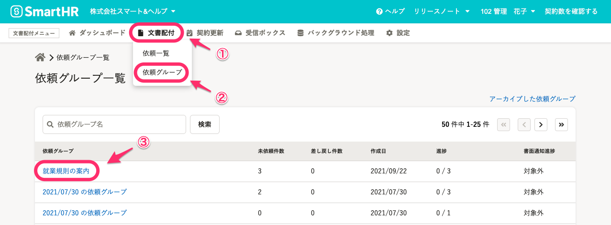
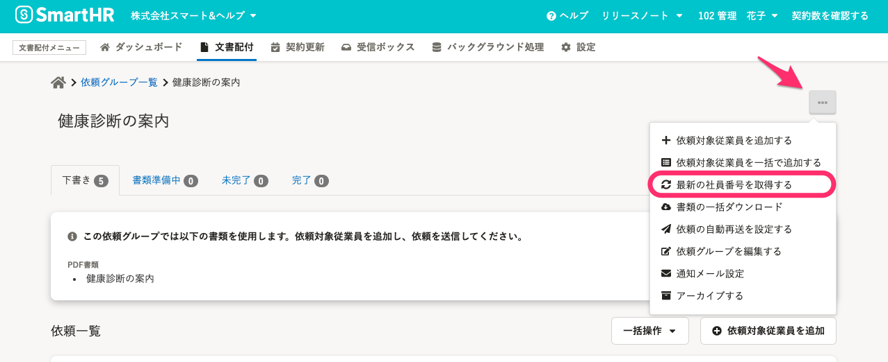

従業員詳細画面で社員番号を変更しても、文書配付機能では変更が反映されない場合があります。

下記手順を参考に、従業員情報を再取得してください。

# 1\. \[依頼グループ\] > 該当の依頼グループ名をクリック

文書配付のダッシュボード画面を開き、画面上部にあるメニューで **\[文書配付\]** から **\[依頼グループ\]** をクリックします。

**\[依頼グループ\]** をクリックすると、依頼グループが一覧表示されます。一覧の中から該当の依頼グループをさがし、グループ名のリンクをクリックしてください。

グループ名をクリックすると、詳細画面が表示されます。

# 2\. \[...\] メニュー > \[最新の社員番号を取得する\] をクリック

依頼グループの画面右上にある **\[...\]メニュー** を開いて **\[最新の社員番号を取得する\]** をクリックします。

# \[最新の社員番号を取得する\] をクリックしても反映されない場合は？

上記の手順を踏んでも最新の従業員情報が反映されない場合、ブラウザの更新ボタンをクリックし、画面更新を行なってください。

※ バックグラウンド処理で実行しますので、即時反映されない場合があります。
※ SmartHR 内の従業員数が多い場合は、多少のお時間がかかりますので、ご了承ください。
