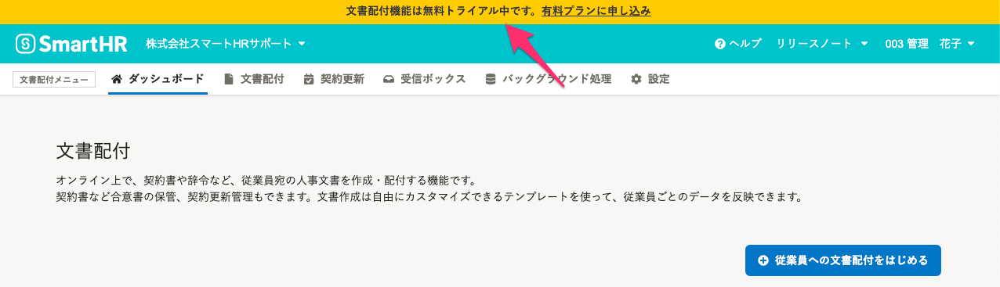
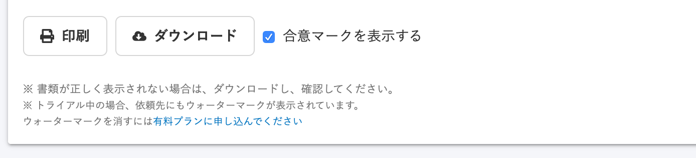
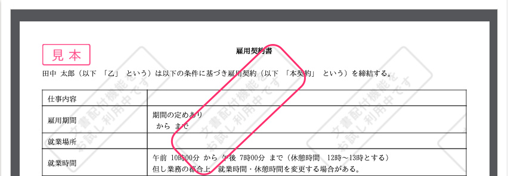

SmartHRのオプション機能である **\[文書配付\]** 機能のみを解約をした場合、SmartHRのトップページから **\[文書配付\]** 機能の画面にアクセスはできますが、**\[トライアルモード\]** に戻ります。

# Q. 閲覧やダウンロードはできる？

はい、過去に合意した書類の閲覧やダウンロードは引き続き可能です。

:::alert
雇用契約機能がアンインストールされた場合は、書類を閲覧することはできません。
アンインストールはご自身で操作できません。詳しくは下記のフォームにてお問い合わせください。
[雇用契約機能有料プランお問い合わせ | SmartHR](https://smarthr.jp/koyou_agreement_proposal)
:::

# Q. ウォーターマーク（透かし）は付く？

いいえ、過去に合意済みの書類にはウォーターマークは表示されません。また、解約前に依頼し、解約後に従業員が合意した場合でも、ウォーターマークは表示されません。

:::tips
トライアルモードでも書類の依頼はできますが、解約後に作成した依頼の書類上には **\[文書配付機能をお試し利用中です\]** というウォーターマークが入ります。

:::
