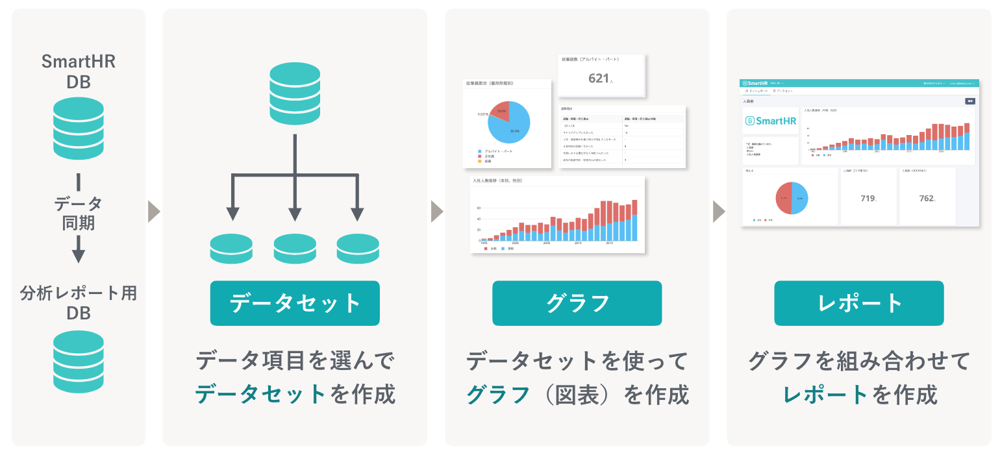

SmartHRに登録された情報が分析レポートに取り込まれたあと、どのようにグラフやレポートとなるのか、データの仕組みを説明します。

# 概要

分析レポートは、SmartHRに蓄積されたデータを使ってグラフやレポートを作成できる機能です。

分析レポートの利用は、SmartHRに登録されているデータを同期することから始まります。

データの同期は、分析レポートの初回利用時にシステムによって自動で行なわれるため、操作の必要はありません。

データの同期後は、同期したデータの中から必要なデータ項目を選んで「データセット」を作成し、データセットを元に「グラフ（図表）」を作成します。

作成したグラフを組み合わせると、「レポート」が完成します。

## データセットとは

データセットについて、詳しくは以下のヘルプページを参照してください。

:::related
[データセットとは](https://knowledge.smarthr.jp/hc/ja/articles/4411678184729)
:::

# レポートの種類

分析レポートには、プリセットレポートとオリジナルレポート、2種類のレポートがあります。

## プリセットレポートとは

プリセットレポートは、データ分析の専門知識がない方でも簡単に利用できるように用意した、サンプルとなるレポートです。

分析レポート機能の初回利用時には、システムによりプリセットレポートが自動で作成されます。

2021年7月現在、以下のプリセットレポートが利用できます。

- 労務系
    - 働き方改革推進状況レポート
    - 行政報告レポート（ロクイチ報告を除く）
    - 高年齢者雇用状況報告書用レポート（令和3年）
    - 障害者雇用状況報告書用レポート（令和3年）
- 人事系
    - 組織情報レポート
    - 採用・人員計画検討レポート
    - 離職分析レポート
- 勤怠・給与系
    - 勤怠レポート
    - 給与レポート

プリセットレポートの作成と同時に、プリセットレポートに対応するデータセットも作成します。

[プリセットレポートを追加する](https://knowledge.smarthr.jp/hc/ja/articles/1500001783842)

### プリセットレポートと対応するデータセット一覧

プリセットレポート名、対応するデータセット名の末尾には、それぞれ「\_yyyy-mm-dd」（作成日時）がつきます。

| **プリセットレポート名** | **対応するデータセット名** |
| --- | --- |
| 働き方改革推進状況レポート |   働き方改革推進状況レポート用データセット※個人名あり   |
| 行政報告レポート（ロクイチ報告を除く） | 行政報告レポート（ロクイチ報告を除く）用データセット |
| 高年齢者雇用状況報告書用レポート（令和3年） | 高年齢者雇用状況報告書用レポート（令和3年）用データセット |
| 障害者雇用状況報告書用レポート（令和3年） | 障害者雇用状況報告書用レポート（令和3年）用データセット |
| 組織情報レポート | 組織情報レポート用データセット |
| 採用・人員計画検討レポート | 採用・人員計画検討レポート用データセット |
| 離職分析レポート |   離職分析レポート用データセット  離職分析レポート用データセット※個人名なし   |
| 勤怠レポート | 勤怠レポート用データセット※個人名あり |
| 給与レポート | 給与レポート用データセット※個人名なし |

:::tips
### プリセットレポートに対応するデータセットの活用術
グラフの新規作成・修正は、プリセットレポートに対応するデータセットを活用すると便利です。
プリセットレポートに対応しているデータセットをもとに、以下のさまざまな内容に対処できます。
- プリセットレポートにグラフを追加したい場合
- プリセットレポートのグラフを修正したい場合
- 新しいグラフを作成したい場合
- データセットにデータ項目を追加して、より幅広いグラフ作成に対応させたい場合
:::

## オリジナルレポートとは

オリジナルレポートは、分析レポートで作成したグラフや画像、テキストなどのデータを自由に組み合わせて作るレポートです。

プリセットレポートに使われているデータセットをもとにグラフを作成して配置したり、プリセットレポートのグラフをそのまま引用することも可能です。

:::related
[データセットを作成・編集・削除する](https://knowledge.smarthr.jp/hc/ja/articles/360035221113)
[レポートを作成・編集・削除する](https://knowledge.smarthr.jp/hc/ja/articles/360035221173)
:::
