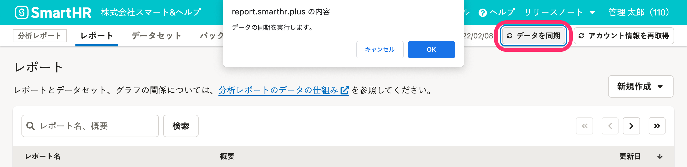

分析レポートのデータを同期（更新）する方法を説明します。

# データの同期とは

作成したレポートやデータセットの内容は、データセットを作成した時点の情報です。

SmartHRに登録されている最新の情報でレポート・データセットを表示するには、データの同期が必要です。

:::tips
分析レポート機能の初回利用時のみ、分析レポート機能を開くと同時に、自動で「データの同期」と「プリセットレポートの作成」が実行されます。
:::

一部のプリセットレポートは、利用開始前にデータ項目の対応付け設定が必要です。

詳細は下記のヘルプページを参照してください。

:::related
[データ項目の対応付けを設定する](https://knowledge.smarthr.jp/hc/ja/articles/360049292533)
:::

# 操作手順

分析レポート画面右上の **［データを同期］** をクリックすると、メッセージが表示されます。

 **［OK］** をクリックすると、バックグラウンド処理が開始されます。

バックグラウンド処理が終了すると、SmartHRに登録している最新のデータが分析レポート機能のデータセットに反映されます。

:::alert
データの同期中は、データの同期を重ねて実行できません。
データの同期完了後に操作してください。
:::
