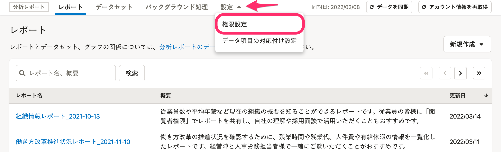
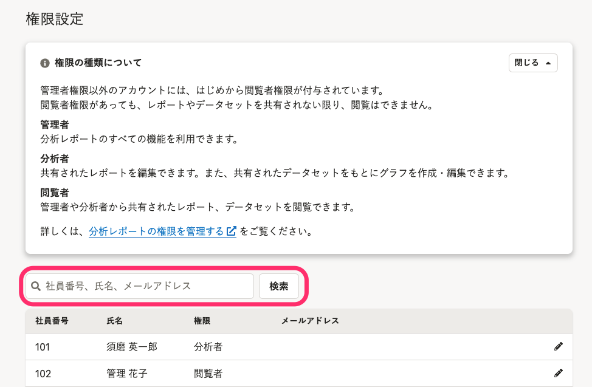
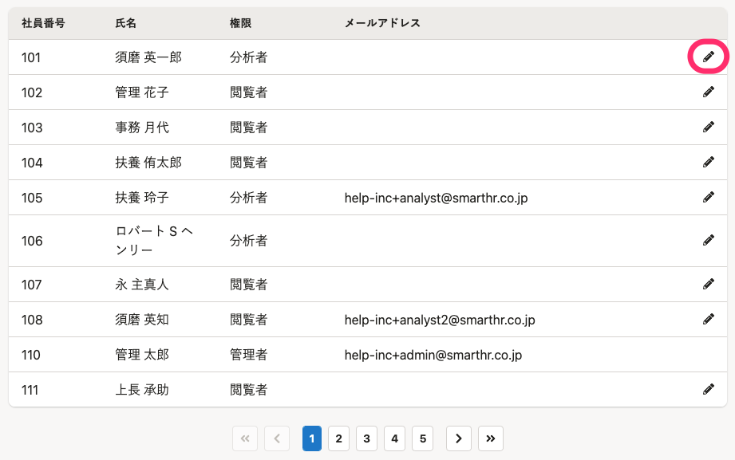
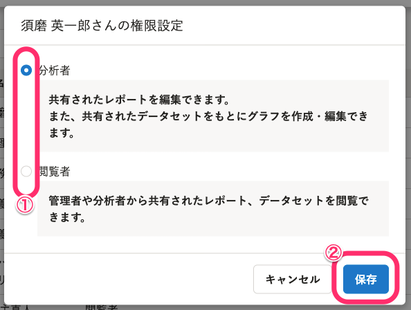

分析レポートの権限と、権限の変更方法を説明します。

:::alert
権限の変更ができるのは、SmartHRの管理者権限を持つアカウントのみです。
:::

# 分析レポートの権限とは

分析レポートには、管理者、分析者、閲覧者の3つの権限があります。

SmartHRで管理者権限を持つアカウントは、分析レポートでも管理者権限を持ちます。

それ以外のアカウントは、分析レポートでははじめから閲覧者権限が設定されています。

:::alert
分析レポートの管理者権限を持つアカウントは、管理者権限から分析者または閲覧者権限への変更ができません。
分析者または閲覧者権限に変更したい場合は、SmartHRの権限を管理者権限以外に変更してください。
[アカウントの権限を確認・変更する](https://knowledge.smarthr.jp/hc/ja/articles/360026106574)
:::

## 各権限で利用できる機能

各権限でできることは以下の通りです。

- 管理者：分析レポートのすべての機能を利用できます。
- 分析者：共有されたレポートを編集できます。また、共有されたデータセットをもとにグラフを作成・編集できます。
- 閲覧者：管理者や分析者から共有されたレポート、データセットを閲覧できます。

:::tips
分析者または閲覧者権限を持っていても、管理者からレポート、データセットの共有を受けない限り、レポートとデータセットの閲覧・編集はできません。
共有については下記ヘルプページを参照してください。
[レポートとデータセットの共有範囲を設定する](https://knowledge.smarthr.jp/hc/ja/articles/360035221033)
:::

より詳しい内容は以下表を参照してください。

記号の説明：○=操作可能、△=共有を受ければ操作可能、×=操作不可能

| **メニュー名** | **操作** | **管理者** | **分析者** | **閲覧者** |
| :-- | :-- | :-- | :-- | :-- |
| レポート | レポートの作成 | ◯ | ◯ | × |
| レポート | レポートの複製 | ◯ | × | × |
| レポート | レポートの閲覧 | ◯ |   自分が作成したもの：◯  他者が作成したもの：△   | △ |
| レポート | レポートの共有 | ◯ |   自分が作成したもの：◯  他者が作成したもの：△   | × |
| レポート | レポートの編集 | ◯ |   自分が作成したもの：◯  他者が作成したもの：△   | × |
| レポート | レポートの削除 | ◯ |   自分が作成したもの：◯  他者が作成したもの：△   | × |
| レポート | レポートのタイトルと概要編集 | ◯ |   自分が作成したもの：◯  他者が作成したもの：△   | × |
| データセット | データセットの作成 | ◯ | × | × |
| データセット | データセットの閲覧 | ◯ | △ | △ |
| データセット | データセットの共有 | ◯ | × | × |
| データセット | データセットの編集 | ◯ | × | × |
| データセット | データセットの削除 | ◯ | × | × |
| データセット | データセットのタイトル編集 | ◯ | × | × |
| データセット | グラフの作成 | ◯ | △ | × |
| データセット | グラフの複製 | ◯ | △ | × |
| データセット | グラフの削除 | ◯ | △ | × |
| データセット | グラフの画像・CSVダウンロード | ◯ | △ | × |
| 設定 | 権限設定 | ◯ | × | × |
| 設定 | プリセットレポート設定 | ◯ | × | × |
| 設定 | データ項目対応付け | ◯ | × | × |
| バックグラウンド処理 | バックグラウンド処理結果の閲覧 | ◯ | ◯ | × |
| データを同期 | 従業員情報の最新化 | ◯ | ◯ | × |

# 権限を変更する

## 1.［設定］>［権限設定］をクリック

分析レポート画面上部の **［設定］** をクリックして開くメニューにある **［権限設定］** をクリックすると、権限設定画面に移動します。

## 2\. 対象者を検索

検索フォームに社員番号、氏名、メールアドレスのいずれかを入力して **「検索」** をクリックし、権限を変更したい対象を検索します。

## 3.［鉛筆アイコン］をクリック

権限を変更したいアカウントの右側に表示されている **［鉛筆アイコン］** をクリックすると、権限設定のダイアログが表示されます。

## 4\. 権限を選択し、「保存」をクリック

 **［分析者］** もしくは **［閲覧者］** を選択し、 **「保存」** をクリックすると、変更が保存されます。

