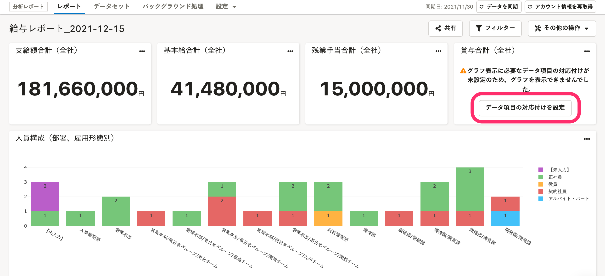
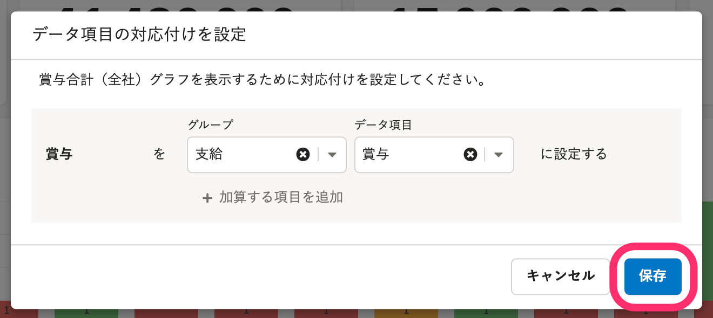
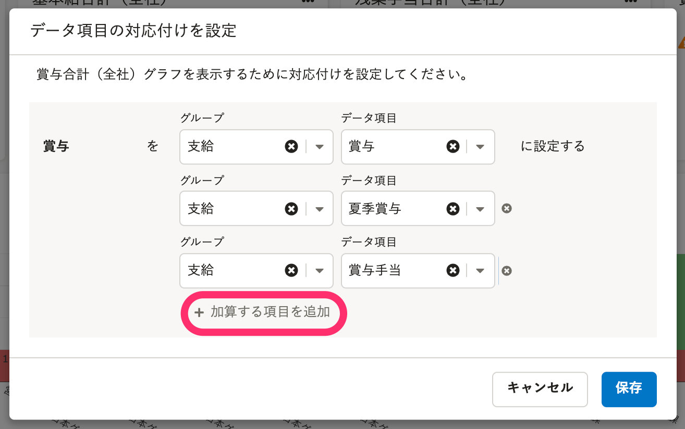
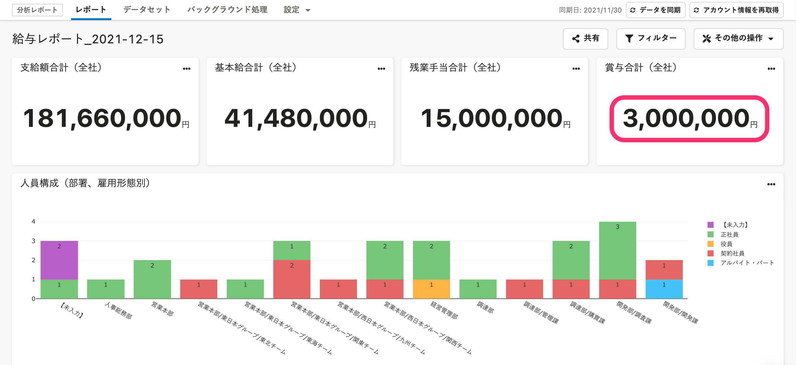

分析レポートで利用できるプリセットレポートの「データ項目の対応付け」の設定手順を説明します。

データ項目の対応付けは、プリセットレポートのグラフを表示するために必要な設定です。

:::tips
以下のプリセットレポートは、データ項目の対応付けは不要です。
- 行政報告レポート（ロクイチ報告を除く）
- 組織情報レポート
:::

# プリセットレポートとは

プリセットレポートとは、データ分析の専門知識がない方でも簡単に利用できるように用意した、サンプルとなるレポートです。

2021年7月現在、以下のプリセットレポートがあります。

- 労務系
    - 働き方改革推進状況レポート
    - 行政報告レポート（ロクイチ報告を除く）
    - 高年齢者雇用状況報告書用レポート（令和3年）
    - 障害者雇用状況報告書用レポート（令和3年）
- 人事系
    - 組織情報レポート
    - 採用・人員計画検討レポート
    - 離職分析レポート
- 勤怠・給与系
    - 勤怠レポート
    - 給与レポート

プリセットレポートを追加する手順は以下のヘルプページを参照してください。

:::related
[プリセットレポートを追加する](https://knowledge.smarthr.jp/hc/ja/articles/1500001783842)
:::

# 設定手順

:::alert
データ項目の対応付けを設定できるのは、管理者のみです。
:::

## 1\. プリセットレポート名をクリック

任意のプリセットレポート名をクリックすると、レポート詳細画面に移動します。

## 2\. ［データ項目の対応付けを設定］をクリック

グラフの基となる値が未設定のグラフには **［データ項目の対応付けを設定］** ボタンが表示されます。

 **［データ項目の対応付けを設定］** をクリックすると、データ項目の対応付けを設定する画面が表示されます。

## 3\. 該当するデータ項目を選択し、［保存］をクリック

項目に対して、該当するグループとデータ項目を設定し、 **［保存］** をクリックします。

下記の項目は、加算するデータ項目を10個まで設定できます。

- 基本給
- 賞与
- 支給合計
- 残業手当
- 住宅手当
- 役職手当
- 総労働時間
- 残業時間
- 有給休暇日数
- 有給休暇残日数

 **［＋加算する項目を追加］** をクリックしてデータ項目を設定してください。

加算する項目の削除は、項目の外に表示されている **［×］** をクリックしてください。

 **［保存］** をクリックすると、レポート詳細画面へ移動し、設定したデータ項目に関連するグラフが表示されます。

