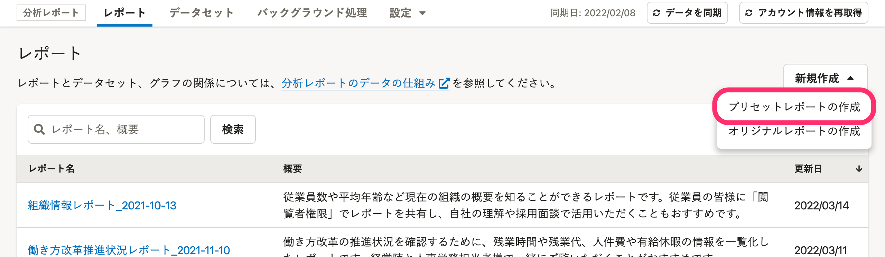
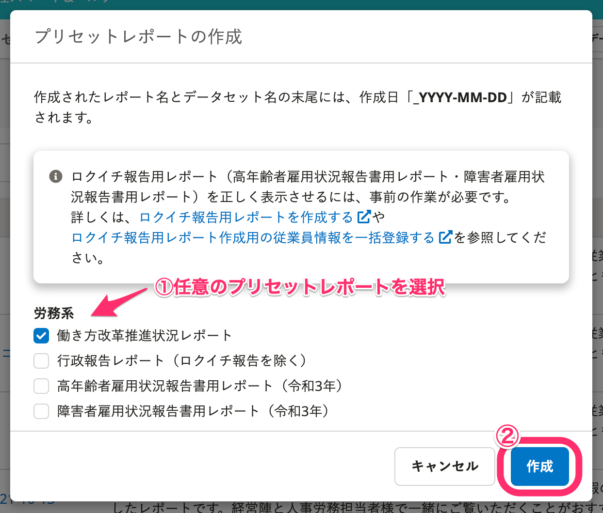
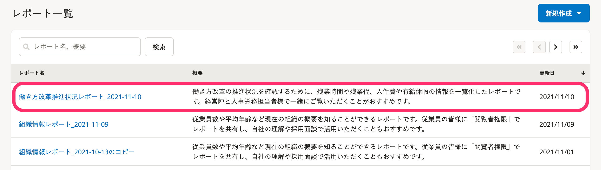
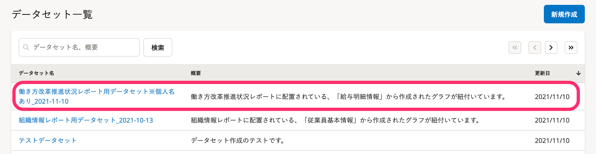

分析レポートで利用できる「プリセットレポート」をレポート一覧に追加する手順を説明します。

プリセットレポートの追加は、以下のような場合に行なってください。

- プリセットレポートをもとにしてレポートを作成・アレンジしたい
- SmartHRの機能改善により、新しいプリセットレポートが追加された

追加したプリセットレポートは、一部、データ項目の対応付け設定が必要です。

詳しくは以下のヘルプページを参照してください。

:::related
[データ項目の対応付けを設定する](https://knowledge.smarthr.jp/hc/ja/articles/360049292533)
:::

# 1\. レポート一覧にある［新規作成▼］>［プリセットレポートの作成］をクリック

レポート一覧画面右上にある **［新規作成▼］** をクリックし、プルダウンメニューから **［プリセットレポートの作成］** をクリックすると、プリセットレポートの作成画面が表示されます。

# 2\. 任意のプリセットレポートにチェックを入れ、［作成］をクリック

任意のプリセットレポートを選び、レポート名の左にあるチェックボックスにチェックを入れて **［作成］** をクリックします。

※以降は **［働き方改革推進状況レポート］** を選択した場合を例に案内します。

 **［作成］** をクリックすると画面に「プリセットレポート作成を行っています。」と表示されます。

プリセットレポート作成状況はバックグラウンド処理画面で確認でき、完了するとメールで通知されます。

# 3\. レポート一覧にプリセットレポートが追加されたことを確認する

レポート一覧にプリセットレポートが追加されたことを確認してください。

:::tips
プリセットレポートを追加すると、プリセットレポートに対応するデータセットも、データセット一覧に同時に作成されます。

:::
