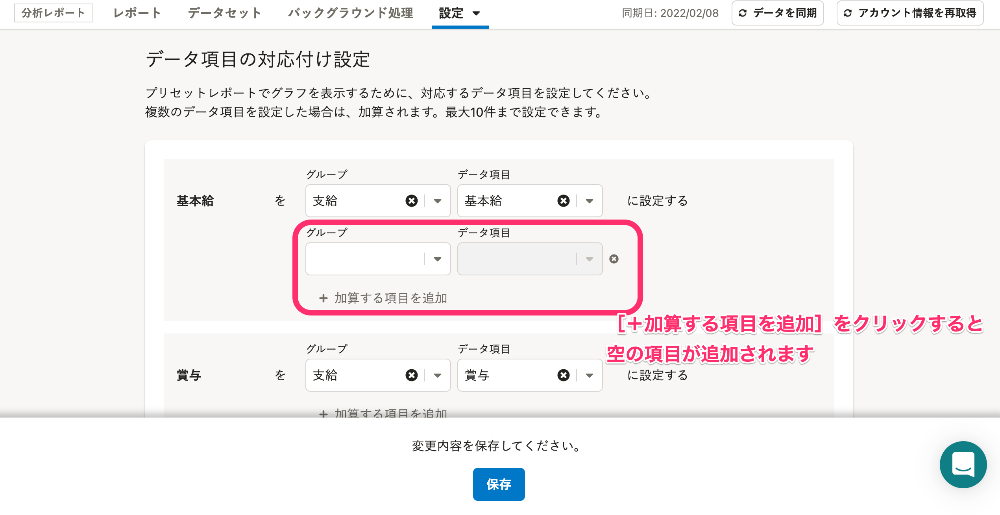
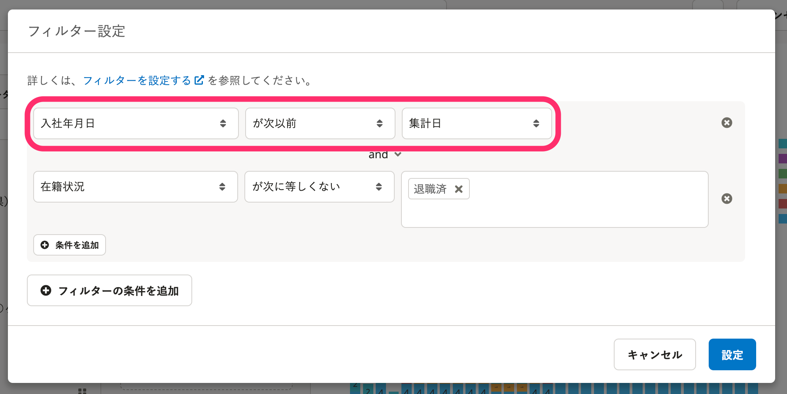
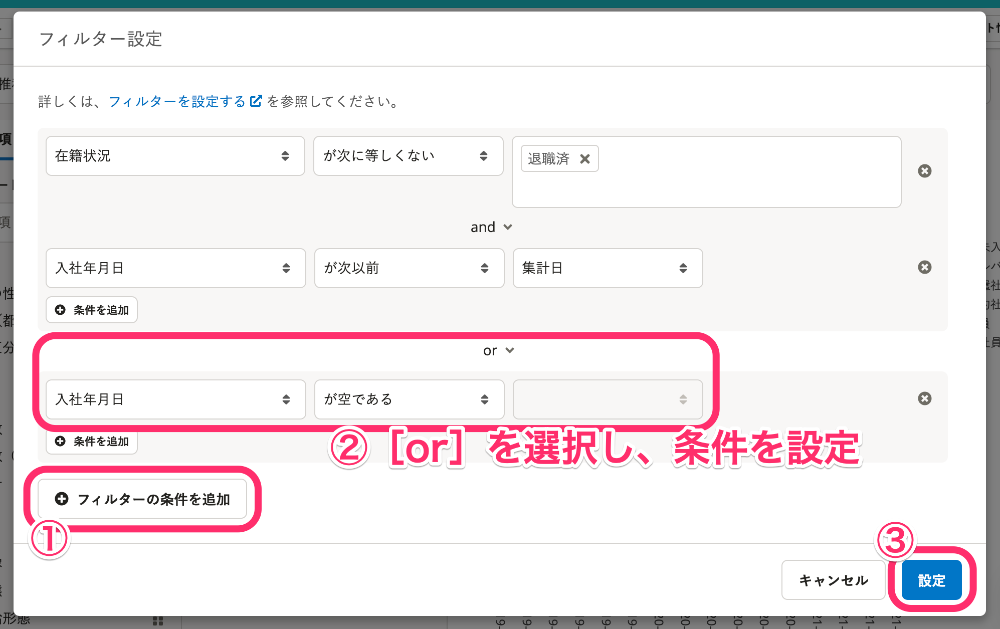
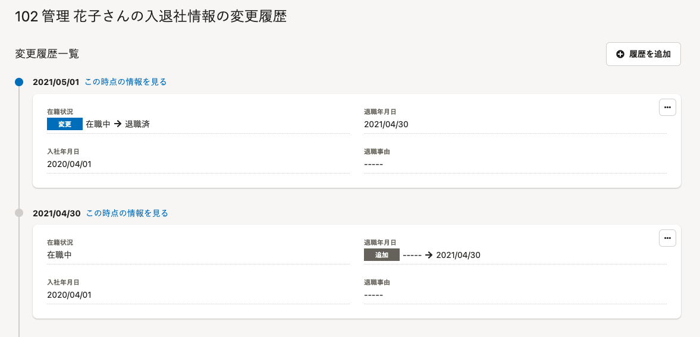
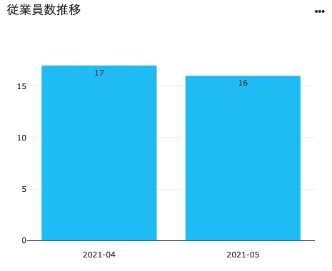

# Q. プリセットレポートの「データ項目の対応付け」は、複数のデータ項目を設定できますか？

## A. はい、一部の項目は複数のデータ項目を設定できます。

下記の項目は、データ項目を10個まで設定できます。

- 基本給
- 賞与
- 支給合計
- 残業手当
- 住宅手当
- 役職手当
- 総労働時間
- 残業時間
- 有給休暇日数
- 有給休暇残日数

データ項目の対応付け設定画面で **［＋加算する項目を追加］** をクリックして、項目を追加してください。

詳しい操作手順は以下のヘルプページを参照してください。

:::related
[プリセットレポートの初期設定をする](https://knowledge.smarthr.jp/hc/ja/articles/360049292533)
:::

# Q. プリセットレポートに表示されている従業員数が実際の従業員数よりも少ないのはなぜですか？

## A. 以下いずれかの可能性が考えられます。

- 従業員情報 **［入社年月日］** 項目が未入力のため、システム標準のフィルター設定によって表示対象から外れている
- 従業員情報に登録されているデータの「適用日」が正しくない

:::alert
分析レポートで可視化できる情報は「SmartHRにはじめて従業員情報を投入した時点以降」の情報です。
:::

### 従業員情報［入社年月日］項目が未入力のため、システム標準のフィルター設定によって表示対象から外れている場合

システム標準のフィルター設定では、SmartHRの従業員情報 **［入社年月日］** 項目が未入力の従業員は従業員数に含めない設定になっています。

例：「従業員数推移」のグラフ

システム標準のフィルター設定により、 **［入社年月日が次以前（集計日）］** が設定されています。

入社年月日が未入力の従業員はグラフ上で表示されません。

#### 実際の従業員数を表示する方法

運用にあわせて、以下いずれかの方法をお試しください。

1.  すべての従業員の **［入社年月日］** 項目を入力し、データを同期する
2.  対象のグラフ編集画面で **［フィルター設定］** をして、従業員情報の **［入社年月日］** 項目が空の場合でも表示する条件を追加する

参考：上記②を実施する場合のフィルター設定手順

-  **［＋フィルターの条件を追加］** をクリック
- 新しく追加されたフィルターの条件の **［and］** を **［or］** に変更
- 条件のプルダウンメニューから **［入社年月日］［が空である］** を選択
-  **［設定］** をクリック

:::related
[フィルターを設定する](https://knowledge.smarthr.jp/hc/ja/articles/360035221193)
:::

### 従業員情報に登録されているデータの「適用日」が正しくない場合

入社年月日や退職年月日、在籍情報を入力していても、適用日が正しくなければ、正しい従業員数を表示できません。

以下の条件を満たすと、正しい従業員数を表示します。

- 入社年月日：入社年月日（orそれ以前）を適用日として、入社年月日が入力されている
- 退職年月日：退職年月日（orそれ以前）を適用日として、退職年月日が入力されている
- 在籍状況：退職年月日の翌日を適用日として、 **［退職済］** となっている

例：各情報が正しく入力されている従業員 管理花子さんの入退社情報の変更履歴

入社年月日、退職年月日、在籍状況を確認すると、以下の通り入力されています。

- 入社年月日の入力内容：2020/04/01
- 退職年月日の入力内容：2021/04/30
- 在籍状況：退職年月日の翌日（2021/05/01）に **［退職済］** に変更

この場合、2021年4月末までは **［在職中］** のため従業員数に含まれます。

在籍状況が **［退職済］** に変わる2021年5月からは従業員数に含まれなくなります。

この従業員が含まれた「従業員数推移のグラフ」（下図）を見ると、2021年4月の従業員数は17名ですが、2021年5月の従業員数は16名になっていることが確認できます。

