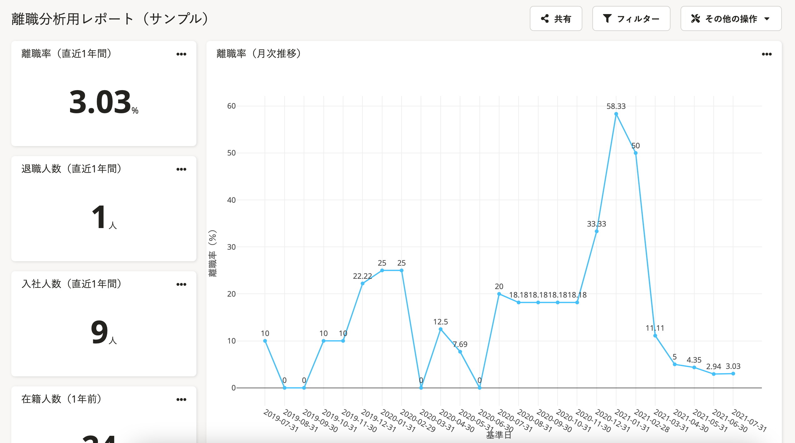

プリセットレポートとして用意されている「離職分析用レポート」は、離職率や入退社に関するデータを可視化できます。

離職分析用レポートに関するよくある質問は以下のヘルプページを参照してください。

:::related
[離職分析用レポートに関するよくある質問](https://knowledge.smarthr.jp/hc/ja/articles/1500001792562)
:::
:::tips
「離職分析用レポート」は、2021年1月にプリセットレポートとして新しく追加されました。
2021年1月以前から分析レポート機能を利用している場合、離職分析用レポートはレポート一覧に自動で追加されません。
以下のヘルプページを参考に「離職分析用レポート」のプリセットレポートを追加してください。
[プリセットレポートを追加する](https://knowledge.smarthr.jp/hc/ja/articles/1500001783842)
:::

# 離職分析用レポートで確認できること

「離職分析用レポート（サンプル）」では以下のグラフを確認できます。

- 離職率（直近1年間、月次推移）
- 退職人数（直近1年間）
- 入社人数（直近1年間）
- 在籍人数（1年前）
- 在籍人数（1年前）×入社人数（年間）×退職人数（年間）
- 平均勤続年数推移（月別）
- 入社者数推移（年別、月別、年別×性別、月別×性別、年別×雇用形態別、月別×雇用形態別、年別×部署別、月別×部署別）
- 退職者数推移（年別、月別、年別×性別、月別×性別、年別×雇用形態別、月別×雇用形態別、年別×部署別、月別×部署別）
- 退職者リスト

:::tips
離職率のグラフに表示できる期間は、最長「2年間」分です。
恐れ入りますが、現在は2年間を超えるグラフは作成できません。
:::

# 離職率の計算式と各指標の定義

離職率は以下の計算式をもとに算出しています。

- 離職率＝退職人数÷（在籍人数＋入社人数）

また、離職率のグラフで確認できる「在籍人数（1年前）」「入社人数（年間）」「退職人数（年間）」は、月の最終日を基準日とし、その日付をもとに以下の通り定義しています。

- 在籍人数（1年前）：「基準日の1年前の日付」時点の在籍従業員数
- 入社人数（年間） ：「基準日から遡って1年間」に入社した従業員数
- 退職人数（年間） ：「基準日から遡って1年間」の期間に退職した従業員数

例えば、基準日が「2020-12-31」の場合は、以下の情報を表示します。

- 在籍人数（1年前）：2019-12-31の在籍従業員数
- 入社人数（年間） ：2020-01-01〜2020-12-31の期間に入社した従業員数
- 退職人数（年間） ：2020-01-01〜2020-12-31の期間に退職した従業員数
