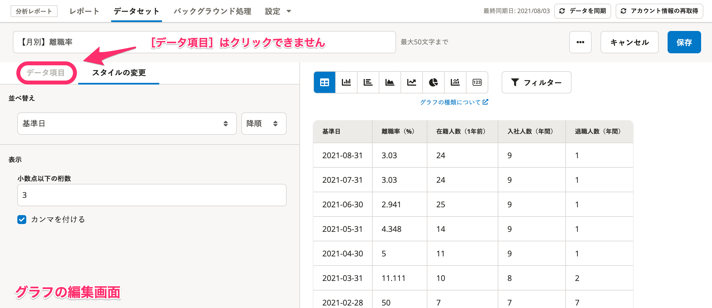
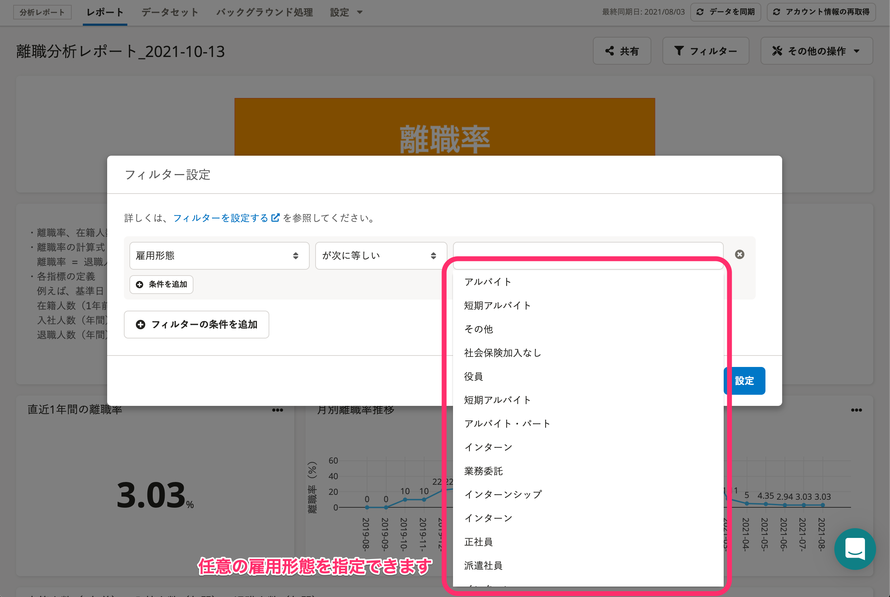
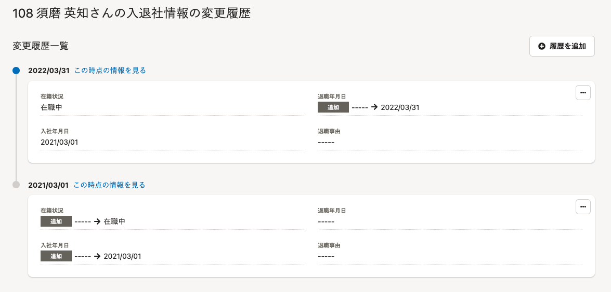
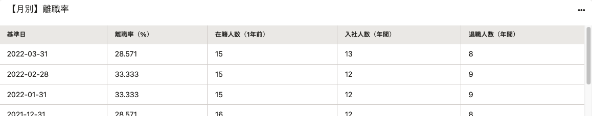

# Q. グラフのデータ項目を編集する方法はありますか？

## A. いいえ、ありません。

離職率はシステム上で算出しており、データ項目を変更すると計算式が変わってしまいます。

そのため、仕様によってデータ項目を編集できないようにしています。

「離職分析用レポート」のグラフは、 **［スタイルの変更］** のみ編集できます。

# Q. 離職率はどのように算出していますか？

## A. 離職率は以下の計算式をもとに算出しています。

- 離職率＝退職人数÷（在籍人数＋入社人数）

計算式や各指標にまつわる詳細は、以下のヘルプページを参照してください。

:::related
[離職分析用レポートとは](https://knowledge.smarthr.jp/hc/ja/articles/1500001693001)
:::

# Q. 雇用形態別のグラフを閲覧できますか？

## A. はい、フィルターによる絞り込みで、表示する雇用形態を指定できます。

フィルターの操作手順について、詳細は以下のヘルプページを参照してください。

:::related
[フィルターを設定する](https://knowledge.smarthr.jp/hc/ja/articles/360035221193)
:::

# Q. 離職率が直近の2年間分しか表示されないのはなぜですか？

## A. 離職率のグラフで表示できる期間は2年間分です。

恐れ入りますが、現在は2年間を超えるグラフは作成できません。

# Q. 直近1年間の離職率が正しく表示されません。なぜですか？

## A. 離職率の算出には、分析レポート導入後1年間の情報が正しく登録されている必要があります。1年分の情報が溜まるまで、正しい離職率は表示できません。

:::alert
分析レポートで可視化できる情報は「SmartHRにはじめて従業員情報を投入した時点以降」の情報です。
離職率グラフで2年間の推移を表示するには、分析レポート導入後3年間の情報が正しく登録されている必要があります。
:::

離職分析用レポートで離職率を確認する日を「基準日」として、以下それぞれの条件を満たすと、正しい離職率を表示します。

- 「在籍人数（1年前）」のグラフ
    - 条件：基準日から1年前の時点で **［入社年月日］** と **［在籍状況］** が入力されていること
    - 算出方法：基準日から1年前の従業員情報（入社年月日と在籍状況）を参照して算出
- 「入社人数（年間）」のグラフ
    - 条件： 基準日時点で **［入社年月日］** が入力されていること
    - 算出方法：基準日時点の従業員情報（入社年月日）を参照して算出
- 「退職人数（年間）」のグラフ
    - 条件： 基準日時点で **［退職年月日］** が入力されていること
    - 算出方法：基準日時点の従業員情報（退職年月日）を参照して算出

例：基準日時点で各情報が正しく入力されている従業員 須磨英知さんの入退社情報の変更履歴

基準日（2022/03/31）時点の入社年月日、退職年月日、在籍状況を確認すると、以下の通り入力されています。

- 入社年月日の入力内容：2021/03/01（基準日の1年前に入社）
- 退職年月日の入力内容：2022/03/31（基準日時点では**在職**）
- 在籍状況： **［在籍中］** （基準日時点では**在職中**）

この従業員は、基準日（2022/03/31）時点では、 **［在籍人数（1年前）］ ［入社人数（年間）］ ［退職人数（年間）］** すべてのグラフに反映されています。

ただし、2021/03/01以前の情報がないため、例えば基準日が2022/02/28だった場合、基準日の1年前（2021/02/28）に **［入社年月日］** と **［在籍状況］** が入力されていないため、 **［在籍人数（1年前）］** のグラフには反映されていません。

