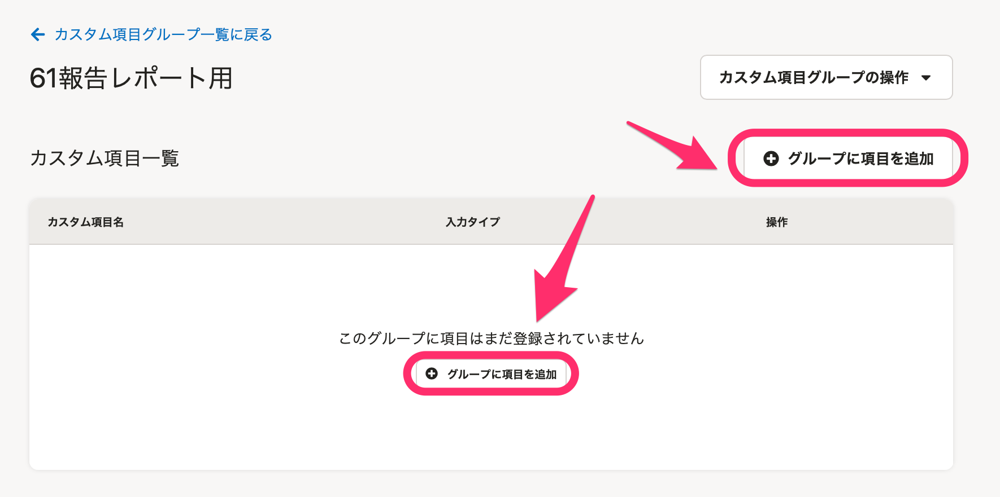

分析レポートではロクイチ報告用の **［高年齢者雇用状況報告書用レポート］** と **［障害者雇用状況報告書用レポート］** のプリセットレポートを用意しています。

集計する項目を「従業員情報のカスタム項目」として登録し、情報を分析レポート機能に同期することでレポートを作成できます。

:::alert
 **［高年齢者雇用状況報告書用レポート］と［障害者雇用状況報告書用レポート］は、毎年、新規作成してください。** 
作成したレポートは自動で更新されないため、年度ごとにプリセットレポートを作り直す必要があります。
:::

# ロクイチ報告とは

ロクイチ報告とは、毎年6月1日時点での高年齢者および障害者の雇用状況をハローワークに報告するために**高年齢者雇用状況報告書**と**障害者雇用状況報告書**を作成・提出する業務を指します。

通称「ロクイチ報告」または「6/1報告」とも呼ばれています。

# ロクイチ報告用レポート作成手順

:::alert
ロクイチ報告用レポートの作成にあたっては、あらかじめ従業員情報の雇用形態が正しく登録されているか確認してください。
ロクイチ報告の対象かどうかは、SmartHRに登録されている雇用形態の情報で判断しています。
[雇用形態のマスターデータを管理する](https://knowledge.smarthr.jp/hc/ja/articles/360026105714)
:::

## 1\. カスタム従業員項目にロクイチ報告用の項目を作成する

### 1-1. 共通設定の［カスタム従業員項目］にある［カスタム項目グループを追加］をクリック

画面右上のアカウント名 > **［共通設定］** を選び、画面左のリストにある **［カスタム従業員項目］** をクリックすると **［カスタム項目グループ一覧］** が表示されます。

 **「+カスタム項目グループを追加」** をクリックすると、 **［カスタム項目グループの追加］** ダイアログが表示されます。

 **［カスタム項目グループ名］** に「61報告レポート用」などと入力し、 **［登録］** をクリックしてください。

### 1-2.［+グループに項目を追加］をクリックし、ロクイチ報告レポート用の項目を作成する

 **［カスタム項目一覧］** の **［＋**  **グループに項目を追加］** をクリックすると、 **［カスタム項目の追加］** ダイアログが表示されます。

 **［入力タイプ］** の項目で **［ドロップダウンリスト］** を選択し、ロクイチ報告レポート用に **［1週間の所定労働時間］** や **［障害者情報］** 項目を作成してください。

:::tips
項目ごとのプルダウンリストに設定する値は、以下の内容で登録してください。
- 項目名：1週間の所定労働時間
    - 設定する値：30時間以上、20時間以上30時間未満
    - 注意：数字は必ず**半角で入力**します。全角で入力すると、プリセットレポートでグラフを表示できません。
- 項目名：障害者情報
    - 設定する値：重度身体障害者、重度身体障害者以外の身体障害者、重度知的障害者、重度知的障害者以外の知的障害者、精神障害者

:::

 **［登録］** をクリックすると、作成した項目が登録されます。

## 2\. 従業員データを登録する

ロクイチ報告レポート用に作成した項目に、従業員情報を登録します。

### 一人ずつ登録する場合

SmartHRの画面上部にある **［従業員リスト］** から任意の **［従業員名］** \> **［編集する］** の順にクリックすると、従業員情報の編集画面に移動します。

ロクイチ報告レポート用に作成した項目に情報を入力し、 **［更新する］** をクリックしてください。

### ファイルを使って一括で登録する場合

SmartHRの画面上部にある **［従業員管理］** のメニューから **［更新する（ファイル）］** をクリックすると、「更新したい対象を選択してください」という画面が表示されます。

ロクイチ報告レポートの情報インポート用に用意したファイルをアップロードすると、情報を一括登録できます。

:::related
[ロクイチ報告用レポート作成用の従業員情報を一括登録する](https://knowledge.smarthr.jp/hc/ja/articles/360055393673)
:::

## 3\. 分析レポート機能にデータを同期する

SmartHRのトップページ左側の **［機能］** 欄にある **［分析レポート］** をクリックすると、分析レポート機能の画面に移動します。

分析レポート機能の画面右上にある **［データを同期］** をクリックすると、SmartHRに登録されている最新の情報を同期します。

※ 初めて同期する場合は数時間かかる場合があります。ご了承ください。

### 前年度も分析レポート機能でロクイチ報告用レポートを作成している場合

ロクイチ報告用レポートに使うプリセットレポートは、年度ごとに作り直す必要があります。

以下のヘルプページを参考に、 **［高年齢者雇用状況報告書用レポート］** と **［障害者雇用状況報告書用レポート］** を追加してください。

:::related
[プリセットレポートを追加する](https://knowledge.smarthr.jp/hc/ja/articles/1500001783842)
:::

### はじめて分析レポート機能を利用する場合

レポート一覧にある各レポート名をクリックすると、 **［データ項目の対応付けを設定］** ダイアログが表示されます。

各データ項目に対して、新規で作成したカスタム項目をそれぞれ設定し、 **［保存］** をクリックしてください。

:::tips
データ項目の対応付けは、分析レポートメニューにある **［設定▼］** をクリックして開くメニューから、 **［データ項目の対応付け設定］** 画面へ移動して設定もできます。

:::

データ項目の対応付け設定を保存すると、レポート詳細画面へ移動し、レポートを確認できます。

例：高年齢者雇用状況報告書用レポート

例：障害者雇用状況報告書用レポート

各書類の赤枠の項目に該当します。

:::alert
⑯〜⑰の結果については、レポートおよびハローワークから提供されている記入方法を参考に記入してください。
⑰については、定年退職年齢が60歳の場合を想定した結果を表示しています。
:::

## 4\. データセットのフィルター設定を確認する

続いて、ロクイチ報告用レポートに必要ない従業員情報を省くため、フィルターを設定します。

「高年齢者雇用状況報告書用レポート」「障害者雇用状況報告書用レポート」には、システム標準で次のフィルター設定を適用しています。

システム標準のフィルター設定：雇用形態が次に等しくない［派遣社員］［業務委託］［役員］

:::alert
雇用形態が **［執行役員］** の従業員を **［役員］** に含めている場合、システム標準のフィルター設定ではロクイチ報告の対象から漏れてしまいます。
執行役員の従業員に **［役員］** の雇用形態が設定されていないか、事前にご確認ください。
また、独自に雇用形態を作成・利用している場合は、ロクイチ報告の必要がない雇用形態はフィルター設定で除外してください。
:::

### フィルター設定の確認手順

#### 1.［データセット一覧］から対象の［データセット名］をクリック

 **［データセット一覧］** から対象の **［データセット名］** をクリックすると、データセットの詳細画面が表示されます。

:::alert
データセットのフィルター設定は、両方のデータセットに対して必要です。
- 高年齢者雇用状況報告書用レポート用データセット
- 障害者雇用状況報告書用レポート用データセット
:::

#### 2\. データセットの詳細画面で［編集］をクリック

データセットの詳細画面右側にある **［編集］** をクリックすると、データセットの編集画面が表示されます。

#### 3.［フィルター］をクリックし、条件を確認する

 **［フィルター］** をクリックすると、 **［フィルター設定］** 画面が表示されます。

 **［フィルター設定］画面** で設定状況を確認し、 **［設定］** をクリックしてください。

雇用形態の追加が必要な場合は、プルダウンメニューの右側にある空白部分をクリックすると、SmartHRに登録している雇用形態が表示されます。

フィルターを設定後、画面右上にある **［保存］** をクリックします。

