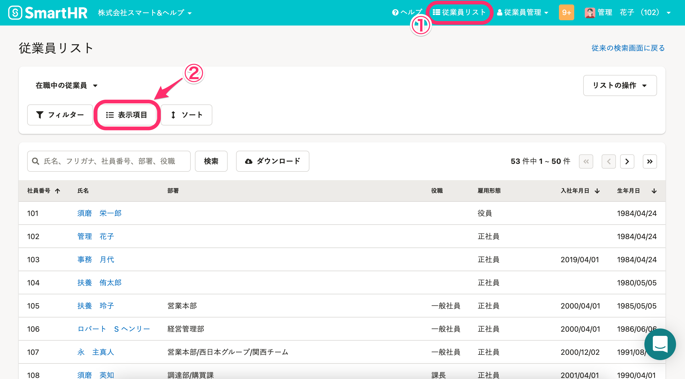
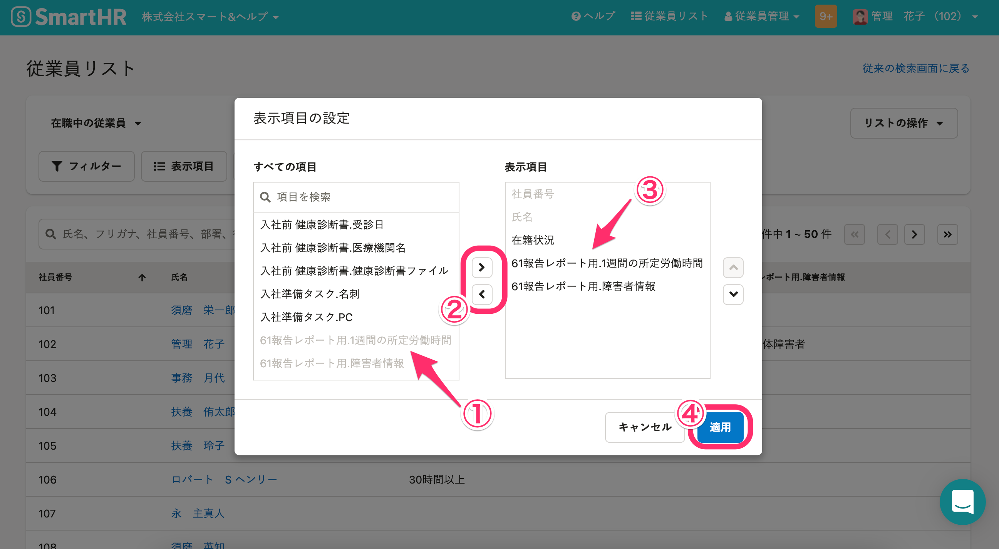
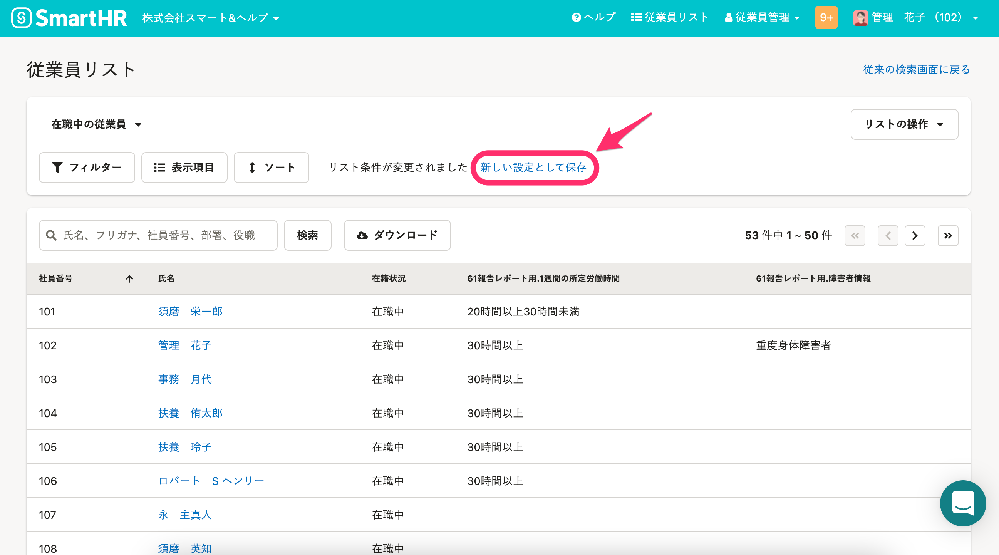
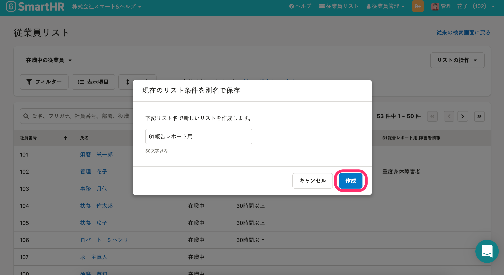
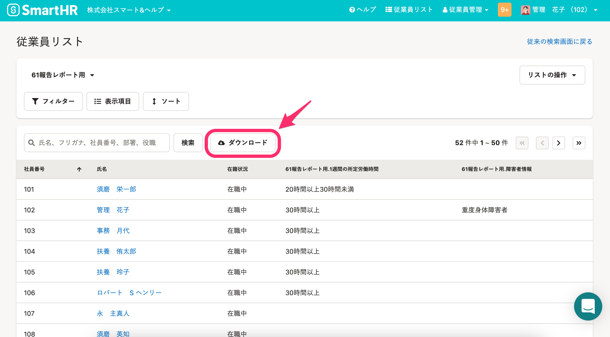
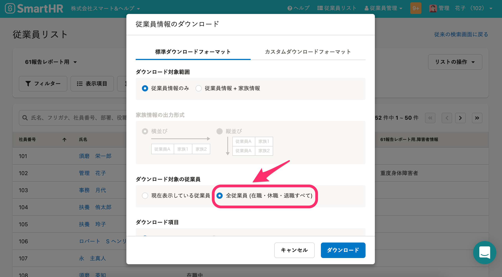
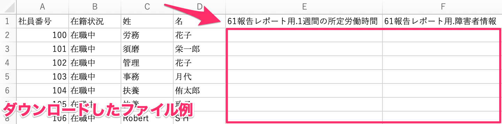

ロクイチ報告用レポート作成用の従業員情報を、カスタムリストを使って一括登録する方法を説明します。

ロクイチ報告用レポートの作成の詳しい手順は以下のヘルプページを参照してください。

[ロクイチ報告用レポートを作成する](https://knowledge.smarthr.jp/hc/ja/articles/360050168054)

# 1\. ロクイチ報告レポート作成用のカスタムリストを作成

## 1-1. ［従業員リスト］画面で［表示項目］をクリック

SmartHR画面上部にある **［従業員リスト］** をクリックし、従業員リストを表示します。

 **［表示項目］** をクリックすると、 **［表示項目の設定］** 画面が表示されます。

## 1-2. ロクイチ報告レポート作成用の表示項目を設定

 **［表示項目の設定］** の左側にある **［すべての項目］** 欄から、 **［在籍状況］** 、 **［61報告レポート用］（ロクイチ報告レポート用に作成したカスタム項目）** を選択し、 **［>］** をクリックして右側の **［表示項目］** 欄に移動させます。

 **［適用］** をクリックすると、選択した表示項目が従業員リストに表示されます。

## 1-3. ロクイチ報告レポート作成用のリスト条件を保存

リストの表示項目を変更すると表示される **［新しい設定として保存］** をクリックします。

 **［現在のリスト条件を別名で保存］** にリスト名を入力したら、 **［作成］** をクリックして登録します。

# 2\. カスタムリストのダウンロードファイルを利用して従業員情報を登録

## 2-1. 従業員リスト中央にある［ダウンロード］をクリック

従業員リスト中央にある **［ダウンロード］** をクリックすると、 **［従業員情報のダウンロード］** 画面が表示されます。

従業員情報のダウンロード方法は以下のヘルプページを参照してください。

:::related
[従業員情報、家族情報の登録データをダウンロードする](https://knowledge.smarthr.jp/hc/ja/articles/360026106394)
:::
:::alert
 **［ダウンロード対象の従業員］** は  **［全従業員（在職・休職・退職すべて）］** を選択してください。
 **［現在表示している従業員］** を選択すると、「6/1時点は在職していたが、作業日時点では退職している従業員」がいた場合、ロクイチ報告用レポートに含められません。

:::

## 2-2. ロクイチ報告レポート用の項目をファイルに入力・保存し、アップロード

ダウンロードしたファイルに **［30時間以上］** など情報を入力して、上書きしたファイルをアップロードすると、ヘッダ名など間違えずにSmartHRに情報を一括登録できます。

用意したファイルをアップロードする方法については、以下のヘルプページを参照してください。

:::related
[複数の従業員情報を一括で登録する](https://knowledge.smarthr.jp/hc/ja/articles/360026107234)
:::
