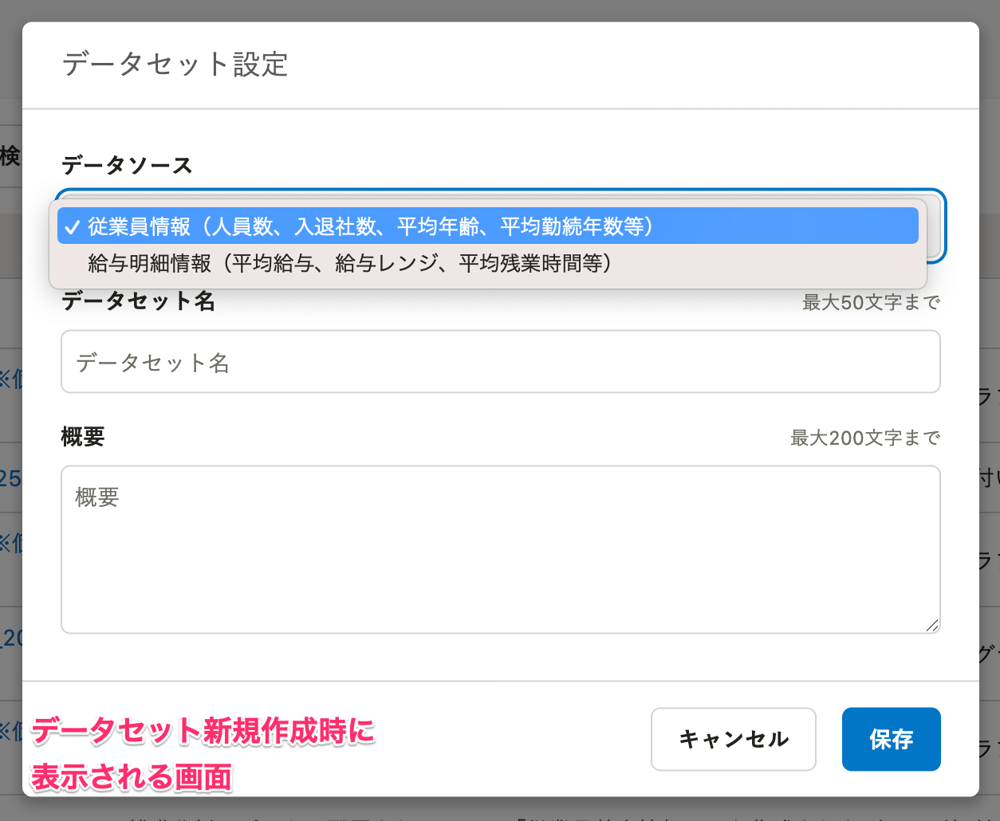
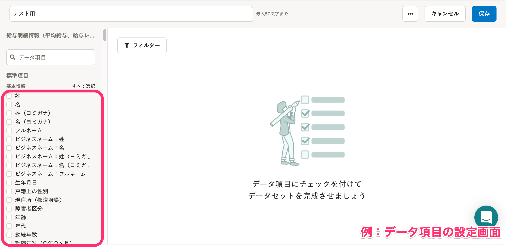
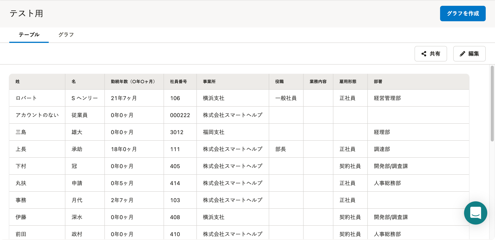
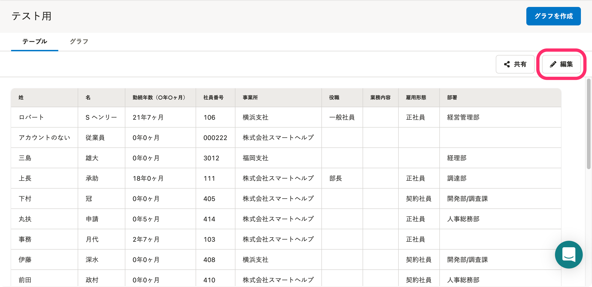

分析レポートでグラフを作成するために必要な「データセット」について説明します。

:::related
[分析レポートのデータの仕組み](https://knowledge.smarthr.jp/hc/ja/articles/4411387763993)
:::

# データセットの概要

分析レポートは、SmartHRに登録されているデータをもとにグラフを作成し、レポートとして自由にまとめられる機能です。

グラフの作成に必要な情報を1つにまとめたものを分析レポートでは「データセット」と呼び、1つの単位として管理しています。

データセットには以下3つの要素が含まれ、それぞれ設定が必要です。

- データソース：情報の引用元が「従業員情報」か「給与明細情報」かを示すもの
- データ項目：データソースに含まれる最小単位の情報（例：従業員情報の **［姓］** や **［名］** など）
- テーブル：データソースに含まれる情報のうち、どの情報をグラフに使うかを設定したもの

続いて、「データソース」と「データ項目とテーブル」について説明します。

## データソースとは

SmartHRから引用するデータは以下の2つに分けられ、分析レポートではこれらの総称を「データソース」と呼びます。

- 従業員情報（人員数、入退社数、平均年齢、平均勤続年数等）
- 給与明細情報（平均給与、給与レンジ、平均残業時間等）

例：データセット新規作成時に表示される画面

データセットに設定できるデータソースは、いずれか1つです。

データソースを選択後、グラフの要素として使いたい「データ項目」を設定します。

:::tips
人事・労務系のグラフを作成したい場合は「従業員情報」、勤怠・給与系のグラフを作成したい場合は「給与明細情報」を設定します。
:::

## データ項目、テーブルとは

### データ項目

グラフを作成する前に、データソースとして設定した従業員情報・給与明細情報から「どの情報を読み込むか」を選択します。

分析レポートでは、 **［姓］［名］［勤務年数］** など最小単位の情報を「データ項目」と呼びます。

例：データ項目の設定画面

例えば、「従業員情報」のデータソースをもとに「部署ごとの入社年月日」のグラフを作成したい場合は、データ項目として **［部署］［入社年月日］** を選択します。

### テーブル

データ項目を選択すると「テーブル」が作成されます。

データソースからどの情報を読み込むか、任意で設定したデータ項目の集まりを「テーブル」と呼びます。

1つのデータセットには1つのテーブルを作成でき、そのテーブルをもとにして複数のグラフを作成できます。

# よくある質問

## Q. テーブルに表示されているデータ項目を選びなおすには、どうしたらいいですか？

### A.［編集］をクリックした先の画面で、テーブルを編集してください。データ項目を選択できる画面が表示されます。

[テーブルを作成・編集する](https://knowledge.smarthr.jp/hc/ja/articles/360035221093)

## Q. データセット作成後、データソースは変更できますか？

### A. いいえ、データセット作成後にデータソースの変更はできません。

作成したデータセットを削除し、データセットを作成しなおしてください。

[データセットを作成・編集・削除する](https://knowledge.smarthr.jp/hc/ja/articles/360035221113)
