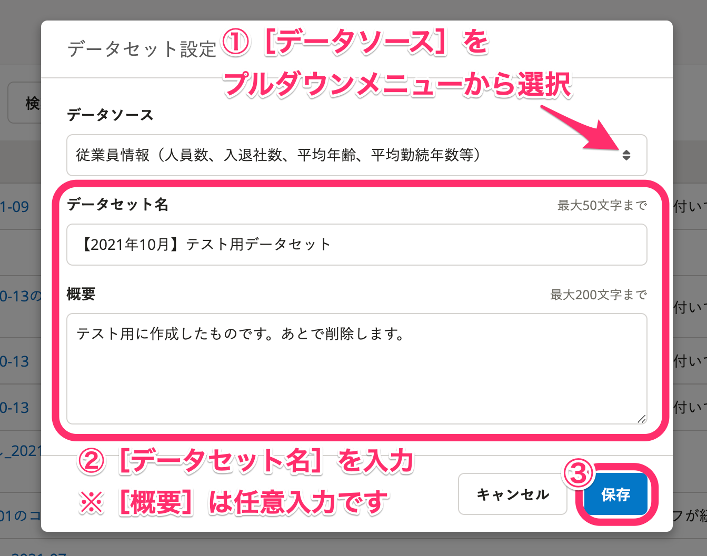
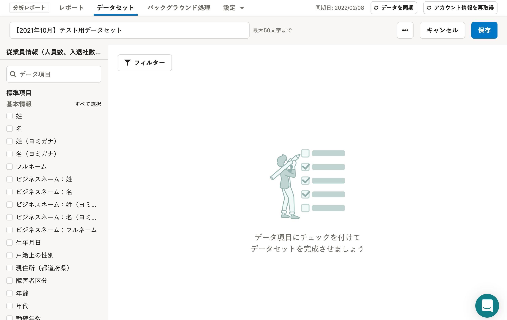

分析レポートのデータセットを作成する方法を説明します。

分析レポートのデータの仕組み、データセットの概要については、以下のヘルプページを参照してください。

:::related
[分析レポートのデータの仕組み](https://knowledge.smarthr.jp/hc/ja/articles/4411387763993)
[データセットとは](https://knowledge.smarthr.jp/hc/ja/articles/4411678184729)
:::

# 1\. 分析レポート機能を開き、［データセット］をクリック

画面上部にある分析レポートメニューの **［データセット］** をクリックすると、データセット一覧が表示されます。

# 2\. ［新規作成］をクリック

データセット一覧画面の右上にある **［新規作成］** をクリックすると、「データセット設定」のダイアログが表示されます。

# 3\. データセットの設定をして［保存］をクリック

 **［データソース］** をプルダウンメニューから選択し、 **［データセット名］** と **［概要］** （任意）を入力して **［保存］** をクリックするとデータセットを作成します。

:::alert
データセット作成後は、データソースの変更ができません。
データソースを修正したい場合は、データセットを作成しなおしてください。
:::

データセットが作成されると、データセットの編集画面が表示されます。

続いて、画面左側に表示されているデータ項目を選択し、「テーブル」を作成します。

# 4\. テーブルを作成する

データセットに含まれる「テーブル」とは、SmartHRの人事データベースから、どのデータ項目を分析レポート機能に読み込むかを設定するものです。

テーブルの作成・編集方法は下記のヘルプページを参照してください。

:::related
[テーブルを作成・編集する](https://knowledge.smarthr.jp/hc/ja/articles/360035221093)
:::
