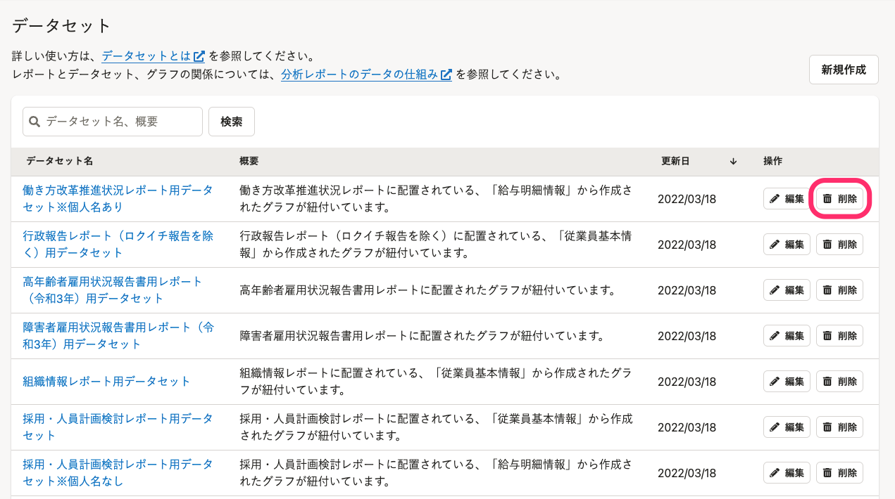
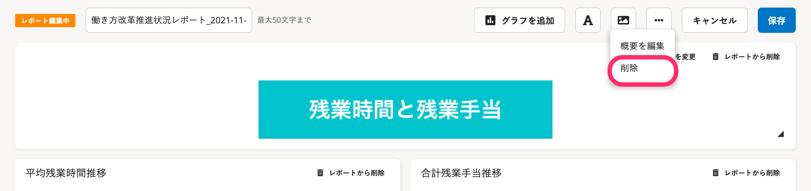
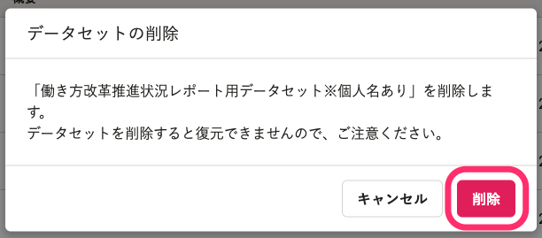

分析レポートのデータセットを削除する方法を説明します。

分析レポートのデータの仕組み、データセットの概要については、以下のヘルプページを参照してください。

:::related
[分析レポートのデータの仕組み](https://knowledge.smarthr.jp/hc/ja/articles/4411387763993)
[データセットとは](https://knowledge.smarthr.jp/hc/ja/articles/4411678184729)
:::

# 1\. データセット一覧画面で［削除］をクリック

データセット一覧画面で **［データセット名］** の右横に表示されている **［削除］** をクリックすると、「データセットの削除」ダイアログが表示されます。

:::tips
削除の操作は、データセットの編集画面からも可能です。
データセットの編集画面から操作する場合は、画面右上にある **［…］メニュー**  から **［削除］** をクリックしてください。
以降の手順はデータセット一覧画面から削除する場合と同じです。

:::

# 2\. ［削除］をクリック

内容を確認し、 **［削除］** をクリックするとデータセット一覧画面からデータセットが削除されます。

:::alert
削除したデータセットは復元できません。
:::
