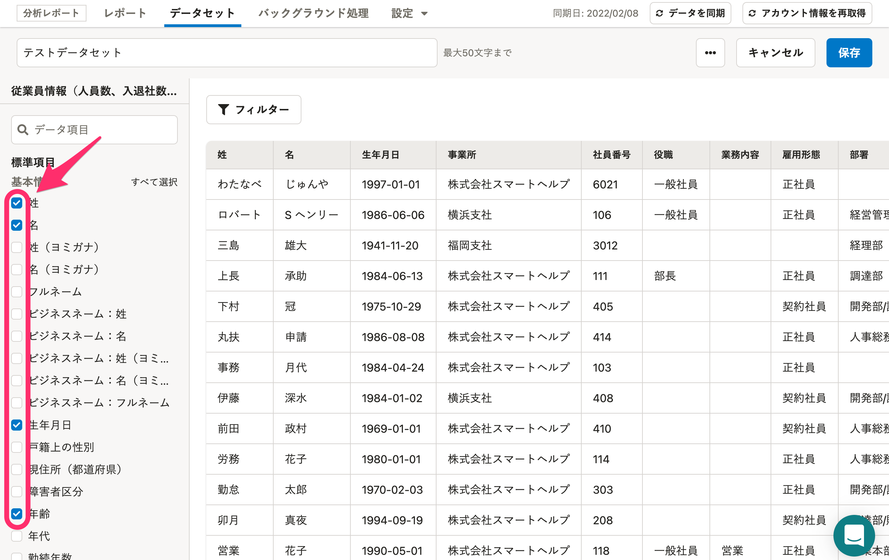
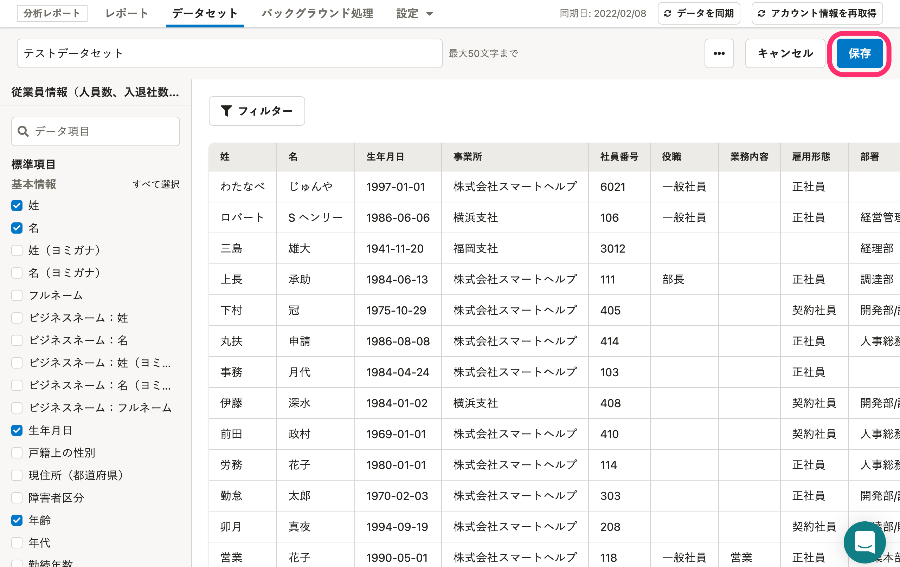
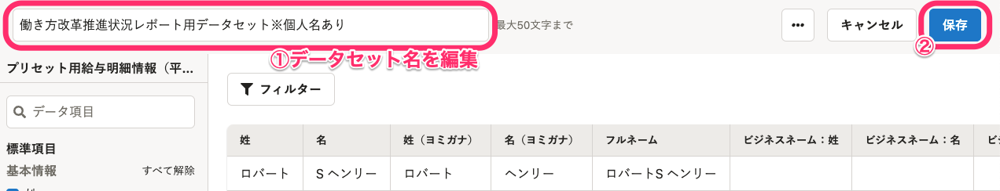
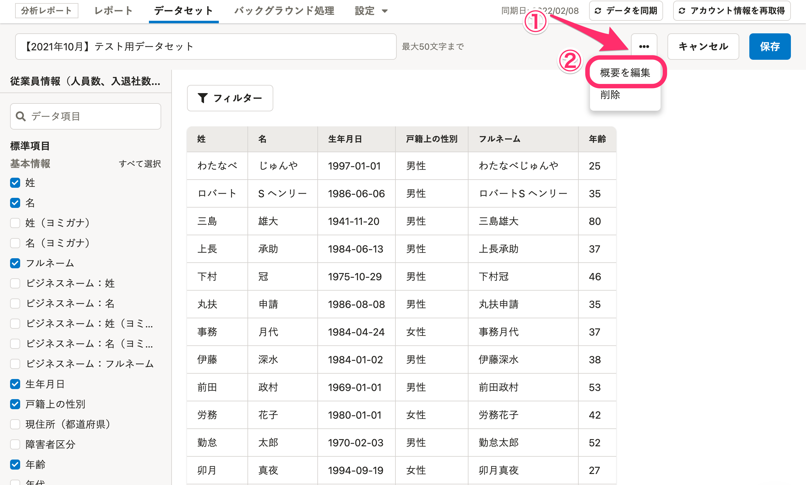
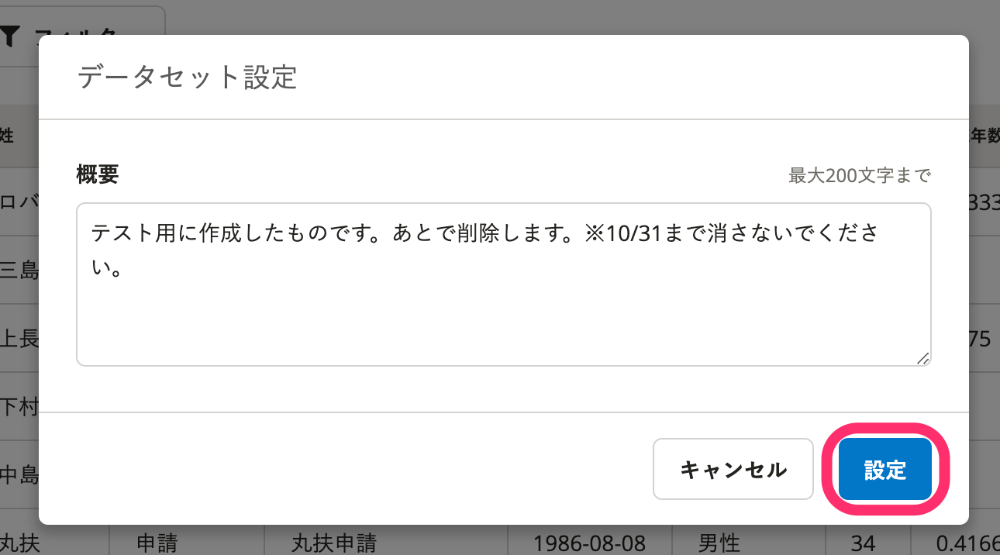
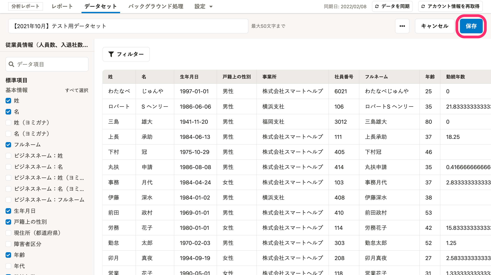

分析レポートのデータセットを編集する方法を説明します。

分析レポートのデータの仕組み、データセットの概要については、以下のヘルプページを参照してください。

:::related
[分析レポートのデータの仕組み](https://knowledge.smarthr.jp/hc/ja/articles/4411387763993)
[データセットとは](https://knowledge.smarthr.jp/hc/ja/articles/4411678184729)
:::

# データセットの内容を編集する

## 1\. データセット一覧画面で［編集］をクリック

データセット一覧画面で **［編集］** をクリックすると、データセットの編集画面が表示されます。

## 2\. データ項目を編集する

画面左側に、SmartHRに登録されている「従業員情報」または「給与情報」の項目が並んでいます。

データ項目を編集してください。

:::tips
画面左側の表示は、データセット作成時に設定した「データソース」により異なります。
以下の画像は「従業員情報」を設定した場合の表示です。

:::

データセットにはフィルターを設定できます。

フィルターの設定方法は下記のヘルプページを参照してください。

:::related
[フィルターを設定する](https://knowledge.smarthr.jp/hc/ja/articles/360035221193)
:::

## 3\. ［保存］をクリック

データセット編集画面右上の **［保存］** をクリックすると、選択した項目やフィルターの設定が保存されます。

# データセット名を編集する

## 1\. データセット一覧画面で［編集］をクリック

データセット一覧画面で **［編集］** をクリックすると、データセットの編集画面が表示されます。

## 2\. データセット名を編集し、［保存］をクリック

画面左上に表示されているデータセット名は直接書き換えられます。

データセット名を変更後、 **［保存］** をクリックすると変更が保存されます。

:::tips
データセット名は1〜50文字で入力してください。
:::

# データセットの概要を編集する

## 1\. データセット一覧画面で［編集］をクリック

データセット一覧画面で **［編集］** をクリックすると、データセットの編集画面が表示されます。

## 2\. ［…］メニュー >［概要を編集］をクリック

データセットの編集画面右上にある **［…］メニュー**  から **［概要を編集］** をクリックすると、「データセット設定」のダイアログが表示されます。

## 3\. ［概要］を編集し、［設定］をクリック

 **［概要］** を編集し、 **［設定］** をクリックすると内容が保存され、データセットの詳細画面に戻ります。

## 4\. ［保存］をクリック

データセットの詳細画面右上にある **［保存］** をクリックすると、変更が保存されます。

:::alert
データセット設定を変更後、 **［保存］** をクリックしないと、変更は保存されません。
:::
