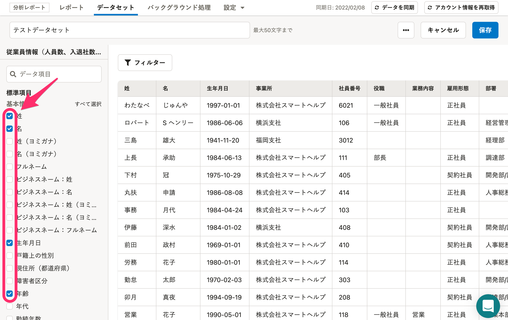
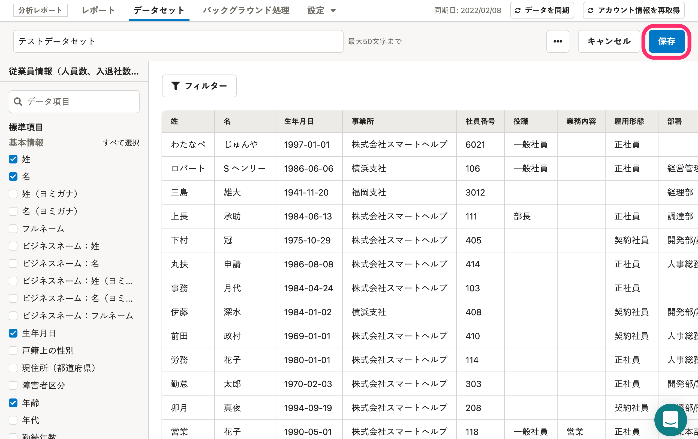

分析レポート機能のテーブルを作成・編集する方法と、テーブルに使用できるデータ項目について説明します。

# テーブルとは

テーブルとは、SmartHRの人事データベースからどのデータ項目を分析レポート機能に読み込むかを設定するものです。

1つのデータセットに1つのテーブルを作成でき、このテーブルをもとにして、従業員データを可視化する各種グラフを作成します。

# テーブルを作成する

データセットを作成すると、データセットの編集画面が表示され、テーブルが作成できるようになります。

テーブル作成後にグラフを作成する方法については、下記のヘルプページを参照してください。

:::related
[グラフを作成・編集・削除する](https://knowledge.smarthr.jp/hc/ja/articles/360035221133)
:::

## 1\. テーブルに使用する項目にチェックを入れる

画面左側に、SmartHRに登録されている「従業員情報」または「給与情報」の項目が並んでいます。

テーブルに使用する項目にチェックを入れてください。

:::tips
画面左側の表示は、データセット作成時に設定した「データソース」により異なります。
以下の画像は「従業員情報」を設定した場合の表示です。

:::

データセットにはフィルターを設定できます。

フィルターの設定方法は下記のヘルプページを参照してください。

:::related
[フィルターを設定する](https://knowledge.smarthr.jp/hc/ja/articles/360035221193)
:::

## 2\. ［保存］をクリック

データセット編集画面右上の **［保存］** をクリックすると、選択した項目やフィルターの設定が保存されます。

# テーブルに使用できるデータ項目

データ項目は、データセット作成時に設定したデータソース（「従業員情報」「給与情報」）により、内容が異なります。

データソースごとの、SmartHRから引用できるデータ項目は以下のとおりです。

## 従業員情報

| **分類** | **データ項目名** |
| --- | --- |
| 基本情報 | 姓 |
| 名 |
| 姓（ヨミガナ） |
| 名（ヨミガナ） |
| フルネーム |
| ビジネスネーム：姓 |
| ビジネスネーム：名 |
| ビジネスネーム：姓（ヨミガナ） |
| ビジネスネーム：名（ヨミガナ） |
| ビジネスネーム：フルネーム |
| 生年月日 |
| 戸籍上の性別 |
| 現住所（都道府県） |
| 障害者区分 |
| 年齢 |
| 年代 |
| 勤続年数 |
| 勤続年数（○年○ヶ月） |
| 業務情報 | 社員番号 |
| 事業所 |
| 業務内容 |
| 雇用形態 |
| 給与支給形態 |
| 部署 |
| 入退社情報 | 在籍状況 |
| 入社年月日 |
| 退職年月日 |
| 退職理由 |
| 雇用保険 | 雇用保険の資格取得年月日 |
| 雇用保険の資格喪失年月日 |
| 社会保険 | 報酬月額（通貨） |
| 報酬月額（現物） |
| 健康保険の標準報酬月額 |
| 厚生年金の標準報酬月額 |
| 配偶者の有無 |
| 社会保険の資格取得年月日 |
| 社会保険の資格喪失年月日 |
| 在留資格情報 | 国籍 |
| 在留資格 |
| 在留期日 |
| 資格外活動許可の有無 |
| 派遣・請負就労区分 |
| カスタム項目 | 従業員情報のカスタム項目として設定した内容を連携可 |

## 給与情報

データソース「従業員情報」のデータ項目に加えて、以下の内容をSmartHRの給与明細機能から引用します。

| **分類** | **データ項目名** |
| --- | --- |
| 基本情報 ※ | 支給日 |
|   対象期間（from）   |
| 対象期間（to） |
| 支給タイプ |
| 支給 | 給与明細項目の項目種別「支給」に登録している項目 例：基本給、職務手当、インセンティブ、通勤手当など |
| 控除 | 給与明細項目の項目種別「控除」に登録している項目 例：健康保険、厚生年金保険、雇用保険、所得税、住民税など |
| 勤怠 | 給与明細項目の項目種別「勤怠」に登録している項目 例：出勤日数、所定休日出勤日数、有給日数など |
| その他 |   給与明細項目の項目種別「その他・合計」に登録している項目 例：差引支給額、支給合計、控除合計、累積出勤時間、累積所得など   |

:::tips
※給与勤怠のデータ項目は、給与明細のステータスが **［確定済］** のものを引用します。
:::
