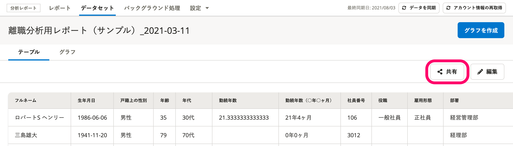
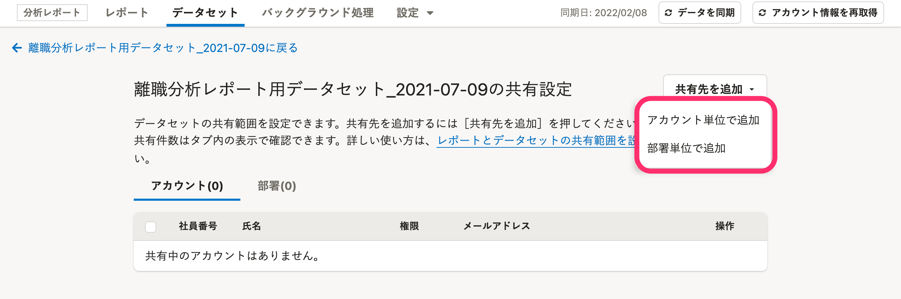
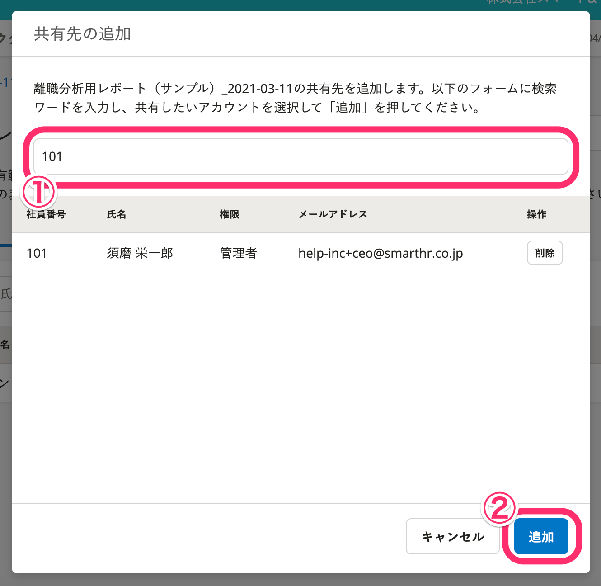
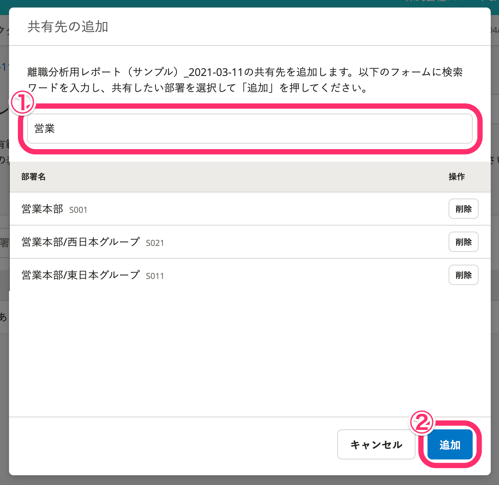
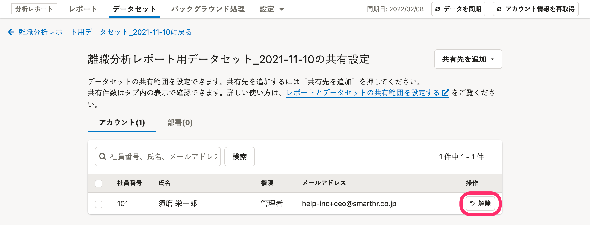
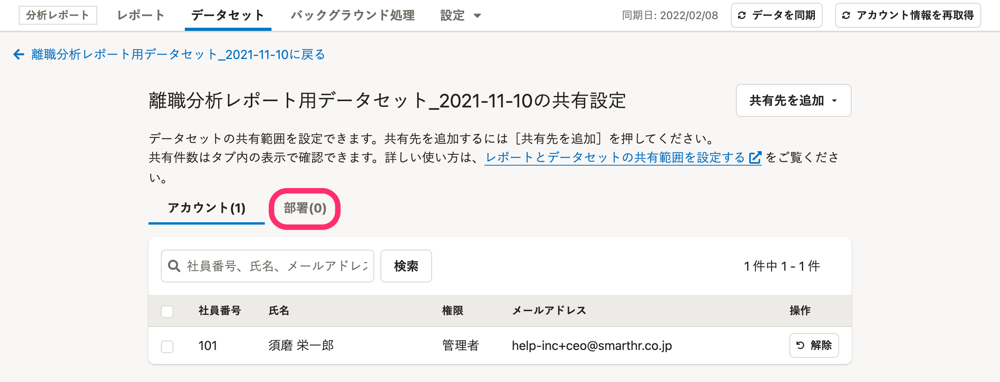
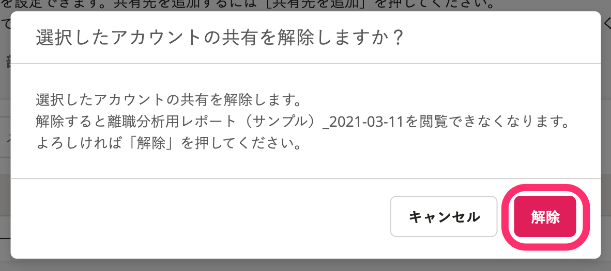
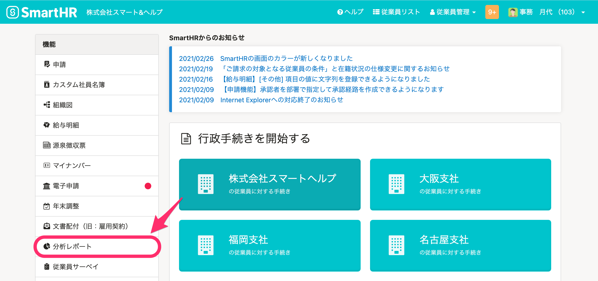
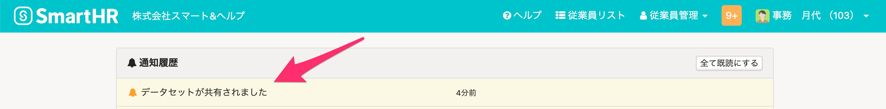

分析レポート機能で作成したレポートやデータセットを共有するには、共有範囲の設定が必要です。

当ページでは、共有を受けたアカウントの権限ごとの利用できる機能の違いと、共有範囲の設定・解除方法を案内します。

# 権限ごとの利用できる機能の違い

分析レポート機能には、管理者、分析者、閲覧者の3つの権限があります。

レポートやデータセットの共有を受けたアカウントができることは、分析レポート機能上で付与されている権限ごとに異なります。

詳細は以下の表のとおりです。

| **権限名** | **説明** |
| --- | --- |
| 管理者 | SmartHRで管理者権限を持つアカウントは、分析レポートでも管理者です。 分析レポートのすべての機能を利用できます。 |
| 分析者 |   共有されたレポートを編集できます。 また、共有されたデータセットをもとにグラフを作成・編集できます。   |
| 閲覧者 | 管理者以外のアカウントは、デフォルトで閲覧者権限が付与されます。 管理者や分析者から共有されたレポート、データセットを閲覧できます。 |

:::related
[分析レポートの権限を管理する](https://knowledge.smarthr.jp/hc/ja/articles/900004660946)
:::

# 共有先を設定する

データセットを例に、共有範囲の設定方法を案内します。

レポートの共有範囲を設定する場合は、レポートの詳細画面から **［共有］** をクリックして操作を進めてください。

手順2以降の操作手順は同じです。

## 1\. 任意の［データセット名］>「共有」をクリック

データセット一覧画面で共有したい **［データセット名］** をクリックすると、データセットの詳細画面に移動します。

データセットの詳細画面右上にある **［共有］** をクリックすると、データセットの共有設定画面が表示されます。

## 2\. 共有するアカウントを設定する

アカウント単位・部署単位での設定が可能です。

 **［共有先を追加▼］** をクリックすると、プルダウンメニューに **［アカウント単位で追加］［部署単位で追加］** が表示されます。

アカウント単位で追加する

 **［アカウント単位で追加］** をクリックすると、 **［共有先の追加］** 画面が表示されます。

画面内のフォームに検索ワード（社員番号、氏名、メールアドレス）を入力し、対象のアカウントを選択して **［追加］** をクリックしてください。

### 部署単位で追加する

 **［部署単位で追加］** をクリックすると、共有先の追加画面が表示されます。

画面内のフォームに検索ワード（部署名、部署コード）を入力し、対象の部署を選択して **［追加］** をクリックしてください。

# 共有を解除する

共有を解除したいアカウントもしくは部署の右側にある **［解除］** をクリックすると、確認画面が表示されます。

追加した部署を解除する場合は、タブの **［部署］** をクリックして一覧表示を切り替えてください。

確認画面で **［解除］** をクリックすると、選択したアカウントおよび部署へのデータセットの共有が解除されます。

下図はアカウントの共有を解除する場合の表示です。

# 共有された相手の画面

更新が反映されると、共有された相手のSmartHRのトップページにある **［機能］** 欄に **［分析レポート］** が表示されます。

また、共有設定時に下記のようなメールが送られます。

| 件名 | {データセットまたはレポート}が共有されました \| 〇〇株式会社 |
| --- | --- |
| 本文 | 〇〇様 〇〇 さんより、{データセットまたはレポート}が共有されました。 下記のURLよりご確認ください。 https://\*\*\*\*\*smarthr.\*\*\*\*\*/\*\*\*\*\*\*\*\*\*\*\*\*\*\* |

メールに記載されたリンク、またはSmartHRの通知履歴をクリックすると、共有されたデータセットまたはレポートに直接アクセスできます。

