分析レポートでグラフを作成・編集・複製・削除する方法を説明します。

グラフの操作は、データセットの詳細画面、レポートの詳細画面の両方から可能です。

# グラフを作成する

## 1\. 分析レポートを開き、［データセット］をクリック

画面上部にある分析レポートメニューの **［データセット］** をクリックすると、データセットの一覧画面が表示されます。

## 2\. 任意の［データセット名］をクリック

データセットの一覧画面から **［データセット名］** をクリックすると、データセットの詳細画面が表示されます。

## 3.［グラフを作成］をクリック

データセットの詳細画面右上にある **［グラフを作成］** をクリックすると、グラフ設定のダイアログが表示されます。

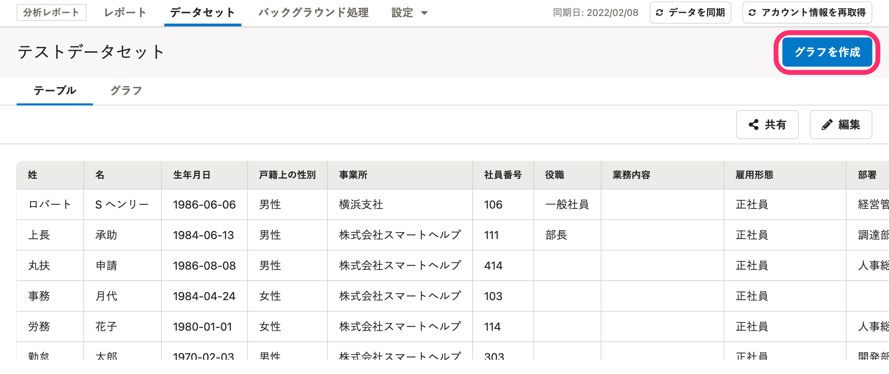

## 4.［グラフ名］を入力し、［作成］をクリック

 **［グラフ名］** を入力して **［作成］** をクリックすると、グラフが作成され、データセットの編集画面に移動します。

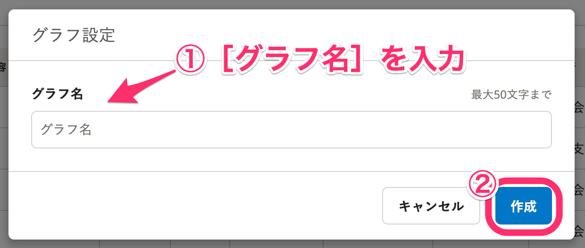

## 5\. 行・列・値を指定する

作成したいグラフに合わせて、グラフの編集画面左側にある **［データ項目］** を選び、行・列・値をドラッグアンドドロップで指定します。

例：「部署ごとの人数」を可視化するグラフ

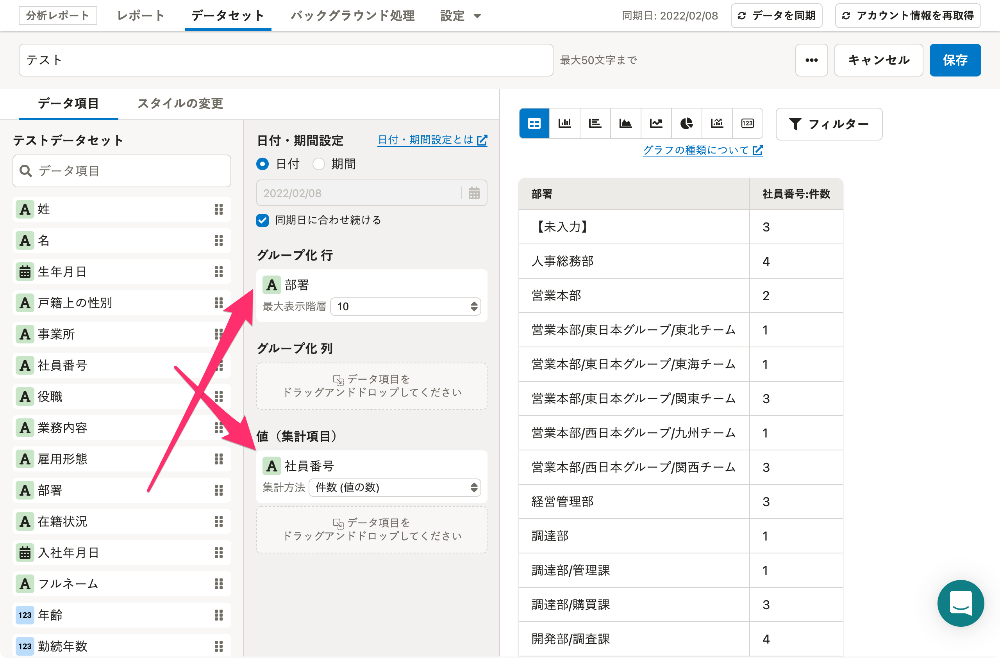

行・列・値を指定すると、画面右側にグラフのプレビューが表示されます。

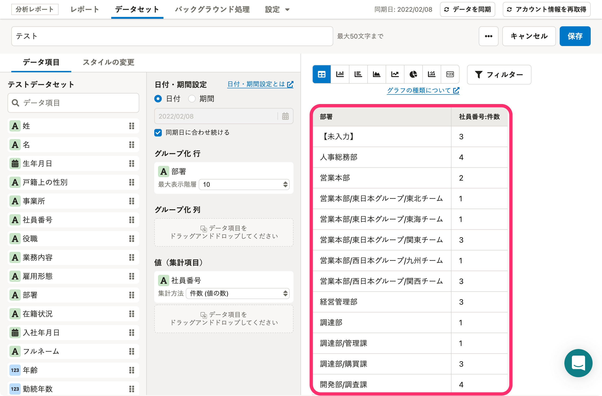

## 6\. （任意）フィルターを設定する

:::tips
フィルターを設定してグラフを保存すると、フィルターがかかった状態を維持できます。
例えば、「レポート閲覧のたびに特定の部署だけを表示するフィルター設定をしている」などの場合は、データセット編集画面のフィルター設定を利用することをおすすめします。
:::

グラフにはフィルターを設定できます。

 **［フィルター］** をクリックするとフィルター設定のダイアログが表示されます。

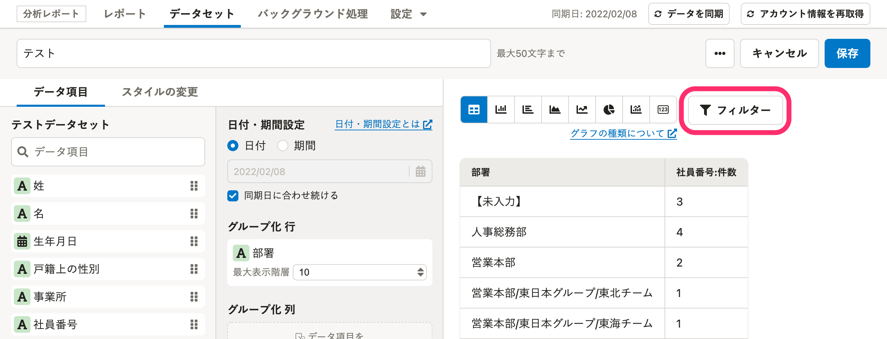

条件を追加して **［設定］** をクリックすると、設定した条件で情報を絞り込めます。

下図では、条件を「部署が空ではない」と設定することで、SmartHRの部署情報が **［【未入力】］** の従業員をグラフに含めないようにしています。

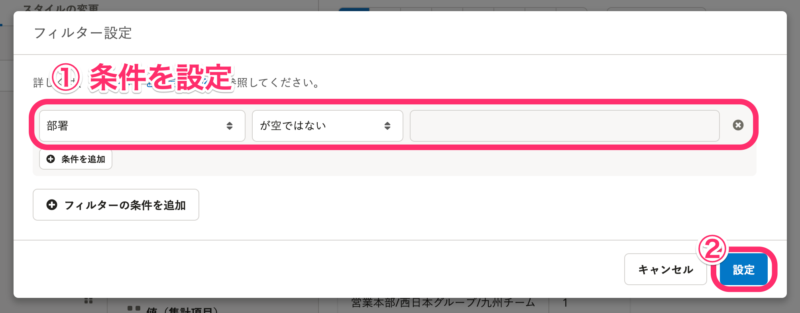

フィルター設定前

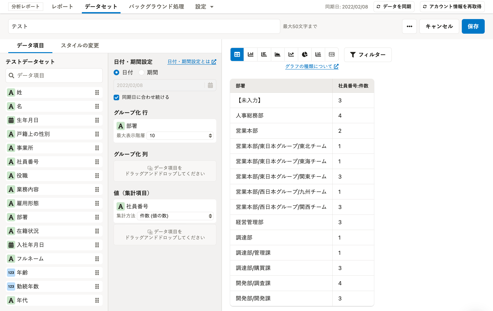

フィルター設定後

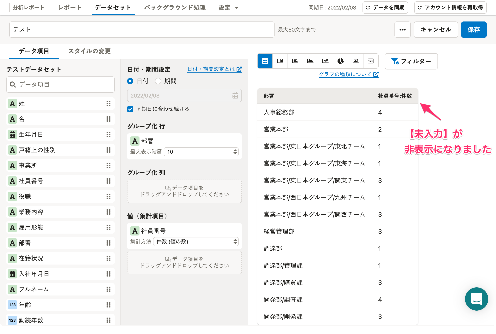

フィルター設定の詳細は、下記のヘルプページを参照してください。

:::related
[フィルターを設定する](https://knowledge.smarthr.jp/hc/ja/articles/360035221193)
:::

## 7\. グラフの種類を指定する

データセットの編集画面中央付近にある各種アイコンでグラフの種類を指定できます。

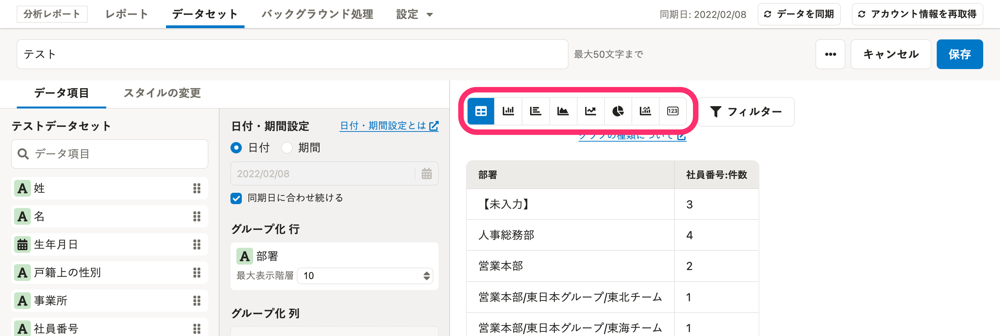

アイコンをクリックすると、グラフの表示が切り替わり、グラフの完成図を画面上で確認できます。

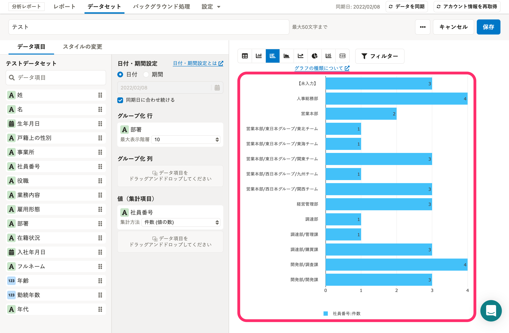

分析レポートで設定できる各種グラフとスタイルの詳細は下記のヘルプページを参照してください。

:::related
[【一覧】グラフとスタイルの種類](https://knowledge.smarthr.jp/hc/ja/articles/360034711174)
:::

## 8.［保存］をクリック

画面右上にある **［保存］** をクリックすると、データセットの詳細画面に戻ります。

データセットの詳細画面で、作成したグラフを確認できます。

# グラフを編集する

## レポートの詳細画面から編集する場合

### 1\. 分析レポートを開き、任意のレポート名をクリック

分析レポート画面上部の **［レポート］** をクリックし、編集したいグラフが含まれるレポート名をクリックすると、レポートの詳細画面が表示されます。

### 2\. 編集したいグラフの［…］メニューから［グラフ編集］をクリック

 **［…］メニュー** から **［グラフ編集］** をクリックすると、データセットの編集画面が表示されます。

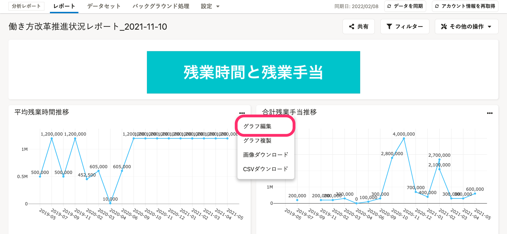

### 3\. グラフの内容を変更し、［保存］をクリック

データセット編集画面右上の **［保存］** をクリックすると、変更が保存されます。

## データセットの詳細画面から作成する場合

### 1\. 分析レポートを開き、［データセット］をクリック

分析レポート画面上部の **［データセット］** をクリックすると、データセット一覧画面が表示されます。

### 2\. 任意の［データセット名］をクリック

データセット一覧画面から、編集したいグラフが含まれる **［データセット名］** をクリックすると、データセットの詳細画面が表示されます。

### 3.［グラフ］表示に切り替え、編集したい［グラフ名］を選択して［編集］をクリック

データセットの詳細画面にある **［グラフ］** をクリックして、タブの表示を切り替えます。

編集したい **［グラフ**  **名］** を選択し、画面右側の **［編集］** をクリックすると、データセットの編集画面に移動します。

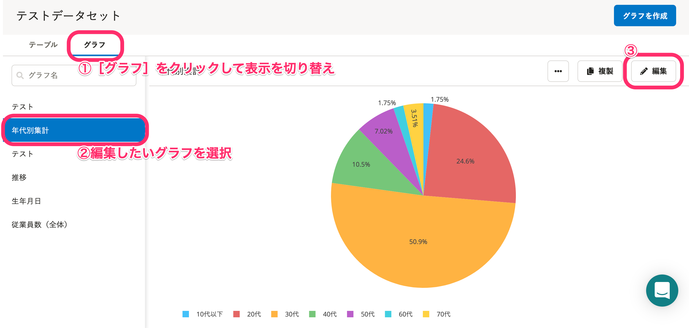

### 4\. グラフを編集し、［保存］をクリック

データセットの編集画面右上にある **［保存］** をクリックすると、変更が保存されます。

:::tips
グラフとスタイルの種類、組み合わせについては、下記のヘルプページを参照してください。
[【一覧】グラフとスタイルの種類](https://knowledge.smarthr.jp/hc/ja/articles/360034711174)
タイトルは、データセット編集画面左上にあるタイトル名から直接入力できます。
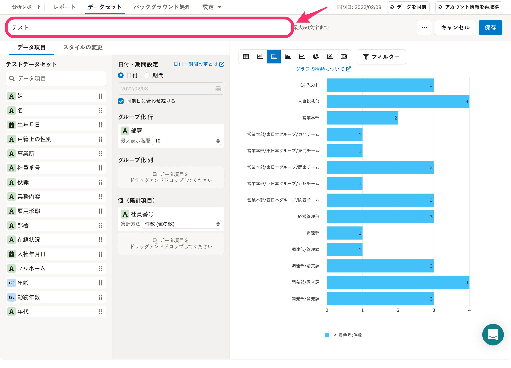
:::

# グラフを複製する

## レポートの詳細画面から複製する場合

### 1\. 分析レポートを開き、任意のレポート名をクリック

レポート一覧画面から複製したいグラフが含まれるレポート名をクリックすると、レポートの詳細画面が表示されます。

### 2\. 複製したいグラフの［…］メニューから［グラフ複製］をクリック

複製したいグラフの **［…］メニュー** から **［グラフ複製］** をクリックします。

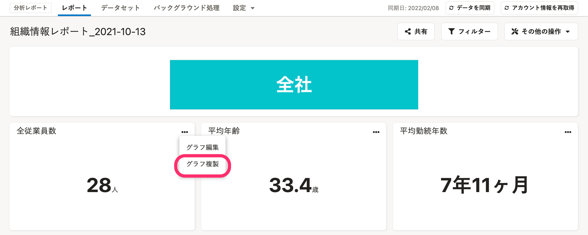

複製したグラフが「{複製元のグラフ名}のコピー」という名称でレポートの最上部に表示されます。

グラフの位置は、ドラッグアンドドロップで動かせます。

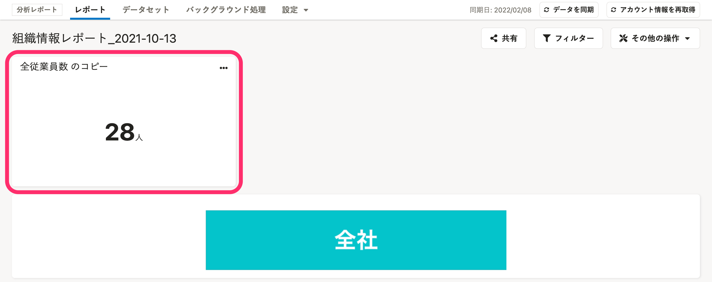

## データセットの詳細画面から複製する場合

### 1\. 分析レポートを開き、［データセット］をクリック

分析レポート画面上部の **［データセット］** をクリックすると、データセット一覧画面が表示されます。

### 2\. 任意の［データセット名］をクリック

データセット一覧画面から複製したいグラフが含まれる **［データセット名］** をクリックすると、データセットの詳細画面が表示されます。

### 3.［グラフ］をクリックして表示を切り替え、複製したい［グラフ名］>［複製］をクリック

データセットの詳細画面にある **［グラフ］** をクリックして、タブの表示を切り替えます。

複製したい **［グラフ名］** をクリックし、画面右側の **［複製］** をクリックすると、「グラフ設定」のダイアログが表示されます。

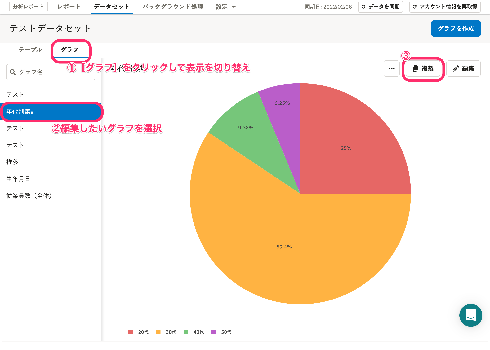

グラフ名の編集後、 **［作成**  **］** をクリックしてダイアログを閉じると、 複製されたデータセットの編集画面に移動します。

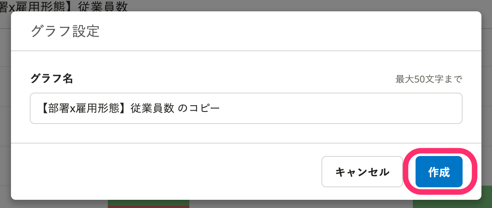

# グラフを削除する

:::alert
削除したグラフは復元できません。
:::

## レポートの詳細画面から削除する場合

### 1\. 分析レポートを開き、任意のレポート名をクリック

レポート一覧画面から削除したいグラフが含まれるレポート名をクリックすると、レポートの詳細画面が表示されます。

### 2\. 削除したいグラフの［…］メニューから［グラフ編集］をクリック

削除したいグラフの **［…］メニュー** から **［グラフ編集］** をクリックすると、データセットの編集画面が表示されます。

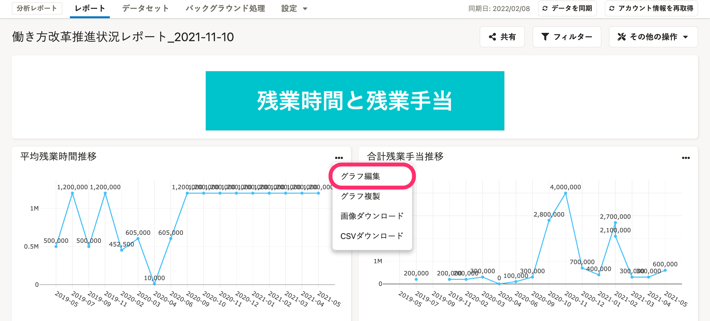

### 3\. ［…］メニューの［削除］をクリック

データセット編集画面の **［…］メニュー** にある **［削除］** をクリックすると、「 **［グラフ名］** を削除します」というダイアログが表示されます。

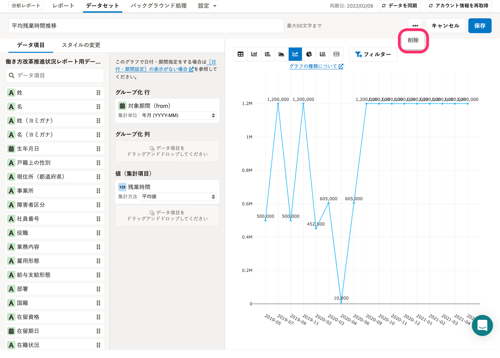

### 4.［削除］をクリック

 **［削除］** をクリックするとグラフを削除します。

## グラフの編集画面から削除する場合

### 1\. 分析レポートを開き、［データセット］をクリック

分析レポート画面上部の **［データセット］** をクリックすると、データセット一覧画面が表示されます。

### 2\. 任意の［データセット名］をクリック

データセット一覧画面から削除したいグラフが含まれる **［データセット名］** をクリックすると、データセットの詳細画面が表示されます。

### 3.［グラフ］表示に切り替え、削除したい［グラフ名］を選択して［編集］をクリック

 **［グラフ］** をクリックして、データセットの詳細画面の表示を切り替えます。

削除したい **［グラフ**  **名］** を選択し、画面右側の **［編集］** をクリックすると、データセットの編集画面に移動します。

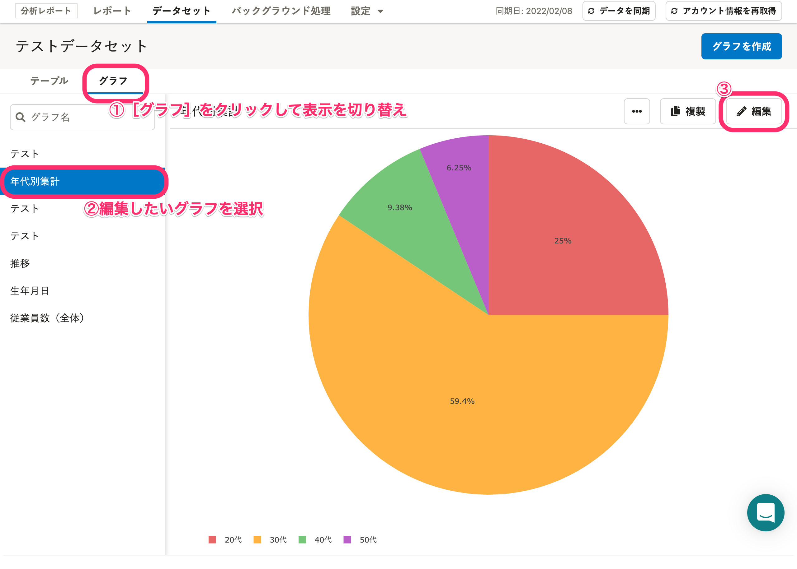

### 4.［…］メニューから［削除］をクリック

データセットの編集画面にある **［…］メニュー** から **［削除］** をクリックすると、「 **［グラフ名］** を削除します」というダイアログが表示されます。

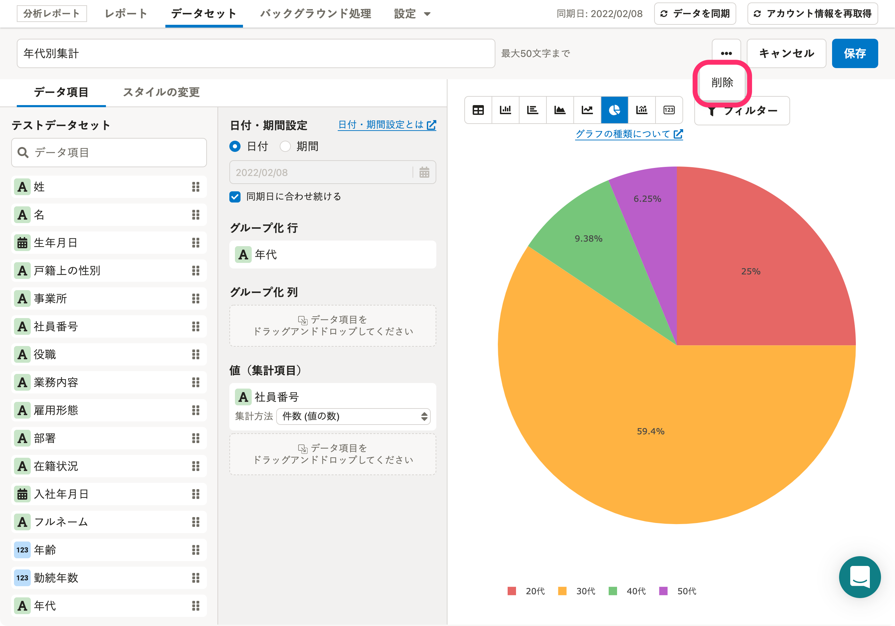

 **［削除］** をクリックするとグラフを削除します。
