分析レポートのレポートやグラフにフィルターを設定する方法を説明します。

# フィルターとは

フィルターを設定することで、レポートやグラフで特定の条件のデータのみを抽出できます。

条件は、複数組み合わせることも可能です。

レポートやデータセットの編集画面で **［フィルター］** をクリックすると、 **［フィルター設定］** のダイアログが表示されます。

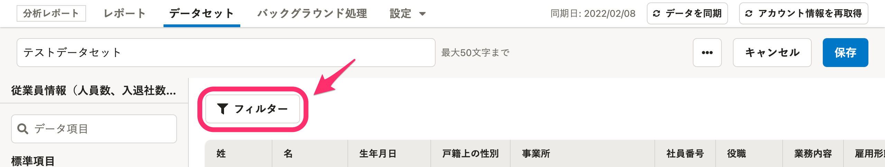

:::tips
**データセットの編集画面で設定した「フィルター設定」は保存できます**
フィルターを設定してデータセットを保存すると、フィルターがかかった状態を維持できます。
例えば、「レポート閲覧のたびに特定の部署だけを表示するフィルター設定をしている」などの場合は、データセット編集画面のフィルター設定を利用することをおすすめします。
:::

# フィルターを設定する

## 1\. 項目を設定する

「生年月日」や「戸籍上の性別」など、フィルターに使用する項目を設定します。

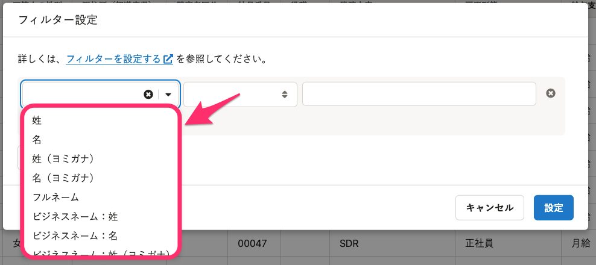

## 2\. 条件を設定する

「が次に等しい」や「が次より大きい」などの条件を設定します。

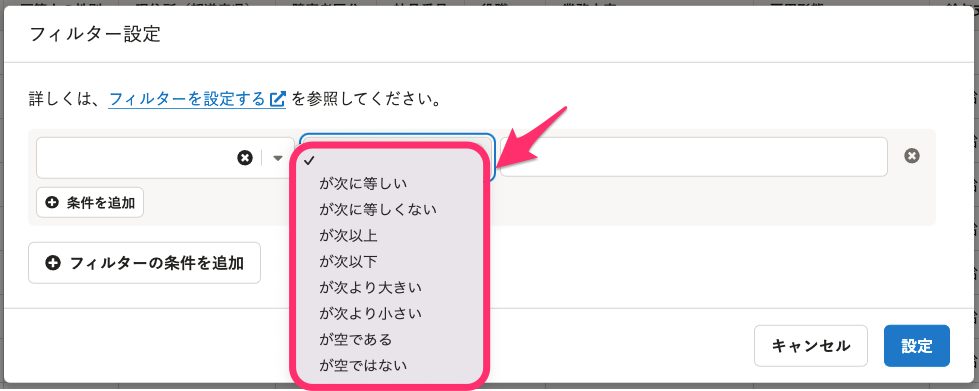

## 3\. 比較する値を設定する

比較する値によって、入力欄の形式が変わります。

### テキスト・数値の場合

自由入力欄になります。

例：「姓」「名」「業務内容」など

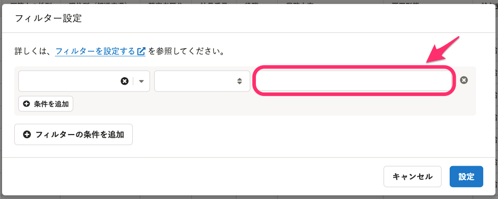

### 日付の場合

「集計日」「集計年月」「集計年」「特定の日付」を選択するプルダウンになります。

例：「生年月日」「入社年月日」「支給日」など

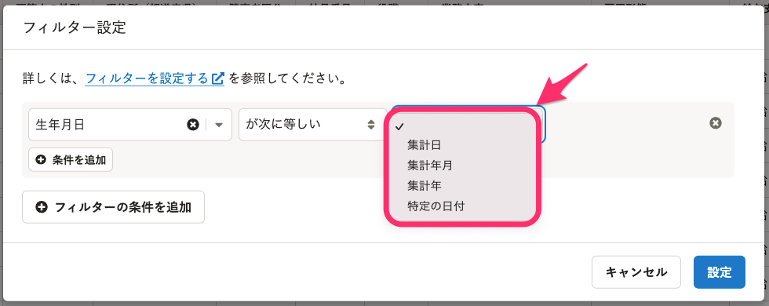

### 選択肢のある項目の場合

プルダウンになります。

例：「戸籍上の性別」「在籍状況」「部署」など

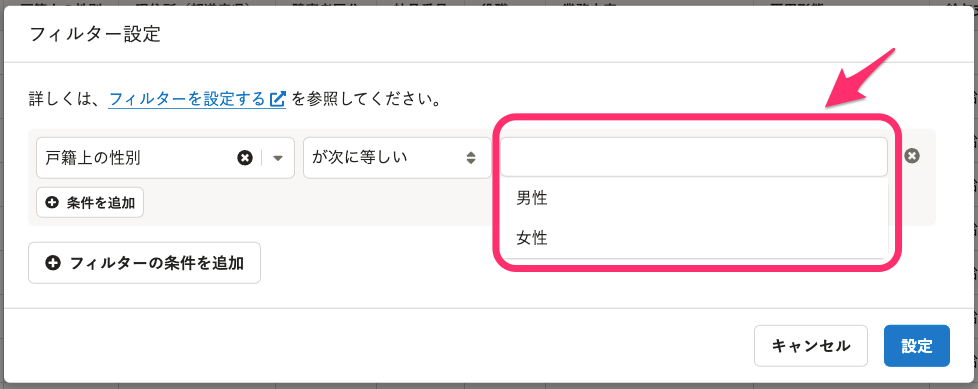

条件を「が空である」にすると、値の欄がグレーアウトして入力できません。

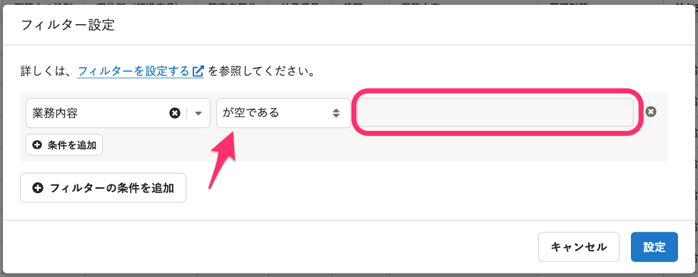

## 4\. ［設定］をクリック

 **［設定］** をクリックするとフィルターを設定します。

# フィルターを解除する

条件の右端に表示されている **［×］** をクリックすると、条件を削除できます。

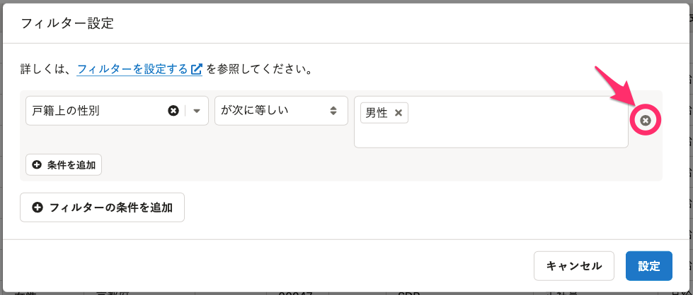

# 条件グループを設定する

条件を組み合わせることで、より複雑なフィルターを設定できます。

## 1\. ［＋条件を追加］をクリック

既存の条件のすぐ下に表示されている **［＋条件を追加］** をクリックすると、同じ条件グループ内に条件を追加します。

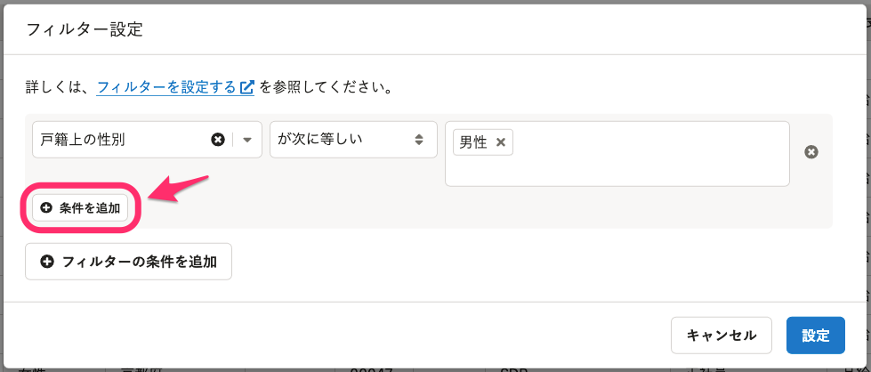

## 2\. 条件の関係を設定する

「and」にすると、両方の条件を満たすデータを表示します。
「or」にすると、どちらかの条件を満たすデータを表示します。

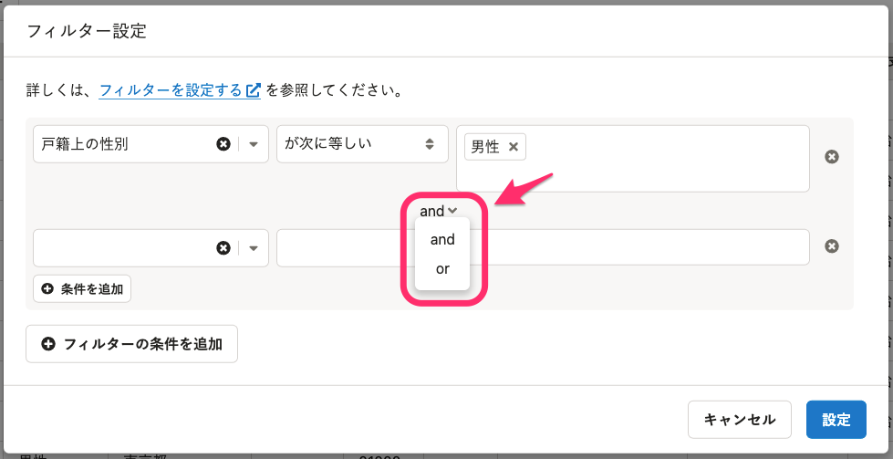

## 3\. 条件を追加して、［設定］をクリック

条件を追加して **［設定］** をクリックすると、フィルターを設定します。

条件の設定方法は、同ページ内「[フィルターを設定する](#i-2)」と同じです。

# 条件グループを複数設定する

複数の条件（条件グループ）を組み合わせることもできます。

## 1\. ［＋フィルターの条件を追加］をクリック

 **［＋フィルターの条件を追加］** をクリックすると、新たな条件グループの設定欄が下に追加されます。

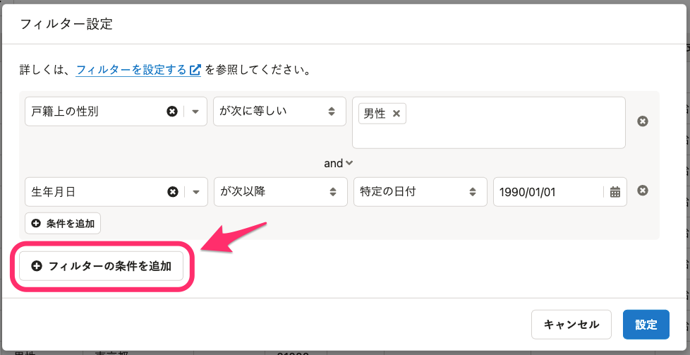

## 2\. 条件同士の関係を設定する

「and」か「or」を選び、グループ同士の関係を設定します。

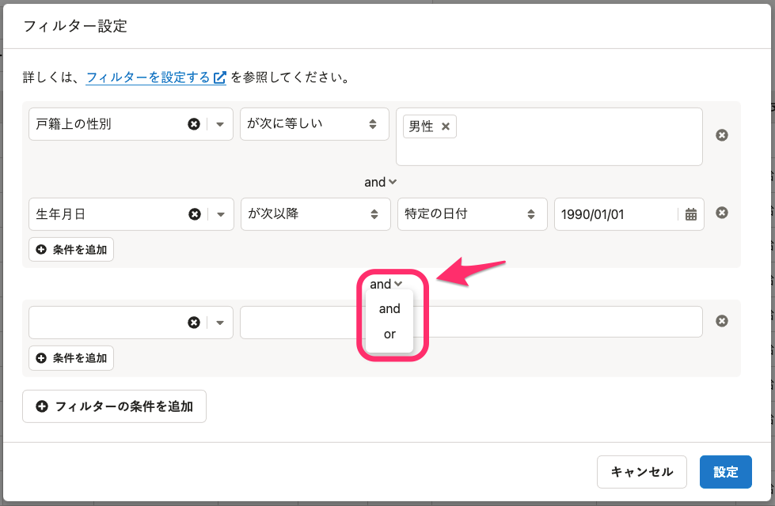

## 3\. 追加した条件を設定する

追加したい条件を設定してください。

# フィルターを編集する

フィルターを設定していると、 **［フィルター］** のアイコンが青になり、チェックマークが表示されます。

 **［フィルター］** をクリックすると、「フィルター設定」のダイアログが表示され、条件が編集できます。

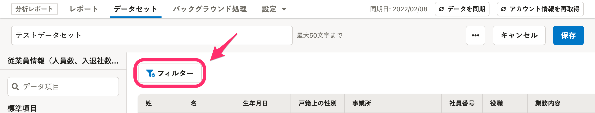

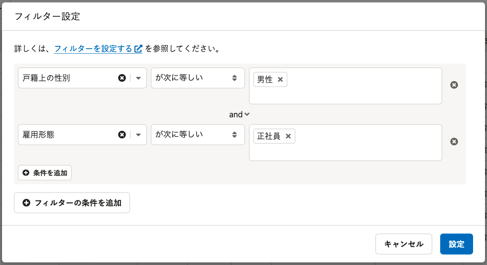
