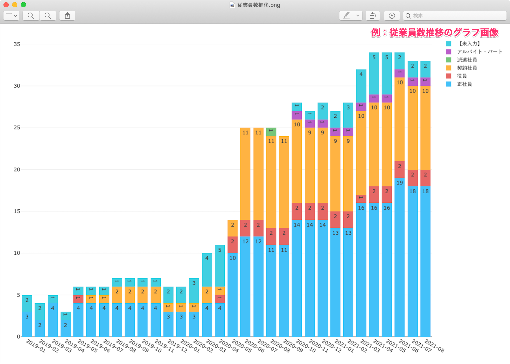

分析レポートで作成したグラフは、グラフ単位で、png形式の画像またはCSVファイルでのダウンロードが可能です。

グラフの画像を社内資料に利用したい場合や、グラフ作成に利用した従業員数や勤続年数のデータを二次加工したい場合などにお役立てください。

# レポートの詳細画面からダウンロードする

## 1\. レポート一覧画面で任意のレポート名をクリック

レポート一覧画面から任意のレポート名をクリックすると、レポートの詳細画面が表示されます。

## 2\. 任意のグラフを選び、［…］メニューからダウンロード対象を選択

任意のグラフを選び、 **［…］メニュー** から **［画像ダウンロード］** または **［CSVダウンロード］** をクリックすると、データのダウンロードを開始します。

例：ダウンロードした従業員数推移（全体）のグラフ画像

例：ダウンロードした従業員数推移（全体）のCSVファイル

# データセットの詳細画面からダウンロードする

## 1.［データセット］> 任意のデータセット名をクリック

分析レポート機能の画面上部にある **［データセット］** をクリックし、データセット一覧から任意のデータセット名をクリックすると、データセットの詳細画面が表示されます。

## 2\. ［グラフ］タブにある任意のグラフを選び、［…］メニューからダウンロード対象を選択

画面左上にある **［グラフ］** タブをクリックして任意のグラフを選び、 **［…］メニュー** から **［画像ダウンロード］** または **［CSVダウンロード］** をクリックすると、データのダウンロードを開始します。

