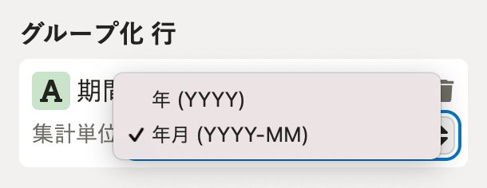

グラフに任意の日付・期間を指定する方法を説明します。

:::tips
各種プリセットレポートを追加・複製し、プリセットレポートに含まれるグラフをカスタマイズすることで、さまざまな用途に活用できます。
詳しくは「日付・期間指定の活用ポイント」の項目を参照してください。
:::

# はじめに

操作手順は、データセットの編集画面に **［日付・期間設定］** の表示がある場合とない場合で異なります。

日付・期間を指定したいグラフを準備し、 **［グループ化 行］** の上に **［日付・期間設定］** の表示があるか確認してください。

## ［日付・期間設定］の表示がある場合の表示

 **［日付・期間設定］** の表示がある場合は、同ページ内の[［日付・期間設定］の表示がある場合](https://knowledge.smarthr.jp/hc/ja/articles/900005586003#toc--4)の手順を参照してください。

## ［日付・期間設定］の表示がない場合の表示

 **［日付・期間設定］** の表示がない場合は、同ページ内の[［日付・期間設定］の表示がない場合](#no-date-picker)の手順を参照してください。

:::tips
給与・勤怠情報が含まれるデータ項目をもとに作られたデータセットの編集画面には、 **［グループ化 行］** の上に期間の表示がありません。
:::

# ［日付・期間設定］の表示がある場合

## 日付を指定する

以下では、プリセットレポートの組織情報レポートに含まれる「【部署x雇用形態】従業員数」のグラフを例に、2020年1月31日の日付を指定する方法を案内します。

### 1\. ［日付・期間設定］の下にある［同期日に合わせ続ける］のチェックを外す

 **［日付・期間設定］** の下にある **［同期日に合わせ続ける］** のチェックを外すと、任意の日付を指定できるようになります。

:::tips
 **［同期日に合わせ続ける］** にチェックを入れると、特定の日付ではなく、データ同期日時点の情報を表示します。
:::

### 2\. 任意の日付を指定する

日付の入力欄に任意の日付を入力、または、入力欄をクリックすると表示されるカレンダー上で任意の日付を指定します。

例：2020年1月31日を指定

指定した日付が反映されていることを確認してください。

### 3\. ［保存］をクリック

画面右上にある **［保存］** をクリックすると、レポートまたはデータセットの詳細画面が表示されます。（データセットの編集画面を表示する直前のページを表示します。）

## 期間を指定する

以下では、プリセットレポートの組織情報レポートに含まれる「従業員数推移」のグラフを例に、2020年1月1日〜12月1日の期間を指定する方法を案内します。

### 1\. ［日付・期間設定］の下にある［終了日を同期日に合わせ続ける］のチェックを外す

 **［日付・期間設定］** の下にある **［終了日を同期日に合わせ続ける］** のチェックを外すと、任意の期間を指定できるようになります。

:::tips
従業員数推移、平均年齢推移、平均勤続年数推移、男女比推移などのグラフは、 **［▲］［▼］** をクリックすると、期間の表示を年単位とするか、年月単位とするかを指定できます。

システム標準の設定では「年月」が指定されています。
:::

### 2.［開始日］と［終了日］を指定する

 **［開始日］** と **［終了日］** の入力欄に任意の日付を入力、または、入力欄をクリックすると表示されるカレンダー上で開始日と終了日をそれぞれ指定します。

例：2020年1月1日〜12月31日の期間を指定

:::tips
カレンダーの表示年月を切り替える方法は下記の通りです。
■表示年を変更
 **［▼］** をクリックすると、表示する年を選択できる画面が表示されます。
任意の年をクリックしてください。

■表示月を変更
 **［<］** をクリックすると前月を表示、 **［>］** をクリックすると次月を表示します。

:::

### 3\. ［保存］をクリック

画面右上にある **［保存］** をクリックすると、レポートまたはデータセットの詳細画面が表示されます。（データセットの編集画面を表示する直前のページを表示します。）

# ［日付・期間設定］の表示がない場合

 **［日付・期間設定］** の表示がない場合は、 **［フィルター］** で「支給日」「期間（from）」「期間（to）」などの条件を追加して日付・期間を指定します。

以下では、プリセットレポートの勤怠レポートに含まれる「月間残業時間推移（平均、中央値）」のグラフを例に、2020年1月1日以降の期間を指定する方法を案内します。

## 1.［フィルター］をクリック

 **［フィルター］** をクリックすると、フィルター設定画面が表示されます。

## 2.［＋フィルターの条件を追加］をクリックし、条件を入力して［設定］をクリック

 **［＋フィルターの条件を追加］** をクリックし、条件を入力して **［設定］** をクリックします。

例：条件として「対象期間（from）」が「特定の日付（2020年1月1日）以降」を入力した場合

指定した期間のとおり表示されていることを確認してください。

## 3.［保存］をクリック

画面右上にある **［保存］** をクリックすると、レポートまたはデータセットの詳細画面が表示されます。（データセットの編集画面を表示する直前のページを表示します。）

# 日付・期間指定の活用ポイント

各種プリセットレポートを追加・複製し、プリセットレポートに含まれるグラフの日付・期間指定をすることで、レポートを共有する相手の権限に関わらず、汎用的に使える資料を作成できます。

月ごと、年ごとに編集する必要はありますが、以下のような場合にお役立てください。

## 例：広報チームの確認用に、その月の1日時点の従業員数を確認できる資料がほしい

プリセットレポート「組織情報レポート」を追加し、必要に応じてグラフを追加・削除してください。

すべてのグラフの日付をその月の1日に指定して保存すると、その月の1日時点の従業員数にまつわる内容が確認できるレポートが完成します。

プリセットレポートの初期設定や追加方法については、下記のヘルプページを参照してください。

:::related
[プリセットレポートの初期設定をする](https://knowledge.smarthr.jp/hc/ja/articles/360049292533)
[プリセットレポートを追加する](https://knowledge.smarthr.jp/hc/ja/articles/1500001783842)
:::
