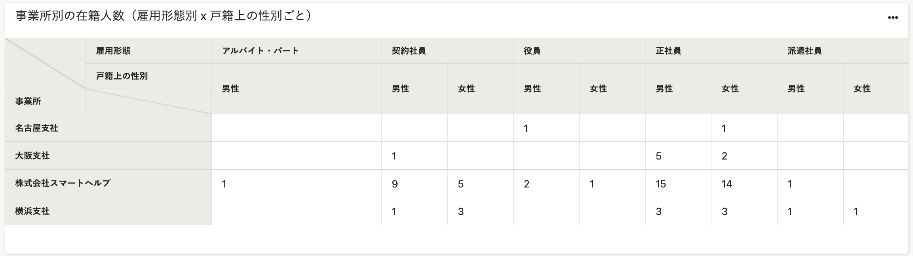
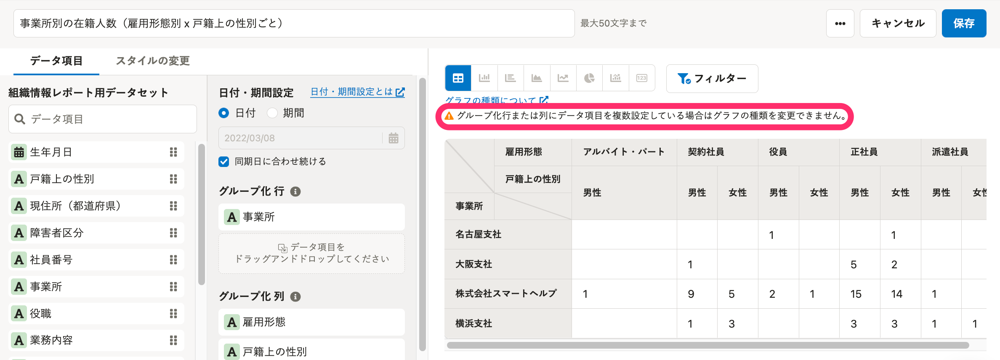
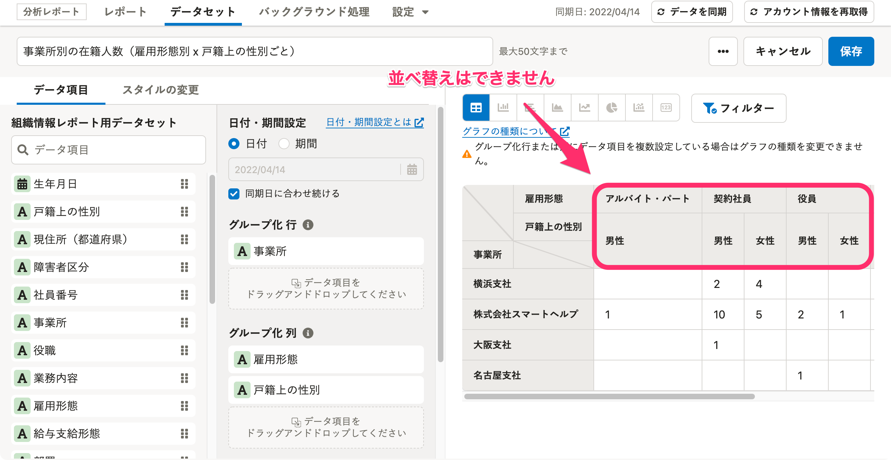
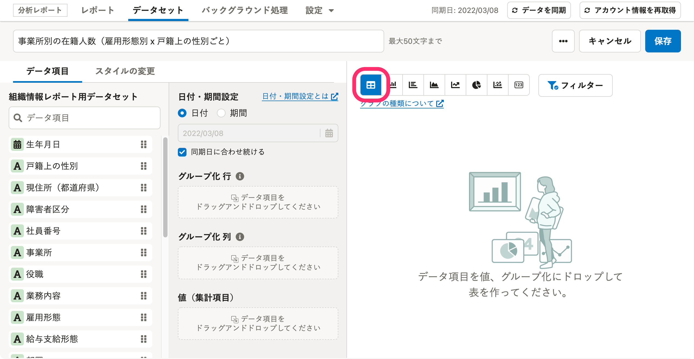
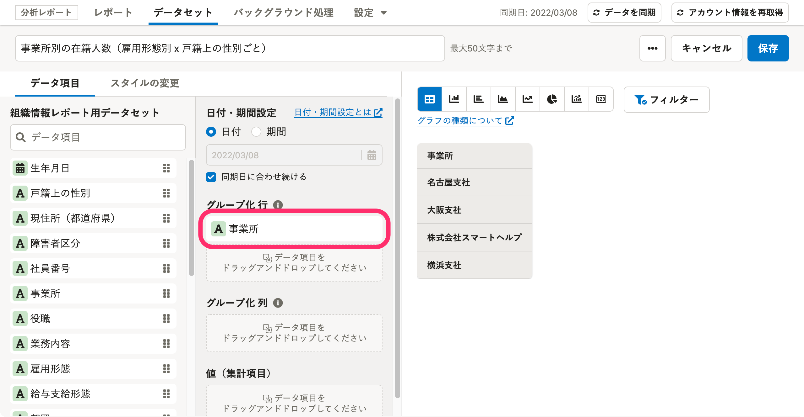
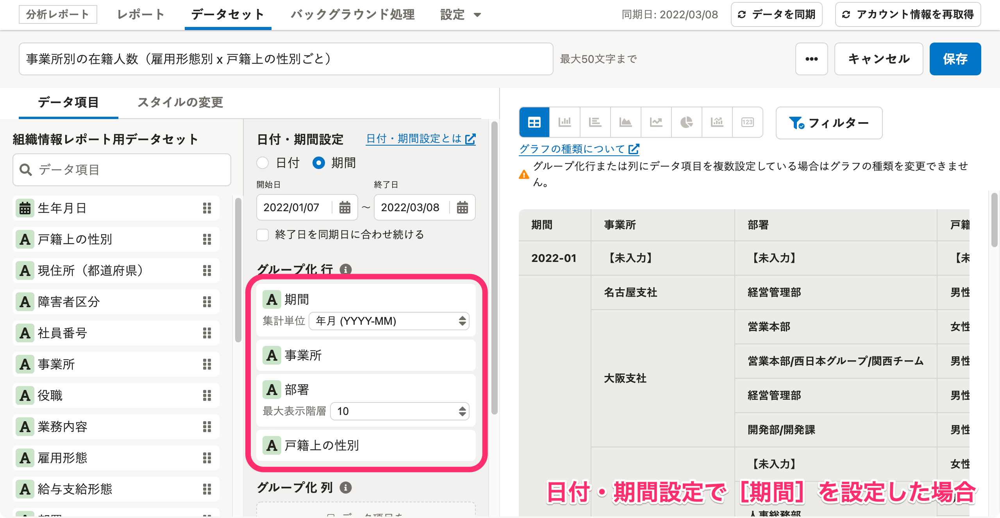
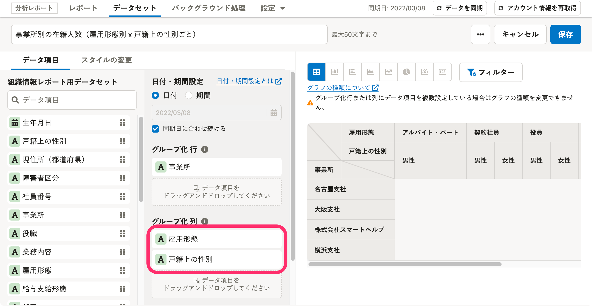
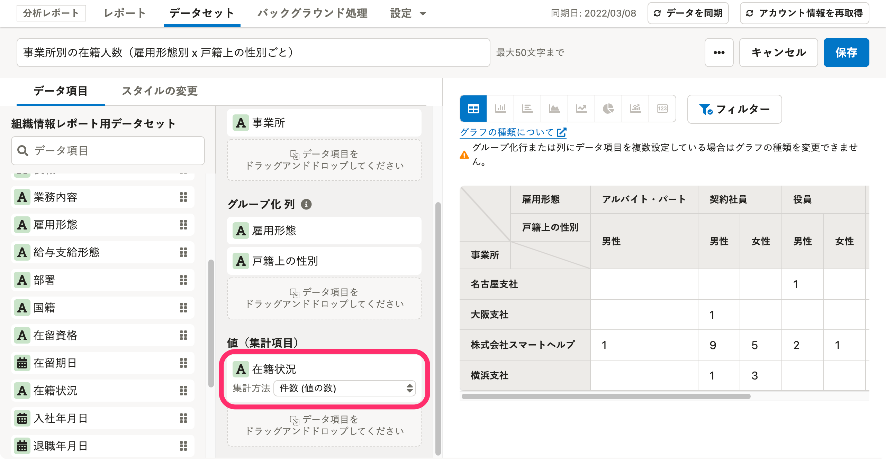
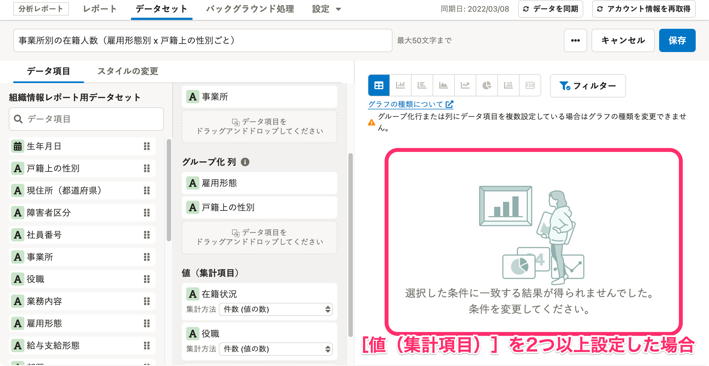
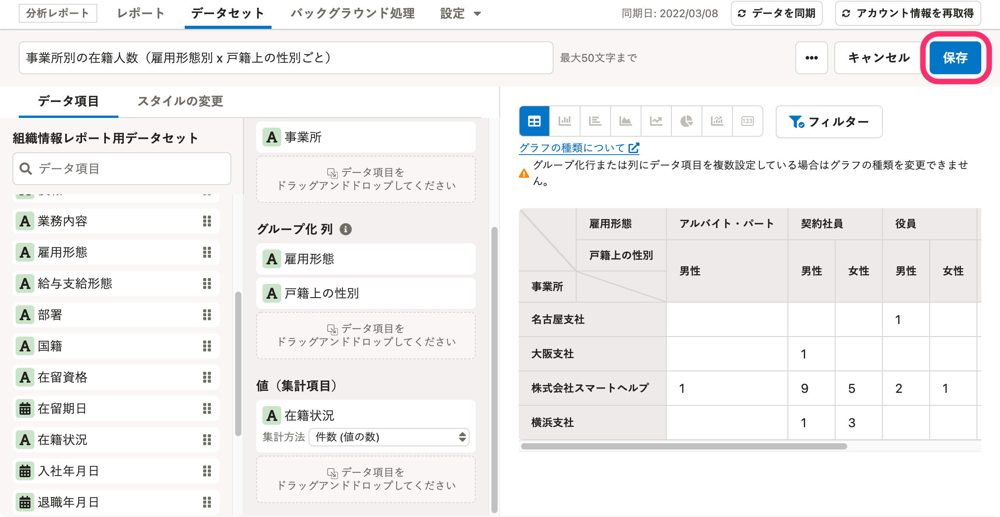

表（ストレートテーブル）に複数のデータ項目を設定する方法を説明します。

ある数字を複数の切り口から確認したい場合に活用してください。

- 例：従業員の勤続年数を、**事業所別**かつ**雇用形態別**で確認したい
- 例：従業員の平均年齢を、**部署別**かつ**戸籍上の性別ごと**で確認したい

グラフの編集画面を開いた状態を準備して、操作をはじめてください。

# 注意事項

## 給与や勤怠に関するデータセットをもとに作成されたグラフは、データ項目の複数設定に対応していません

グラフのもととなるデータセットのデータソースに「給与明細情報」が設定されている場合は、データ項目の複数設定の対象外です。

給与や勤怠に関するデータ項目の複数設定対応については、2022年中のリリースを予定しています。

リリースの際は[分析レポートのリリースノート](https://knowledge.smarthr.jp/hc/ja/sections/4410294055833)でお知らせします。

## ストレートテーブル以外のグラフでは、複数のデータ項目を設定できません

複数のデータ項目の設定に対応しているのは、ストレートテーブルのみです。

2つ以上のデータ項目を **［グループ化 行］** または **［グループ化 列］** に設定すると、「グループ化行または列にデータ項目を複数設定している場合はグラフの種類を変更できません。」というメッセージが表示され、グラフの種類はストレートテーブル以外選択できなくなります。

グラフの種類を変更したい場合は、 **［グループ化 行］** と **［グループ化 列］** に設定したデータ項目が1つになるまで削除してください。

## 列名に表示された要素の横方向の並べ替えはできません

具体的には以下の通りです。

例： **［グループ化 列］** に **［雇用形態］** と **［戸籍上の性別］** を設定した場合

 **［アルバイト・パート］［契約社員］［役員］** 、 **［男性］［女性］** など、列名に表示された要素の横方向の並べ替えはできません。

# 操作手順

以下では、例として「事業所別の在籍人数を、雇用形態別、戸籍上の性別ごとに確認する表作成」の操作手順を案内します。

## 1.［ストレートテーブル］をクリックし、グラフの種類を変更

フィルターの左にあるアイコンをクリックすると、グラフの種類を変更できます。

 **［ストレートテーブル］** をクリックしてください。

## 2.［グループ化 行］に追加したいデータ項目をドラッグアンドドロップ

 **［グループ化 行］** に任意のデータ項目をドラッグアンドドロップすると、表の縦軸にデータ項目が追加されます。

例として **［グループ化 行］** に **［事業所］** を追加します。

:::tips
 **［グループ化 行］** には、3つまでデータ項目を設定できます。
グラフ編集画面内の **［日付・期間設定］** で **［期間］** を設定した場合は、 **［期間］** を除いて3つまでデータ項目を設定可能です。

:::

## 3.［グループ化 列］に追加したいデータ項目をドラッグアンドドロップ

任意のデータ項目を **［グループ化 行］** にドラッグアンドドロップすると、表の横軸にデータ項目が追加されます。

例として **［グループ化 列］** に **［雇用形態］［戸籍上の性別］** を設定します。

:::tips
 **［グループ化 列］** には、3つまでデータ項目を設定できます。
:::

## 4.［値（集計項目）］に追加したいデータ項目をドラッグアンドドロップ

任意のデータ項目を **［値（集計項目）］** にドラッグアンドドロップすると、表に値が追加されます。

例として **［値（集計項目）］** に **［在籍状況］** を設定します。

:::alert
 **［グループ化 列］** と **［グループ化 列］** の両方にデータ項目を設定した場合、 **［値（集計項目）］** に設定できるデータ項目は1つのみです。
2つ以上のデータ項目を設定すると、グラフのプレビュー表示エリアに「選択した条件に一致する結果が得られませんでした。条件を変更してください。」と表示されます。

:::

## 5.［保存］をクリック

 **［保存］** をクリックすると、設定内容が保存されます。

完成したグラフ

