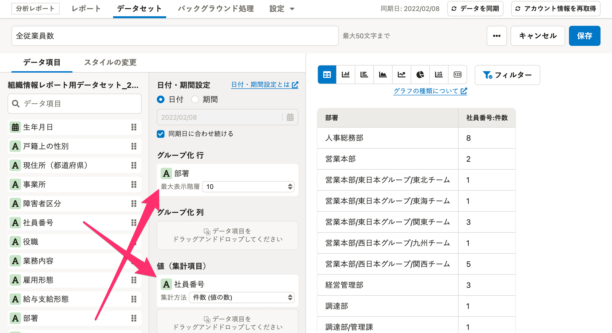
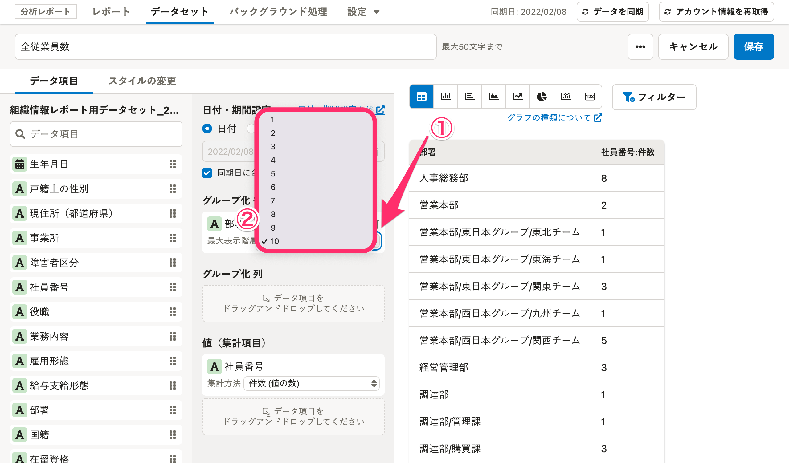
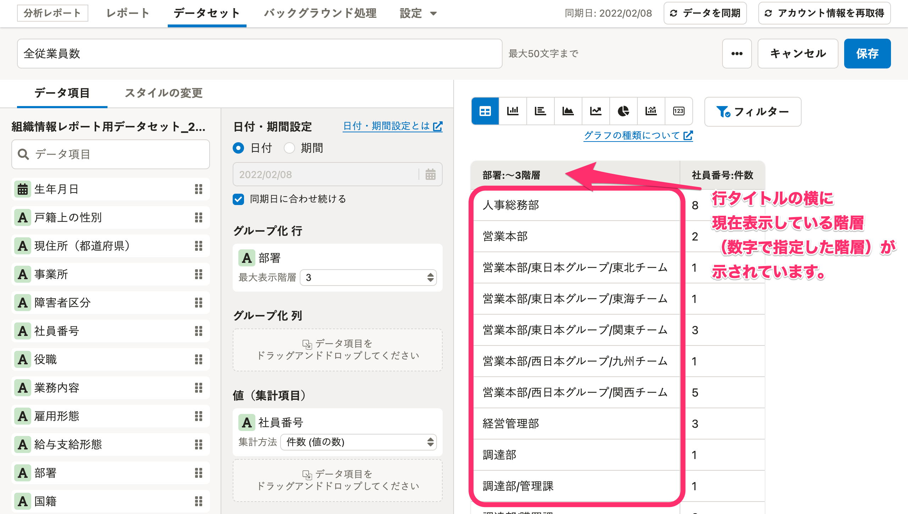

分析レポートで、部署の階層別に集計するグラフの作成方法を説明します。

例えば、部署が「事業部 / ホテル名 / チーム（フロント、清掃、キッチン等）」の3つの階層からなる場合、事業部単位、ホテル単位、チーム単位でグラフを作成できます。

従業員数や平均年齢等の集計にお役立てください。

# 1\. グラフを作成する

以下のヘルプページを参照し、「グラフを作成する」項目の手順4（ **［グラフ名］** を入力し、 **［作成］** をクリック）まで操作を進めてください。

:::related
[グラフを作成・編集・削除する](https://knowledge.smarthr.jp/hc/ja/articles/360035221133)
:::

# 2\. 行・値を指定する

行・値をドラッグアンドドロップで指定します。

例えば、従業員数を部署の階層別に集計したい場合は、 **［グループ化 行］** に「部署」を、 **［値（集計項目）］** に「社員番号」をドラッグアンドドロップしてください。

# 3\. 部署の階層範囲を設定する

部署の下にある **［最大表示階層］** の **［▲］［▼］** をクリックし、集計したい部署の階層数を指定してください。

数字にチェックを入れると、画面右側のプレビューが更新され、表示が変わったことを確認できます。

デフォルトでは **［10］** にチェックが入っていますが、設定はされていない状態です。

画面右上にある **［保存］** をクリックし、設定を保存してください。

## 例：階層対象範囲を3と指定した場合

行タイトルの横に、現在表示している階層（数字で指定した階層）が示されています。

