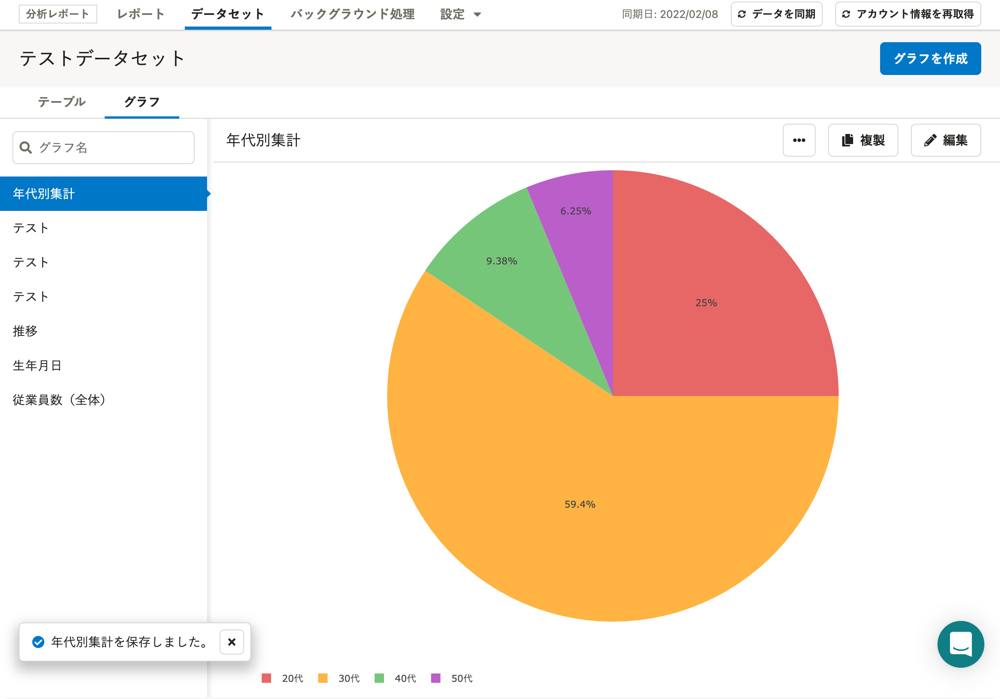

分析レポート機能で、年代別に集計するグラフの作成方法を説明します。

事業所や店舗ごとの年代別人員数を出したいときにお役立てください。

:::tips
当ページの内容は、すでにデータセットを作成している状態を前提にしています。
データセットを作成していない場合は、以下のヘルプページを参照してください。
[データセットを作成・編集・削除する](https://knowledge.smarthr.jp/hc/ja/articles/360035221113)
:::

# 1\. テーブルに年代を追加する

## 1-1. 編集したい［データセット名］をクリック

データセット一覧画面で **［データセット名］** をクリックすると、データセットの詳細画面に移動します。

## 1-2. ［編集］をクリック

画面右上の **［編集］** をクリックすると、データセットの編集画面に移動します。

## 1-3. 従業員情報の［年代］にチェックを入れ、［保存］をクリック

画面左側に表示されている従業員情報のデータ項目の **［年代］** にチェックを入れて **［保存］** をクリックすると、データセットの詳細画面に戻ります。

テーブルの項目に **［年代］** が追加されたことが確認できます。

# 2\. グラフを作成し、年代別に集計する

## 2-1. ［グラフを作成］をクリック

データセットの詳細画面左側にある **［グラフ］** をクリックしてタブの表示を切り替えてください。

画面右上にある **［グラフを作成］** をクリックすると、 **［グラフ設定］** のダイアログが表示されます。

## 2-2. グラフ名を入力し、［作成］をクリック

 **［グラフ名］** を入力し、 **［作成］** をクリックすると、データセットの編集画面に移動します。

## 2-3. 行・値を指定する

年代別のグラフを作成するには **［年代］** を **［グループ化（行）］** の単位に指定してください。

ここでは、例として **［社員番号］** を **［値（集計項目）］** に指定し、社員の年代別の分布のグラフを作ります。

## 2-4. グラフの種類を指定し、［保存］をクリック

グラフ編集画面の中央付近にあるアイコンをクリックすると、グラフの種類を指定できます。

任意の種類を指定して **［保存］** をクリックすると、データセットの詳細画面に戻ります。

データセットの詳細画面に戻ると、年代別集計グラフが完成したことが確認できます。

