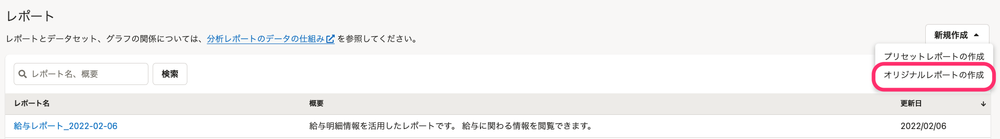

オリジナルのレポートを作成する手順を説明します。

レポートとは、複数のグラフと、テキストや画像をまとめたものです。

SmartHRが用意しているプリセットレポートを作成（追加）する手順は、以下のヘルプページを参照してください。

[プリセットレポートを追加する](https://knowledge.smarthr.jp/hc/ja/articles/1500001783842)

# 1\. レポート一覧画面で［新規作成▼］>［オリジナルレポートの作成］をクリック

レポート一覧画面にある **［新規作成▼］>［オリジナルレポートの作成］** をクリックすると、レポートの作成画面が表示されます。

# 2\. ［レポート名］を入力し、［作成］をクリック

 **［レポート名］** を入力してください。 **［概要］** は任意入力です。

 **［作成］** をクリックするとレポートが作成されます。

:::tips
引き続き、レポート内容の編集に進む場合は以下のヘルプページを参照してください。
[レポートの内容を編集する](https://knowledge.smarthr.jp/hc/ja/articles/360034711234)
[【一覧】グラフとスタイルの種類](https://knowledge.smarthr.jp/hc/ja/articles/360034711174)
:::
