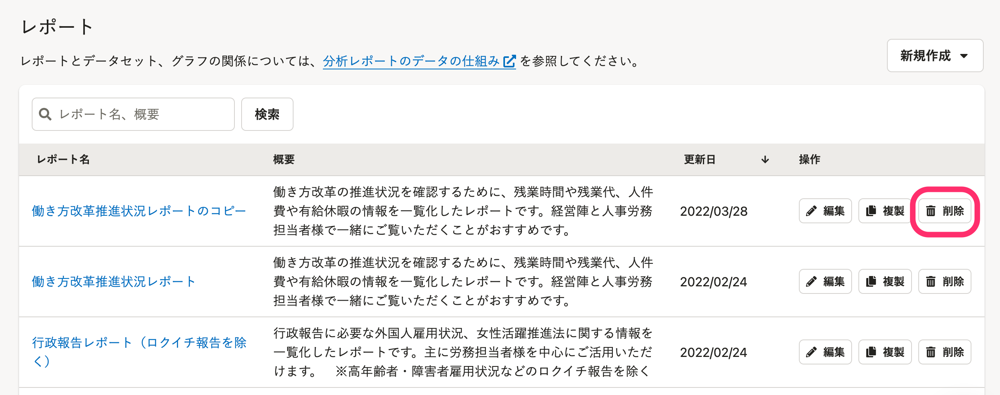

レポートの削除手順を説明します。

# 1\. レポート一覧画面で［削除］をクリック

レポート一覧画面で **［レポート名］** の右横に表示されている **［削除］** をクリックすると、「レポートの削除」ダイアログが表示されます。

:::tips
削除の操作は、レポートの詳細画面からも可能です。
レポートの詳細画面から操作する場合は、画面右上にある **［その他の操作▼］メニュー** から **［削除］** をクリックしてください。
以降の手順はレポート一覧画面から削除する場合と同じです。

:::

# 2\. ［削除］をクリック

内容を確認し、 **［削除］** をクリックするとレポート一覧画面からレポートが削除されます。

:::alert
削除したレポートは復元できません。
:::
