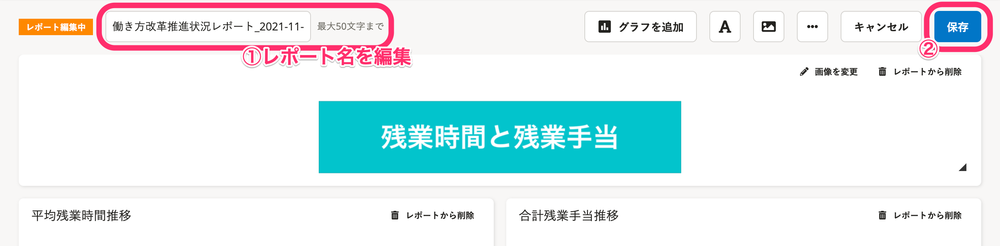
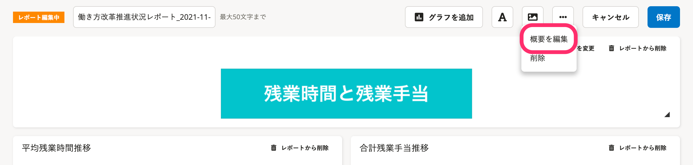
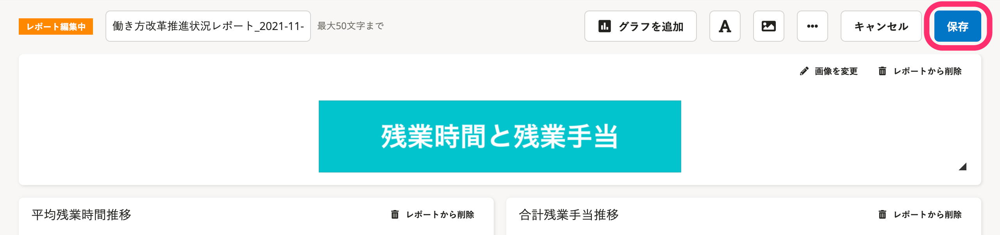

レポート名とレポートの概要を編集する手順を説明します。

:::tips
グラフ追加・削除など、レポート内容を編集する手順は、以下のヘルプページを参照してください。
[レポートの内容を編集する](https://knowledge.smarthr.jp/hc/ja/articles/360034711234)
:::

# レポート名を編集する

## 1\. レポート一覧画面で［編集］をクリック

レポート一覧画面で **［編集］** をクリックすると、レポートの編集画面が表示されます。

## 2\. レポート名を編集し、［保存］をクリック

画面左上に表示されているレポート名は直接書き換えられます。

レポート名を変更後、 **［保存］** をクリックすると変更が保存されます。

:::tips
レポート名は1〜50文字で入力してください。
:::

# レポートの概要を編集する

## 1\. レポート一覧画面で［編集］をクリック

レポート一覧画面で **［編集］** をクリックすると、レポートの編集画面が表示されます。

## 2.［…］メニュー >［概要を編集］をクリック

レポート編集画面の **［…］メニュー**  にある **［概要を編集］** をクリックすると、「レポートの編集」ダイアログが表示されます。

## 3.［概要］を編集し、［更新］をクリック

 **［概要］** を編集して **［更新］** をクリックすると、編集画面に反映されます。

## 4.［保存］をクリック

レポート編集画面の **［保存］** をクリックすると、変更が保存されます。

