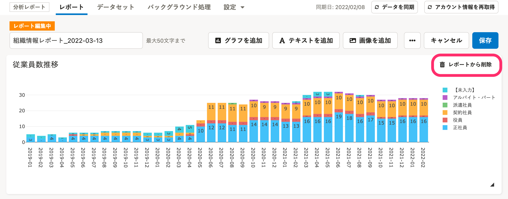

分析レポートでレポート内容を編集する方法を説明します。

レポートには、グラフ・テキスト・画像の3つの要素を配置できます。

レポート編集画面を開くには、レポート一覧画面の **［編集**  **］** をクリックします。

画面左上に **［レポート編集中］** のラベルが表示されているページを準備して操作してください。

# 要素を追加する

## グラフの追加

### 1.［グラフを追加］をクリック

レポート編集画面上部にある **［グラフを追加］** をクリックすると、グラフを選択するダイアログが表示されます。

### 2\. グラフを選択し、［追加］をクリック

追加したいグラフを選択し、 **［追加］** をクリックすると、レポートにグラフを追加します。

検索フォームに、グラフ名やデータセット名を入力して検索もできます。

## テキストの追加

### 1.［テキストを追加］をクリック

レポート編集画面上部にある **［テキストを追加］** をクリックすると、テキストを追加するダイアログが表示されます。

### 2\. テキストを入力し、［追加］をクリック

配置したいテキストを入力し、 **［追加］** をクリックすると、レポートにテキストが追加されます。

## 画像の追加

### 1\. ［画像を追加］をクリック

レポート編集画面上部にある **［画像を追加］** をクリックすると、画像を追加するダイアログが表示されます。

### 2\. 画像をアップロードし、［追加］をクリック

 **［ファイルを選択］** をクリックし、アップロードしたいファイルを選択してから **［追加］** をクリックすると、レポートに画像が追加されます。

# 要素を配置する

レポートに含まれるグラフやテキスト、画像はドラッグアンドドロップすると移動できます。

# 要素のサイズを変更する

レポートに含まれるグラフやテキスト、画像の右下にある三角マークをドラッグアンドドロップすると、サイズを変更できます。

# 要素を編集する

編集したい要素の右上にある **［…］メニュー >［グラフ編集］** をクリックすると、内容を編集できます。

このとき、画面右上の **［その他の操作▼］>［編集］** はクリックしていない状態です。

# 要素を削除する

レポート編集画面で、削除したい要素の右上にある **［レポートから削除］** をクリックすると、確認のダイアログが表示されます。

 **［ウィジェットを削除します］** と表示されたダイアログで **［削除］** をクリックすると、レポートから要素を削除します。

