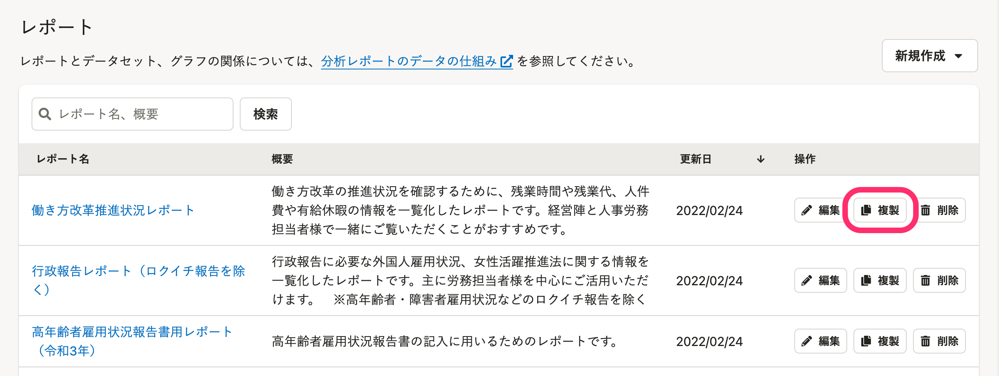
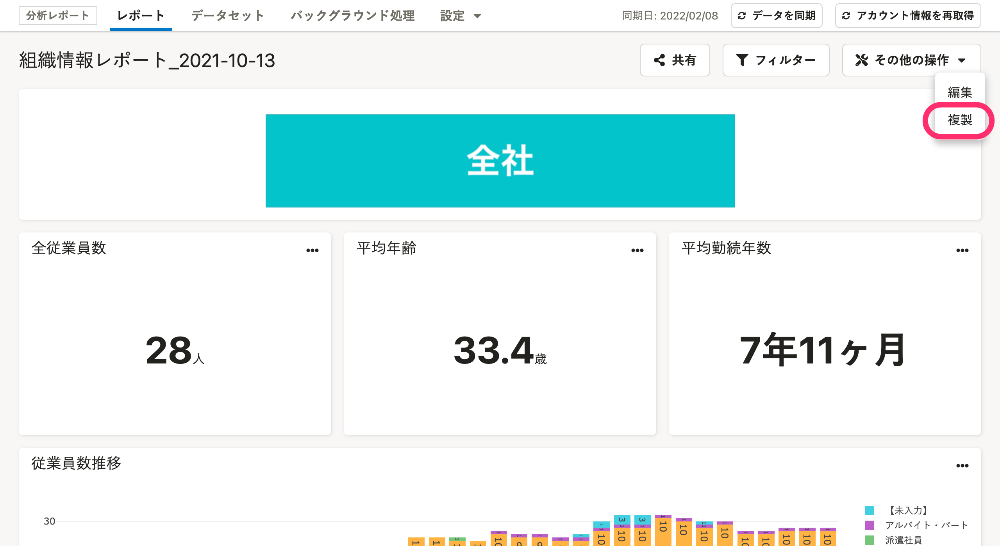
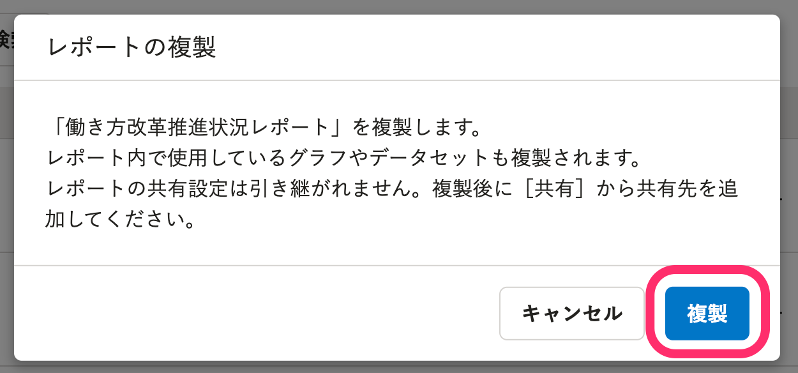
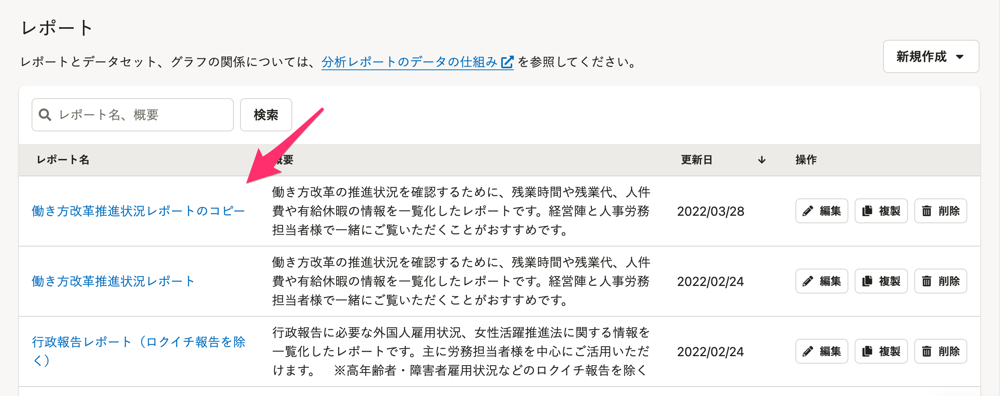

分析レポートで作成したレポートを複製する方法を説明します。

プリセットレポートを基に独自のレポートを作成・編集したい場合には、複製機能を活用してください。

:::alert
複製の操作ボタンは、管理者権限アカウントにのみ表示されます。
:::

# 1\. レポート一覧画面で［複製］をクリック

レポート一覧画面で **［レポート名］** の右横に表示されている **［複製］** をクリックすると、「レポートの複製」ダイアログが表示されます。

:::tips
複製の操作は、レポートの詳細画面からも可能です。
レポートの詳細画面から操作する場合は、画面右上にある **［その他の操作▼］メニュー** から **［複製］** をクリックしてください。
以降の手順はレポート一覧画面から複製する場合と同じです。

:::

# 2\. ［複製］をクリック

内容を確認し、 **［複製］** をクリックするとレポート一覧画面にレポートが複製されます。

複製されたレポートは、自動で **［{複製元のレポート名}のコピー］** というタイトルがつきます。

レポートのタイトルを編集する方法は、以下のヘルプページ内「レポート設定（タイトルと概要）の編集」を参照してください。

[レポートを作成・編集・削除する](https://knowledge.smarthr.jp/hc/ja/articles/360035221173)

なお、レポートを複製すると、レポートで使用しているグラフやデータセットも複製します。

複製したデータセットは、 **［{複製元のデータセット名}のコピー］** というタイトルでデータセット一覧に表示されます。

:::alert
複製元のレポートの共有設定は、複製したレポートには引き継がれません。
複製後に **［共有］** から共有先を追加してください。
:::
