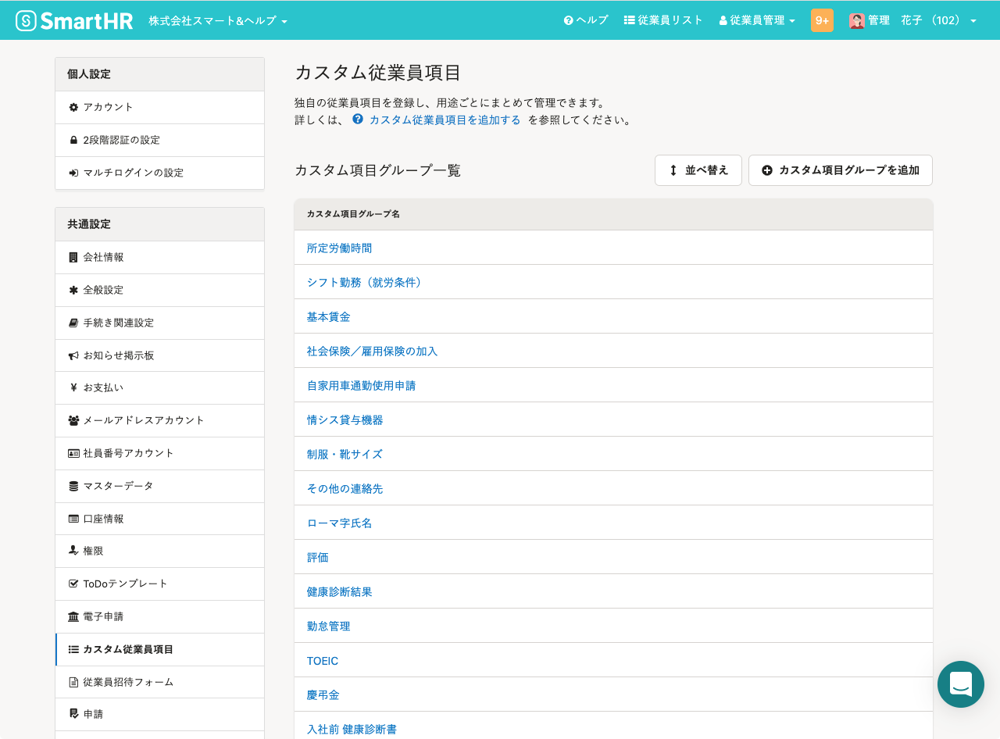
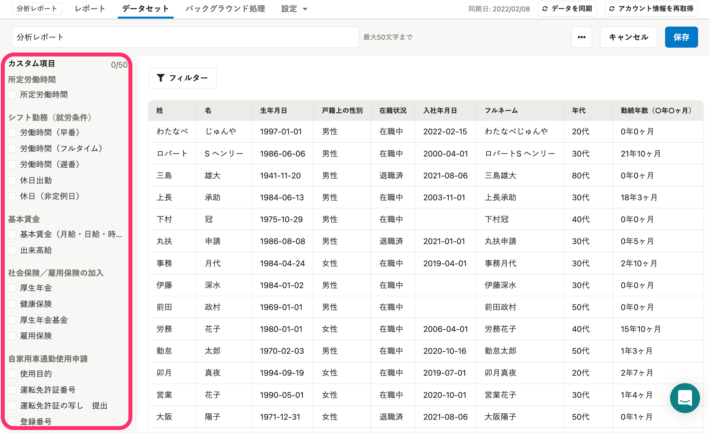
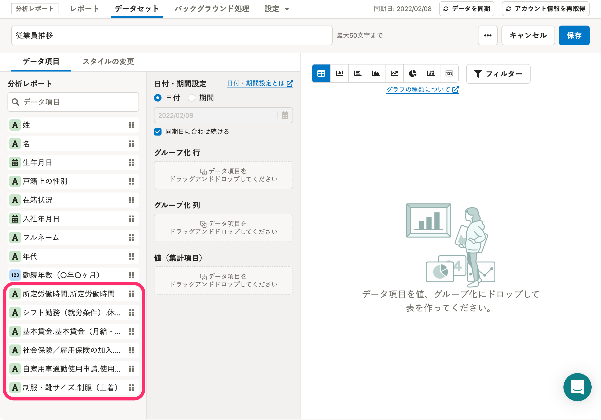
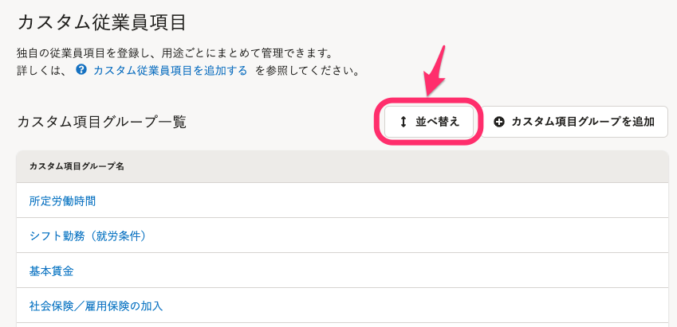
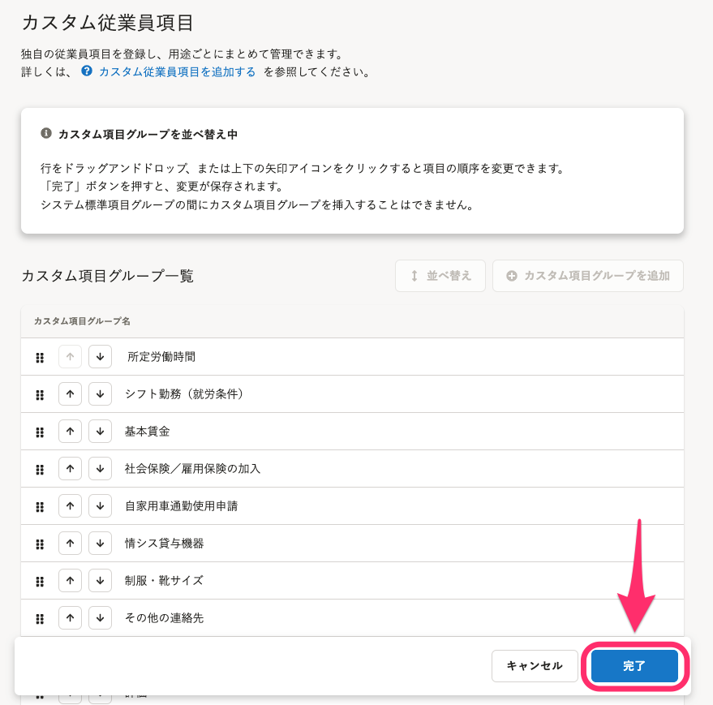

# A. はい、SmartHR基本機能の「カスタム従業員項目」の並び順に合わせて表示しています。

データセットの編集画面に表示されている「カスタム項目」の並び順は、SmartHR基本機能の「カスタム従業員項目」の並び順に合わせて表示しています。

| **SmartHR基本機能** | **分析レポート機能** |  |
| --- | --- | --- |
| **カスタム従業員項目** | **データセット編集画面** |  **データセット編集画面（グラフ）**  |
|  |  |  |

## 並び順が異なる場合

SmartHR基本機能のカスタム従業員項目と、分析レポートの各編集画面の並び順が異なる場合は、下記の手順で表示順を揃えられます。

### 1.［共通設定］>［カスタム従業員項目］画面で［並べ替え］をクリック

SmartHRの **［共通設定］** メニューから **［カスタム従業員項目］** を開き、カスタム従業員項目の **［並べ替え］** をクリックすると、「カスタム項目グループを並べ替え中」という画面が表示されます。

### 2.［完了］をクリック

 **［完了］** をクリックしてください。並べ替えの操作は不要です。

### 3\. 分析レポートでデータの同期を実行する

分析レポートでデータの同期を実行します。操作手順は以下のヘルプページを参照してください。

:::related
[データを同期する](https://knowledge.smarthr.jp/hc/ja/articles/360034711154)
:::

データの同期完了後、データセットやグラフの編集画面で表示順を確認してください。
