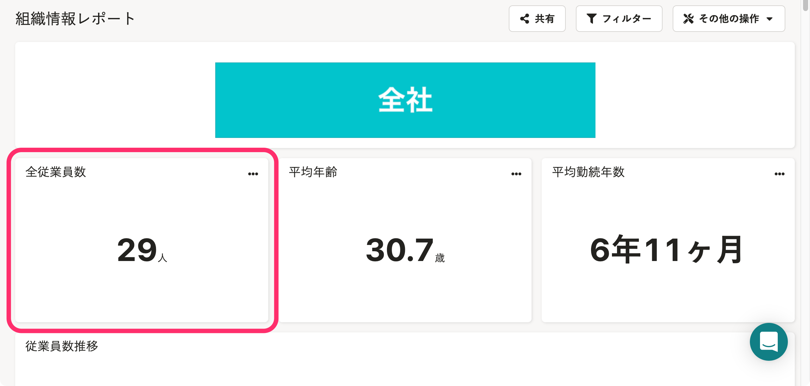
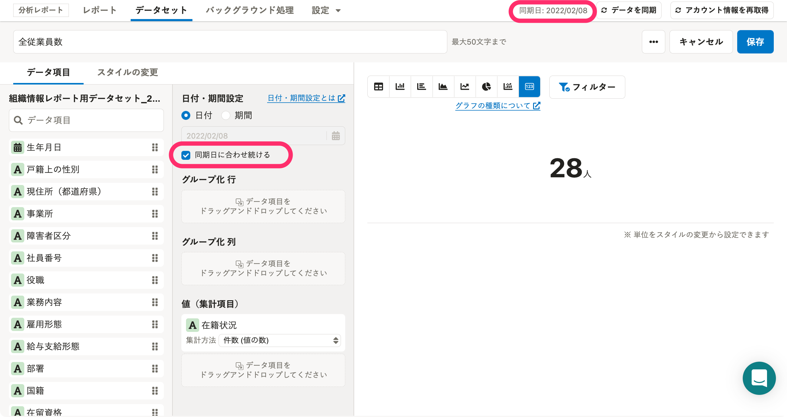
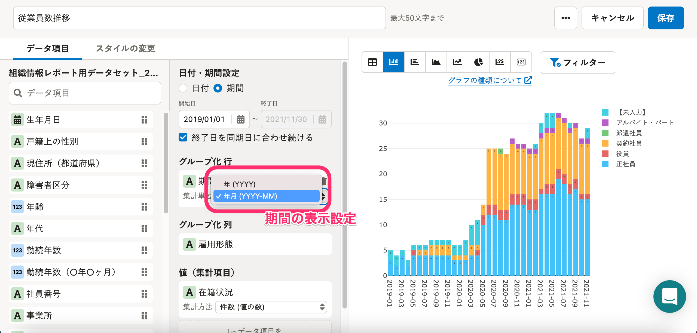
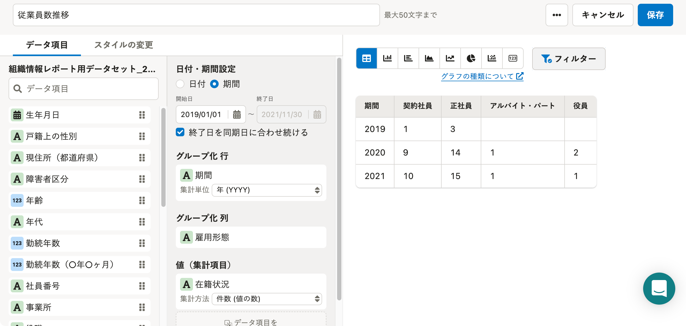
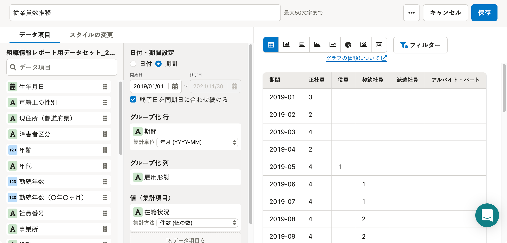

# A. データ同期日のデータを利用しています。

グラフには「ある日付」の情報を示すものと、「ある期間」の情報の推移を示すものがあります。

グラフの具体例とともに、詳細は各項目で説明します。

なお、グラフの日付や期間は変更できます。詳しくは下記のヘルプページを参照してください。

:::related
[グラフの日付・期間を指定する](https://knowledge.smarthr.jp/hc/ja/articles/900005586003)
:::

## 従業員数や平均年齢など「ある日付」の情報を示すグラフ

従業員数、平均年齢、平均勤続年数などのグラフは、「データ同期日」の情報を反映しています。

### 例：組織情報レポートに含まれる「全従業員数」の場合

データセットの編集画面の **［日付・期間設定］** で **［同期日に合わせ続ける］** にチェックが入っていることが確認できます。

データ同期日は、分析レポートメニューの **［同期日］** の表示で確認できます。

## 従業員数や男女比など「ある期間」の推移を示すグラフの場合

従業員数推移、平均年齢推移、平均勤続年数推移、男女比推移などのグラフは、期間の表示設定が年単位か、年月単位かにより、基準日が異なります。

- 年単位の場合：各年の12月31日の情報を集計した情報が反映されています。
- 年月単位の場合：各月の最終日の情報を集計した情報が反映されています。

:::tips
プリセットレポートのグラフに限らず、すべてのグラフの期間はシステム標準の設定で「年月」が指定されています。
:::

年単位に指定した場合と、年月単位で指定した場合の仕様について、上図「従業員数推移」の表示を棒グラフからストレートテーブルに切り替えたものを用いて説明します。

### 例：年単位に指定した場合

各年の12月31日の情報を集計した情報が反映されています。

※12月31日を迎えていない場合は、「データ同期日」の情報が反映されています。

### 例：年月単位に指定した場合

各月の最終日の情報を集計した情報が反映されています。

