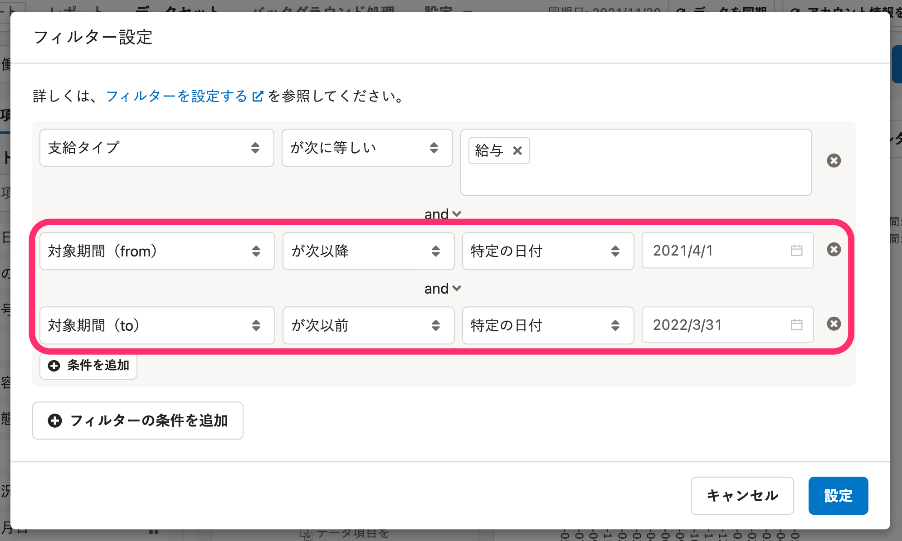

# A. フィルターで対象期間を設定してください。

給与レポートや勤怠レポートなどのプリセットレポートは、SmartHRの給与明細情報をもとに作成しています。

有給取得日数や有給残日数のグラフで期間設定をするには、フィルター設定が必要です。

参照したい期間・時点に応じて、データセットの編集画面でフィルターを設定してください。

## 例：2021年度（2021年4月〜2022年3月）の情報を表示したい場合

フィルター設定画面で以下の通り条件を追加してください。

条件は **［＋条件を追加］** から追加できます。

- 条件1： **［対象期間（from）］［が次以降］［特定の日付］［2021/4/1］** 
- 条件2： **［対象期間（to）］［が次以前］［特定の日付］［2022/3/31］** 

:::related
[フィルターを設定する](https://knowledge.smarthr.jp/hc/ja/articles/360035221193)
:::
