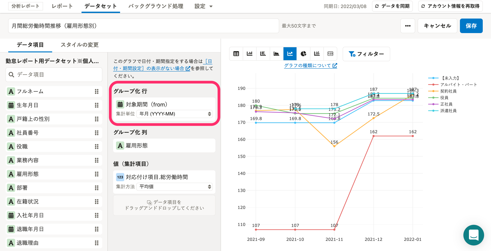
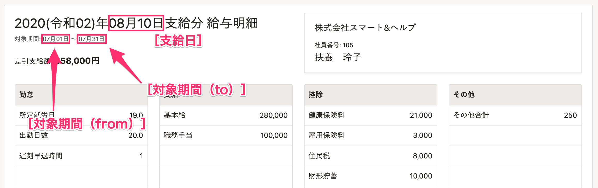

# A.［グループ化 行］に設定された時点（［対象期間（from）］、［対象期間（to）］、［支給日］）の従業員情報を参照しています

給与・勤怠情報のグラフは、SmartHRの給与明細情報に登録されているデータをもとに作成しています。

グラフの時点情報は、データセット編集画面の **［グループ化 行］** に設定されているデータ項目を確認してください。

## それぞれのデータ項目が参照する時点

 **［グループ化 行］** に設定できるデータ項目によって、参照する時点が異なります。

-  **［対象期間（from）］** が設定されている場合：対象期間（賃金計算期間）の始まりとなる日時点の従業員情報を参照しています。
-  **［対象期間（to）］** が設定されている場合：対象期間（賃金計算期間）の終わりとなる日時点の従業員情報を参照しています。
-  **［支給日］** が設定されている場合：給与支給日時点の従業員情報を参照しています。

:::tips
特定の従業員情報が表示されないなどの場合は、「その時点に従業員情報が登録されていたか」を確認してください。
:::

### 例：2020年8月10日支給分の給与明細をもとにしたグラフの場合

 **［グループ化 行］** に設定されているデータ項目ごとの、参照する時点は以下の通りです。

-  **［対象期間（from）］** が設定されている場合：2020/07/01時点の従業員情報を参照しています。
-  **［対象期間（to）］** が設定されている場合：2020/07/31時点の従業員情報を参照しています。
-  **［支給日］** が設定されている場合：2020/08/10時点の従業員情報を参照しています。

