# 「従業員サーベイ」とは

「従業員サーベイ」は、SmartHRに登録している従業員を対象にアンケート調査を実施する機能です。

質問の作成、従業員への配信、回答結果の分析までを、ひと通り時間をかけずに行えます。このため、回答結果に基づいてアクションプランを練ることに集中する助けとなります。

従業員サーベイ機能には、大きく分けて4つのステップがあります。

1.  質問の作成
2.  対象従業員の設定
3.  従業員の回答を閲覧
4.  回答結果の分析

# 権限の設定

はじめて「従業員サーベイ」を利用する時には、権限の設定が必要です。

従業員サーベイ機能では、従業員サーベイ主担当者が労務担当者とは限らないことを考慮し、利用開始時にサーベイ機能管理権限をいずれのアカウントにも付与していません。

詳細は、[「従業員サーベイ」の権限を管理する](https://knowledge.smarthr.jp/hc/ja/articles/360049602014)を参照してください。

# 1\. 質問フォームの作成

## 1\. 機能から［従業員サーベイ］を選択

トップページ左側の **［機能］** 欄にある **［従業員サーベイ］** をクリックし、従業員サーベイ管理画面に移動します。

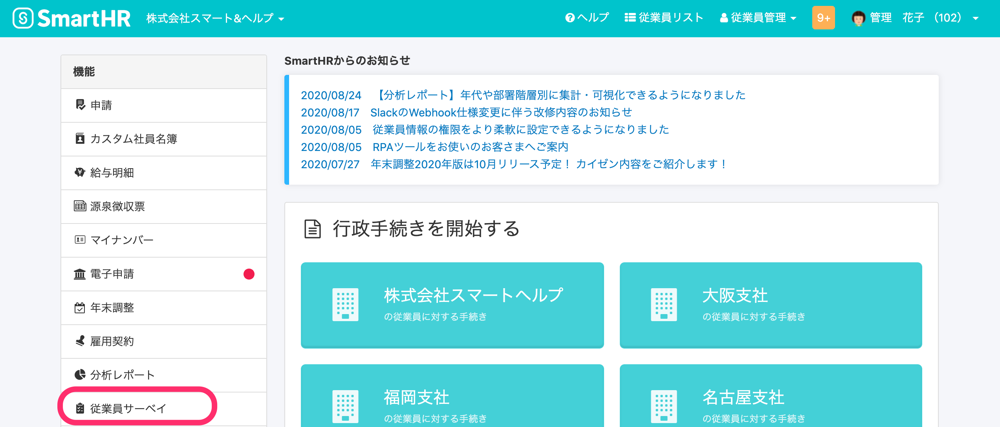

## 2\. ［ホーム］の［サーベイを作成］をクリック

 **［サーベイを作成］** をクリックすると、［サーベイの新規作成］ダイアログが表示されます。

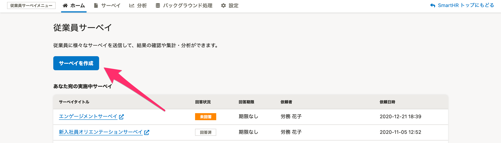

## 3\. 必要な情報を入力し、［保存］をクリック

タイトル、回答結果の扱い方、回答期限、説明を設定します。

タイトルや説明は従業員が回答するフォーム、従業員に配信されるメールの件名と本文に挿入されます。

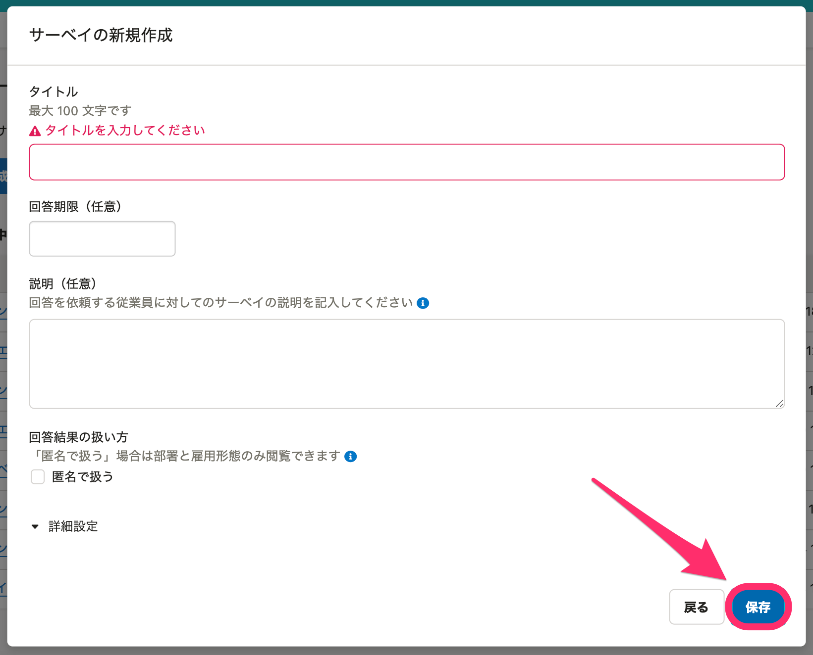

## 4\. 質問を追加し、［保存］をクリック

 **［+質問を追加］** をクリックして、質問を追加していきます。

すべての質問を入力し終えたら、 **［保存］** をクリックすると、サーベイが保存されます。また、左下の **［保存してプレビュー］** をクリックすると、保存と同時に画面の確認ができます。

質問作成の詳細は、[質問を作成する](https://knowledge.smarthr.jp/hc/ja/articles/360050399233)を参照してください。

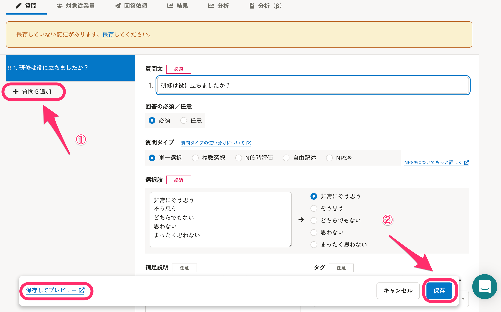

# 2\. 対象にする従業員を選択する

## 1\. ［対象従業員］画面で、［追加］をクリック

 **［対象従業員］** をクリックして画面を切り替え、 **［追加］** をクリックすると、 **［対象従業員追加］** ダイアログが表示されます。

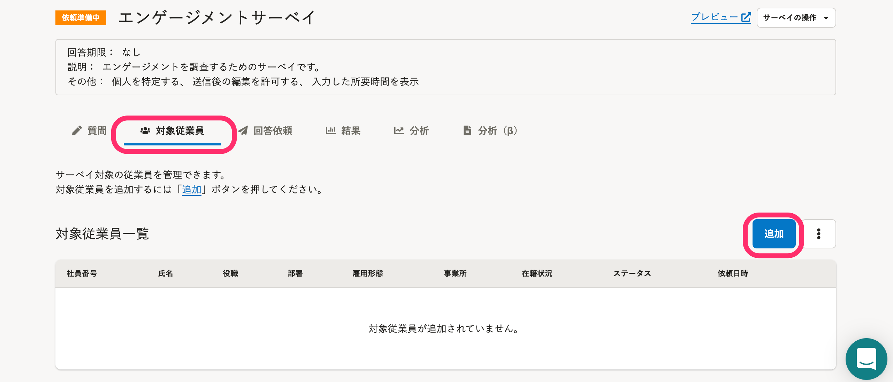

:::tips
社員番号を使って、対象の従業員を一括追加できます。
詳細は、[サーベイ対象の従業員を社員番号を使って一括追加する](https://knowledge.smarthr.jp/hc/ja/articles/900006927443)を参照してください。
:::

## 2\. 対象にする従業員にチェックをつけ、［追加］をクリック

 **［対象従業員追加］** ダイアログでは、SmartHRに登録されている従業員を、フリーワード、在籍状況、雇用形態、入社日で検索できます。

対象の従業員にチェックをつけ、 **［追加］** をクリックします。

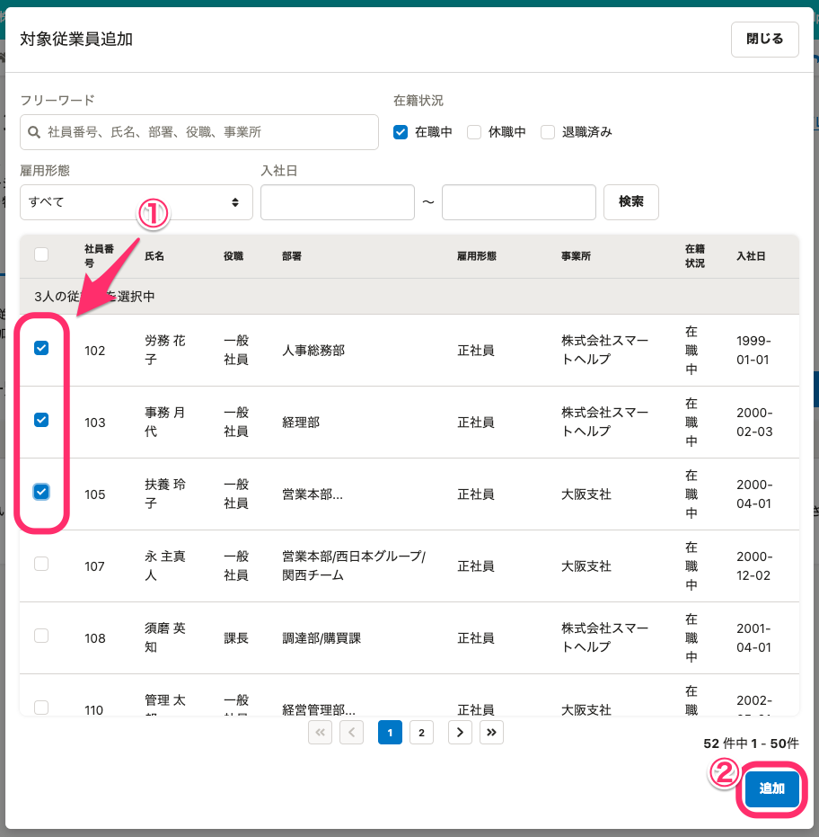

:::tips
現在、SmartHR上で在籍状況が退職済のユーザーでも、退職から1カ月程度はサーベイの配信が可能です。
ただし、退職者に対する連絡・案内等の送付を目的とした個人情報利用の同意を得ている必要があるので、個人情報に関する取り扱いの合意規定に沿ってご利用ください。
:::

## 3\. ［回答依頼］の内容を入力し、［送信］をクリック

 **［回答依頼］** をクリックし、サーベイへの回答依頼メールを設定します。

- **件名**：プリセットで **［「{サーベイ名}」 回答のお願い］** と入力されています。適宜、変更してください。
- **内容**：メールの冒頭に挿入され、その下にサーベイのURLと回答期限が記載されます。

 **［件名］** と **［内容］** を一時的に保存するには、 **［保存］** をクリックします。

設定が完了したら、  **［送信］** をクリックします。

依頼メールの送信はバックグラウンド処理で実行され、送信が完了すると、 **［送信］** の下に **［回答依頼履歴］** が表示され、依頼履歴を確認できます。

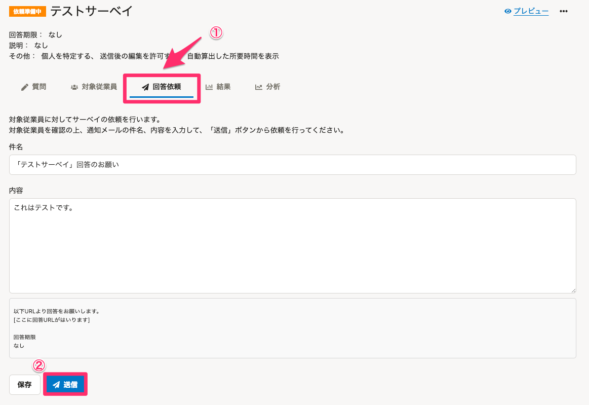

:::tips
回答依頼後のサーベイは削除できません。詳細は、[サーベイを管理する](https://knowledge.smarthr.jp/hc/ja/articles/360050478353)を参照してください。
:::

# 3\. 従業員の回答を閲覧

## 従業員がメールに記載されたURL、もしくはSmartHRの通知欄から回答する

従業員に配信されるメールには、回答用のURLが記載されています。

このURLは、従業員ごとに個別に発行される、推測できないものとなっており、SmartHRにログインせずに回答することが可能です。

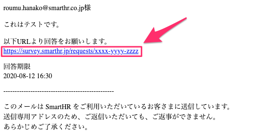

この他に、以下の方法でもサーベイを表示できます。

- SmartHRの右上の通知欄

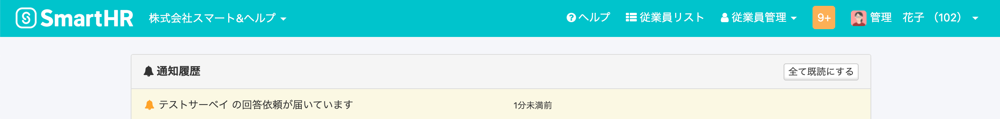

- 従業員サーベイにアクセスした際に、自分が回答しなければならないサーベイを確認

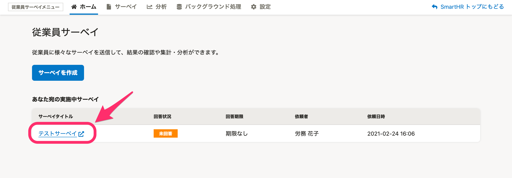

## 従業員が回答次第、［結果］から回答結果が閲覧できる

サーベイの回答が開始されると、随時集計が行われます。 **［結果］** をクリックすると、その時点での回答結果を閲覧できます。

回答内容は、依頼数、完了数、未完了数、完了率のサマリー、質問ごとの集計グラフで表示されます。集計には、部署や雇用形態などのフィルターも適用できます。

なお、回答はCSV書き出しも可能です。詳細は、[従業員サーベイの回答を確認する](https://knowledge.smarthr.jp/hc/ja/articles/360050460953)を参照してください。

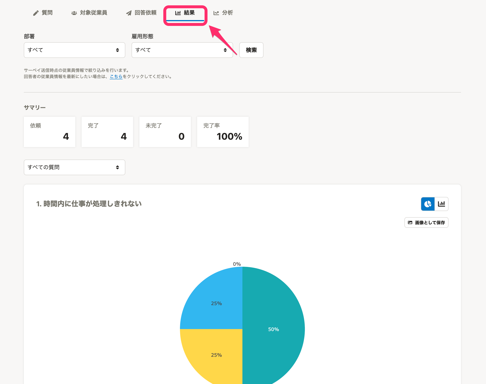

# 4\. 回答結果を分析する

## ボタン1つでクロス集計分析をする

「レポート」機能（分析（β））では、複雑な設定なしにクロス集計分析ができます。詳細は、[従業員サーベイの「レポート」機能とは？](https://knowledge.smarthr.jp/hc/ja/articles/4406859458457)を参照してください。

## 複数のサーベイを横断して多角的な分析をする

「分析」機能を使うと、複数のサーベイを対象に分析したい従業員やサーベイの設問に沿った分析ができます。詳細は、[サーベイの分析を作成する](https://knowledge.smarthr.jp/hc/ja/articles/360053607174)を参照してください。
