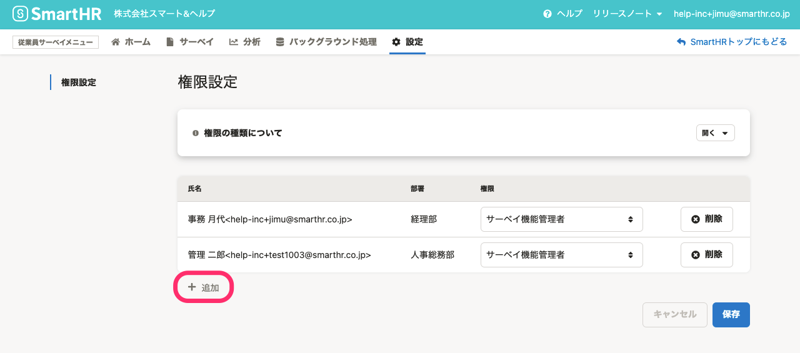

# 従業員サーベイ機能を利用できる2つの権限

従業員サーベイには、 **「サーベイ機能管理者」** 、 **「サーベイ業務担当者」** の2種類の権限があります。

いずれかの権限を持つと、従業員サーベイの作成から回答の閲覧、サーベイ結果をもとにした分析機能などを利用できるようになります。

:::alert
### 利用開始時、SmartHRの管理者権限アカウントにサーベイ機能管理権限は付与されていません
従業員サーベイ機能では、従業員サーベイ主担当者が労務担当者とは限らないことを考慮し、SmartHRの管理者アカウントには **［従業員サーベイメニュー］** の **［**  **権限設定］** に関する操作権限のみ付与しています。
初回利用時には、SmartHRの管理者権限を持つアカウントが、従業員サーベイの権限設定を行なってください。
:::

## 「サーベイ機能管理者」／「サーベイ業務担当者」／「SmartHR管理者」の違い

それぞれの権限で利用できる機能は、下記のとおりです。

| 機能 | サーベイ機能管理者 | サーベイ業務担当者 | SmartHR管理者 |
| --- | --- | --- | --- |
| サーベイ作成 | ◯ | ◯ | ー |
| サーベイ配信※ | ◯ | ◯ | ー |
| 回答閲覧※ | ◯ | ◯ | ー |
| 回答結果の書き出し※ | ◯ | ◯ | ー |
| 分析※ | ◯ | ◯ | ー |
| レポート※ | ◯ | ◯ | ー |
| 従業員サーベイ機能の権限設定 | ◯ | ー | ◯ |

※サーベイ機能の権限を付与されているアカウントであっても、自分が作成したサーベイや分析以外は閲覧・編集できません。

自分が作成したサーベイや分析を他のアカウントで閲覧・編集できるようにするには、サーベイや分析を共有したいアカウントを **「共同管理者」** に設定します。[作成したサーベイや分析を他のアカウントに共有する（共同管理者の設定）](https://knowledge.smarthr.jp/hc/ja/articles/4402361764633)を参照してください。

# 従業員サーベイ機能の権限をアカウントに付与する

従業員サーベイの管理者、業務担当者として機能を利用するために、SmartHRのアカウントに従業員サーベイの権限を付与します。

SmartHRの管理者権限アカウントに対しても、必要な設定です。

## 1\. ［従業員サーベイメニュー］の［設定］をクリック

従業員サーベイの画面に進んだあと、 画面上部 **［従業員サーベイメニュー］** の **［設定］** をクリックします。

## 2\. 画面左下の［+ 追加］をクリックし、権限を付与する従業員と権限の種類を選択

 **［権限設定］** 画面左下の **［+ 追加］** をクリックすると、従業員を検索するフォームが表示されます。

権限を付与したい従業員を名前かメールアドレスで検索し、選択します。

 **［権限］** のプルダウンメニューから権限の種類を選択します。

複数人に権限を付与する場合は、 **［+ 追加］** をクリックすると追加フォームが表示されます。

なお、SmartHRでの権限に関わらず、SmartHRに登録されているすべてのアカウントに権限を付与できます。

## 3\. ［保存］をクリック

設定が完了したら、 **［保存］** をクリックします。

