# サーベイの作成について

従業員サーベイ機能では、従業員に質問を送信することをサーベイ（調査）と呼びます。

サーベイの作成では、質問の作成と配信先従業員の設定を行います。

このページでは、サーベイの作成のうち、質問の作成手順について説明します。

配信先従業員の設定については[従業員サーベイの基本的な使い方](https://knowledge.smarthr.jp/hc/ja/articles/360050344753)を参照してください。

# 質問の作成手順

## 1\. ［ホーム］の［サーベイを作成］をクリック

 **［サーベイを作成］** をクリックすると、サーベイの新規作成フォームが表示されます。

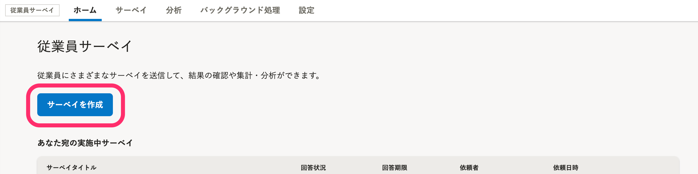\>

サーベイ一覧画面の  **［＋サーベイを作成］** からでも、作成を始められます。

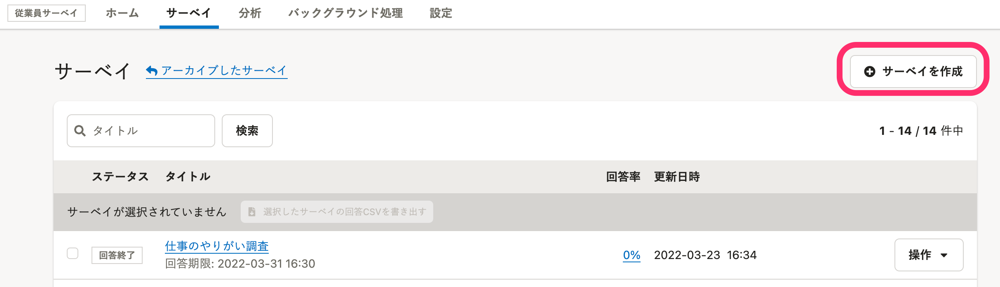\>

 **［サーベイの新規作成］** の画面で、作成するサーベイを選択します。

独自の質問で質問フォームを作成するには、 **［オリジナルサーベイ］** を選択します。

その他のサーベイは、あらかじめ目的に合わせて設計された **「プリセットサーベイ」** です。[プリセットサーベイを利用する](https://knowledge.smarthr.jp/hc/ja/articles/360054477074)を参照してください。

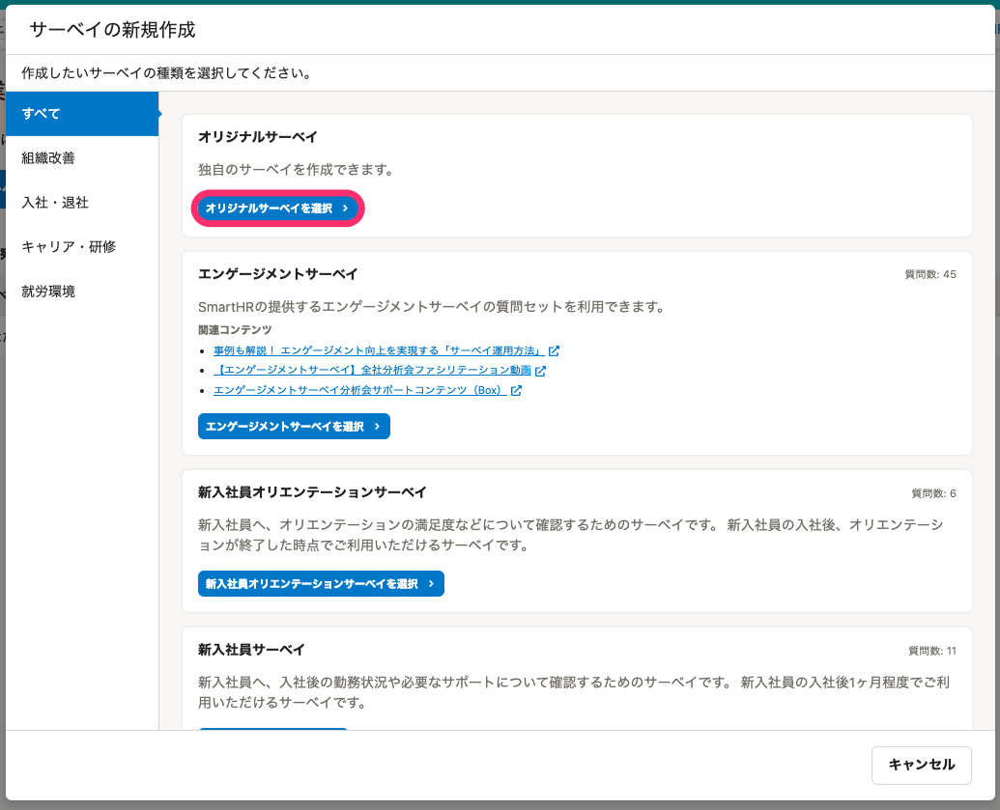

## 2\. サーベイのタイトルなどを設定し、［保存］をクリック

タイトル、回答期限、説明、回答結果の扱い方、回答の編集、所要時間を設定します。

タイトルや説明は従業員が回答するフォーム、従業員に配信されるメールの件名と本文に挿入されます。

ここでの設定は、サーベイ作成画面の **［サーベイの操作］>［基本情報］** から編集できます。

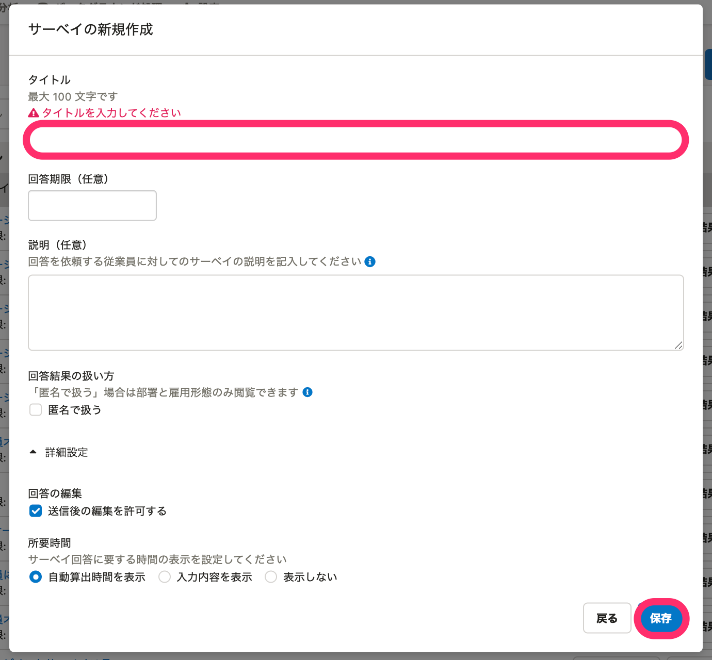

### 設定画面

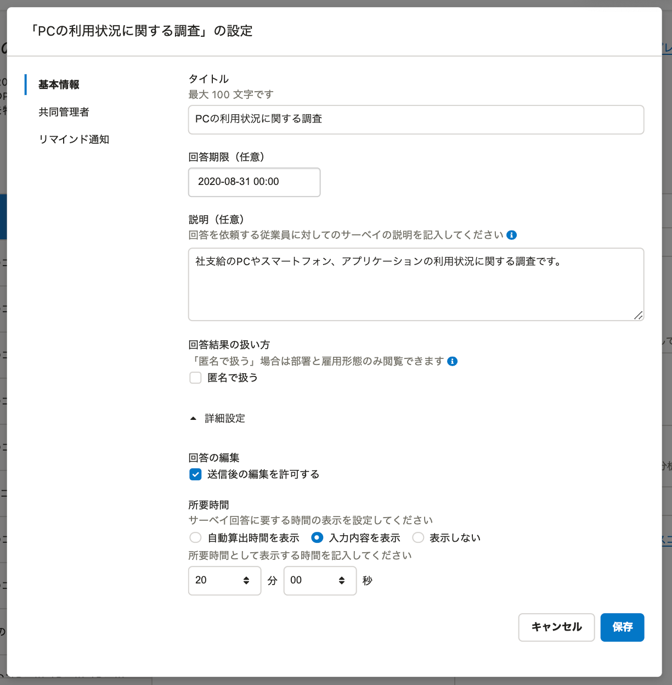

### サーベイ回答者からの見え方

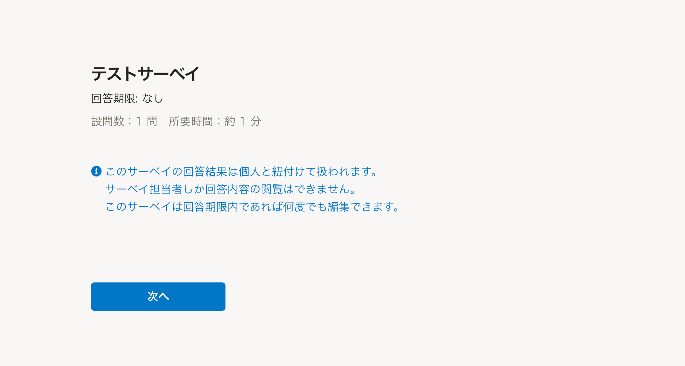

:::tips
### ［匿名で扱う］にチェックを入れた場合
 **［回答結果の扱い方］** の設定で **［匿名で扱う］** にチェックを入れると、回答者の情報は部署と雇用形態しか取得しません。
チェックを入れた場合は、サーベイ管理者が回答と従業員を関連付けて閲覧できないので、匿名でサーベイを実施できます。
[Q. 「匿名で扱う」サーベイとは？](https://knowledge.smarthr.jp/hc/ja/articles/900005669166)
:::
:::tips
### 所要時間の表示が設定できます
-  **［自動算出時間を表示］：** 自動的に所要時間が表示されます。
-  **［入力内容を表示］** ：入力した時間が表示されます。
-  **［表示しない］：** 表示されません。
:::

## 3\. 質問を追加し、［保存］をクリック

質問文、質問タイプ、必須回答かどうか、などを入力して、質問を追加します。質問タイプについては、[質問の種類と使い分け](https://knowledge.smarthr.jp/hc/ja/articles/4413826996377)を参照してください。

1つのサーベイにおける質問の上限は**200問**までです。

すべての質問を入力し終えたら、 **［保存］** をクリックすると、質問フォームが保存されます。

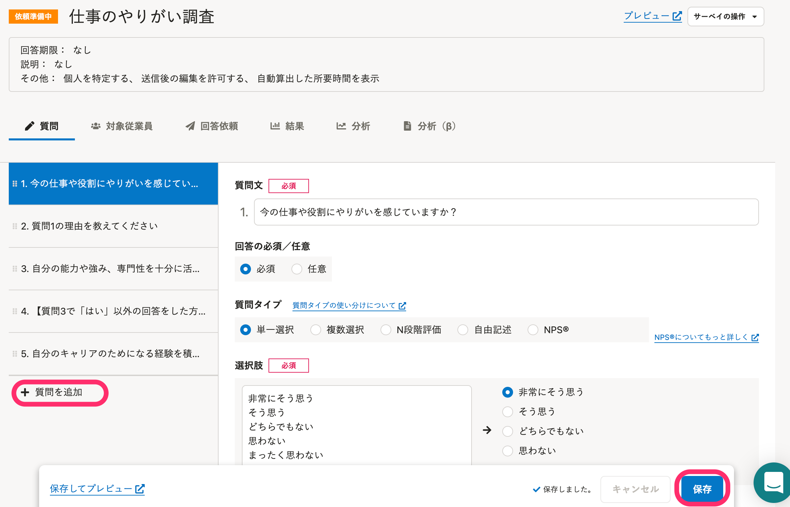

:::tips
### 質問ごとにタグを設定する
質問にタグを付与して、サーベイをまたいだ分類・管理、分析に利用できます。例えば、似た内容を複数の質問に分けて行う場合、それらの質問を関連付けることが可能です。
質問設定画面のタグ欄に、任意のタグ名を入力してください。一度入力したタグは保存されるので、登録済みのタグから選択することもできます。
ただし、エンゲージメントサーベイのみ、タグの追加や編集はできません。
タグは回答画面に表示されず、回答者には公開されません。
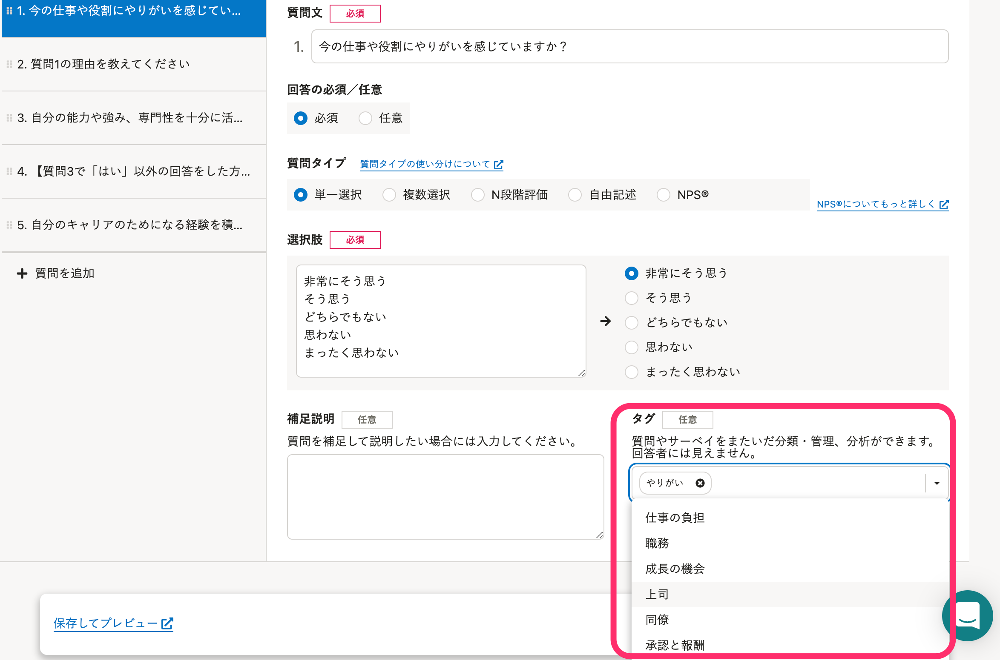
:::
:::tips
### 質問を複製する
質問は複製することができるので、同じ質問タイプでラベルも同一になる場合に利用すると、効率よく質問を作成できます。
質問文の右側にある書類マークの **［複製］** をクリックすると、質問を複製・追加できます。
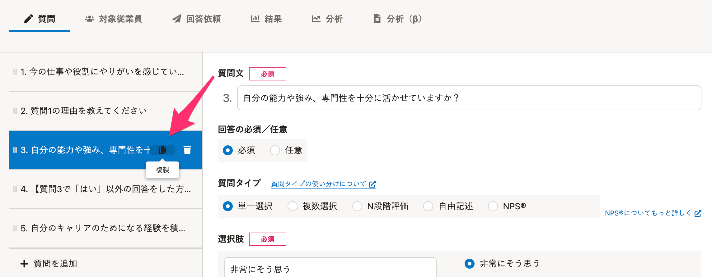
:::

## 4.質問をプレビューする

配信前に質問の見え方を確認するには、右上の［ **プレビュー］** をクリックしてください。

また、左下の［ **保存してプレビュー］** をクリックすると、質問フォームの保存と同時に画面の確認ができます。

回答依頼を送信したあとは、サーベイのステータスが **［回答中］** に変更され、質問文の編集はできません（補足説明・タグ・スコアを算出するかどうか・スコアの算出方法 のみ編集可能）。

配信前に、プレビュー画面でしっかりと内容を確認してください。

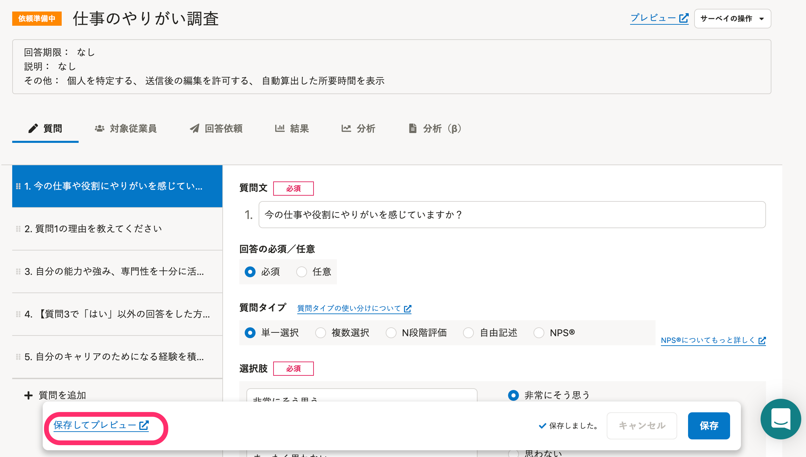

プレビュー画面

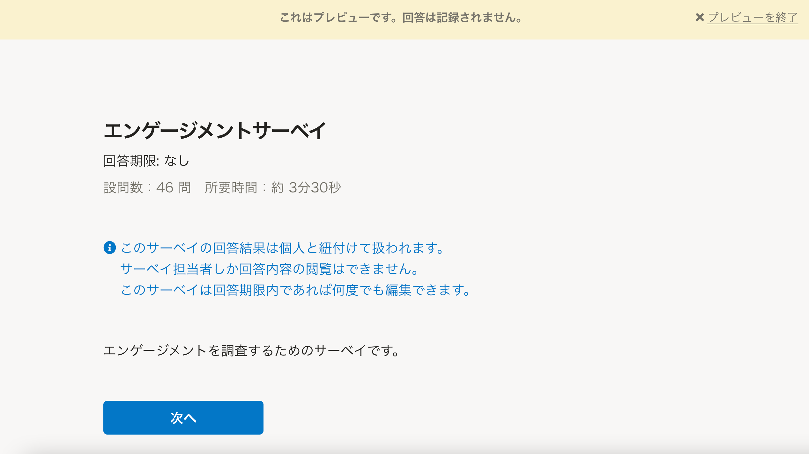

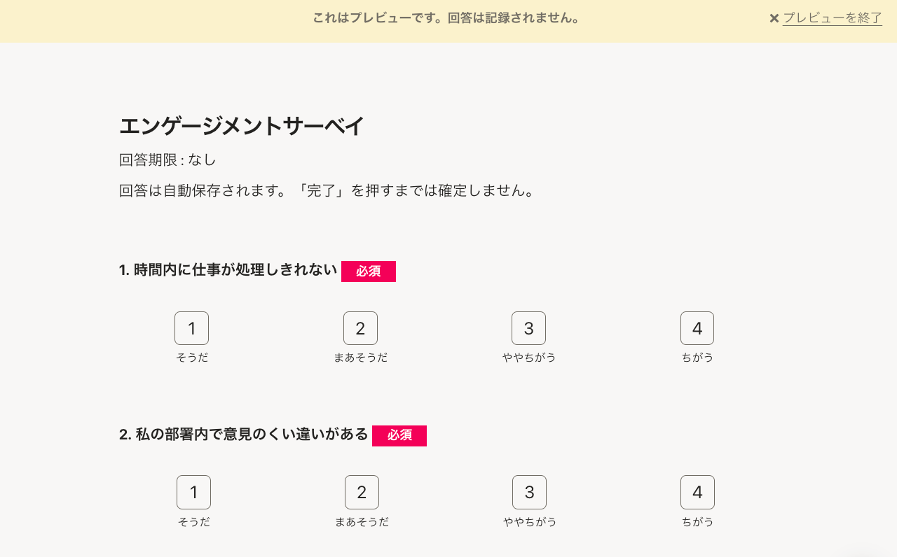
