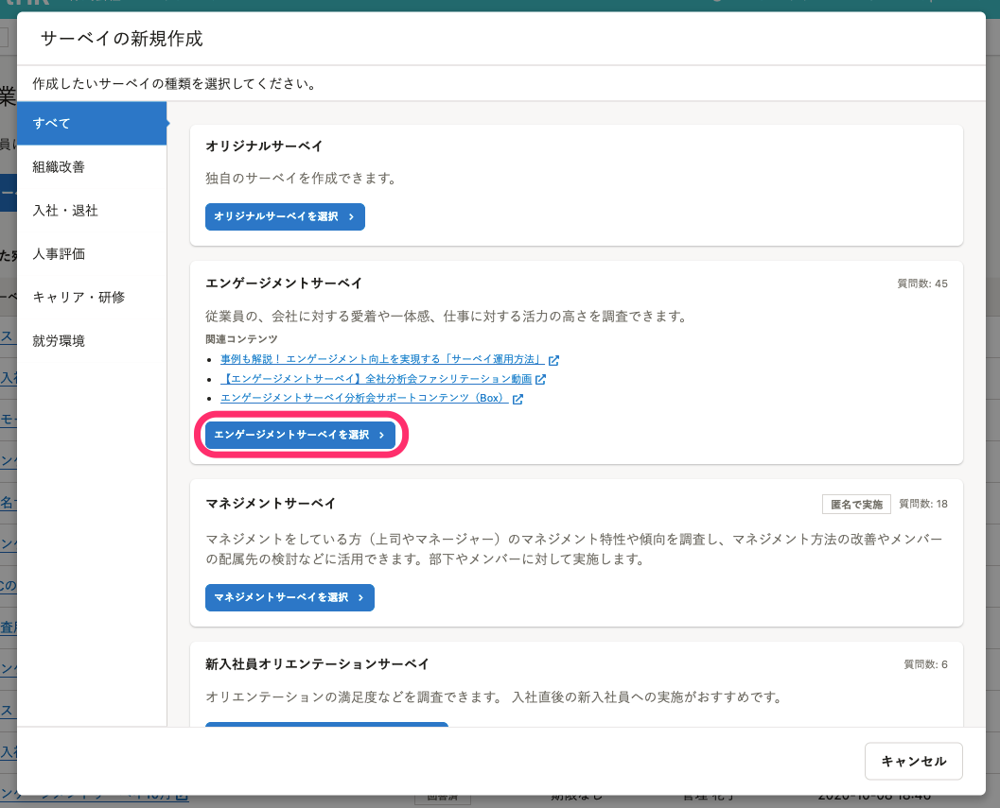
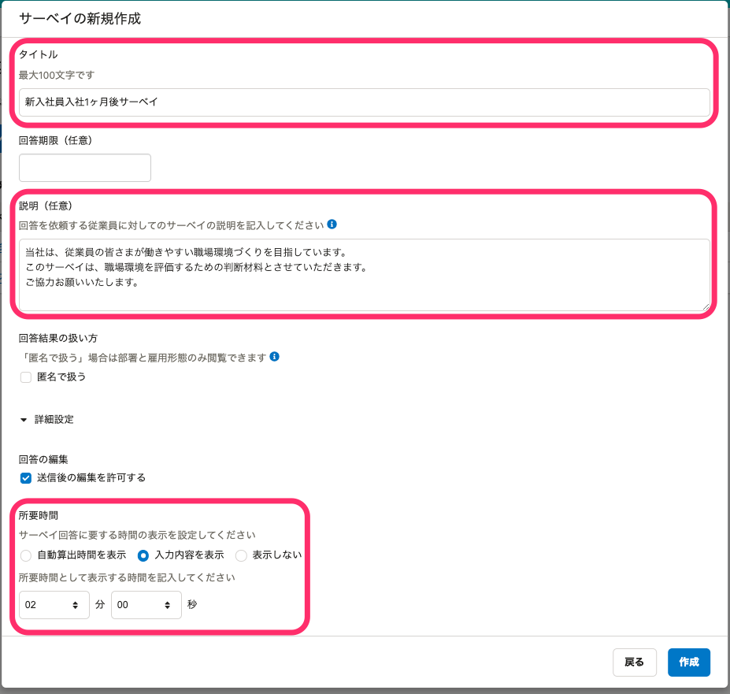
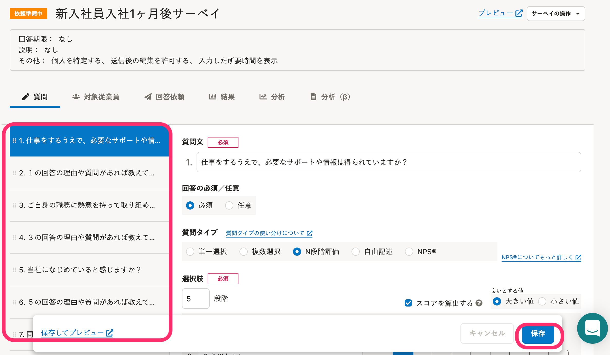
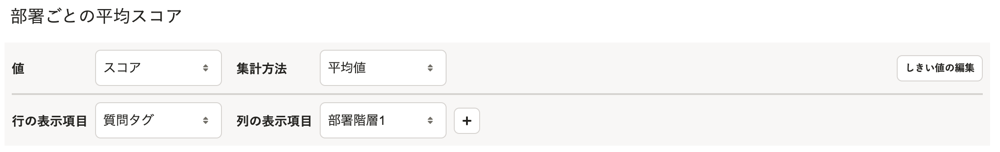
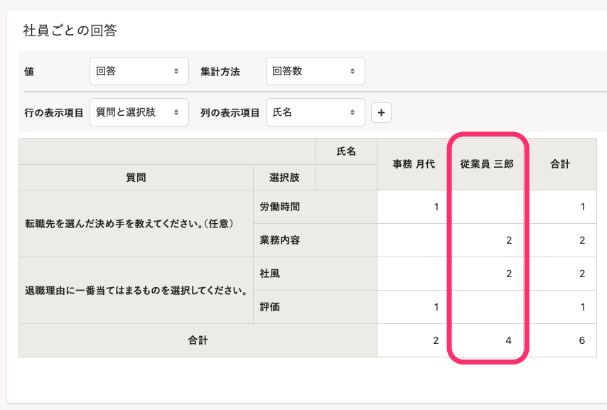
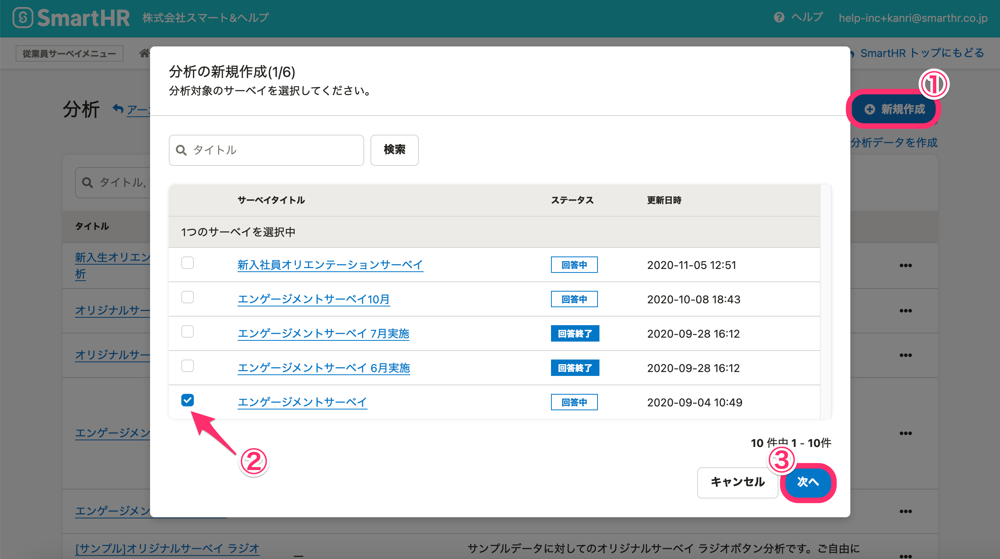
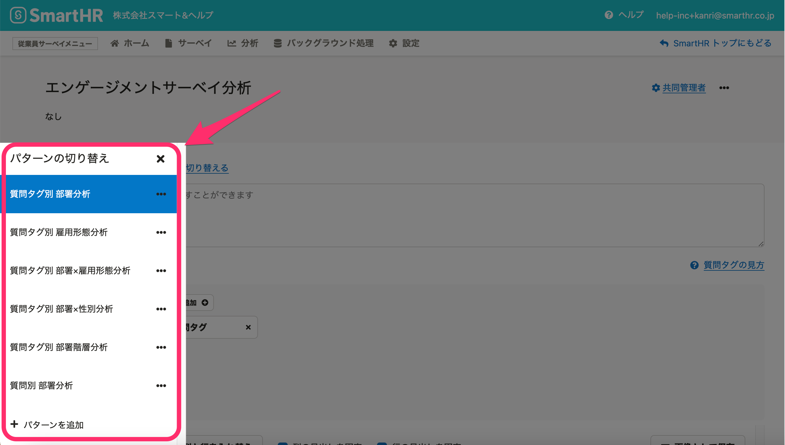

従業員サーベイ機能には、独自の質問を作成する「オリジナルサーベイ」のほかに、あらかじめ目的に合わせて設計されている **「プリセットサーベイ」** があります。

このページでは、プリセットサーベイの利用方法について説明します。

オリジナルサーベイの作成方法は、[質問を作成する](https://knowledge.smarthr.jp/hc/ja/articles/360050399233)を参照してください。

# プリセットサーベイの種類

## 14種類のプリセットサーベイ

プリセットサーベイは、14種類あります。

それぞれに、サーベイの目的と対象従業員を想定して設計しています。

| 分類 | サーベイ名 |   目的と想定対象従業員   |   質問数   |
| --- | --- | --- | --- |
| 組織改善 | **エンゲージメントサーベイ** |   従業員の、会社に対する愛着や一体感、仕事に対する活力の高さを調査できます。   |   45   |
|   **マネジメントサーベイ**   |   マネジメントをしている方（上司やマネージャー）のマネジメント特性や傾向を調査し、マネジメント方法の改善やメンバーの配属先の検討などに活用できます。部下やメンバーに対して実施します。   |   18   |
| 入社・退社 | **新入社員オリエンテーションサーベイ** |   オリエンテーションの満足度などを調査できます。入社直後の新入社員への実施がおすすめです。   |   6   |
| **新入社員入社1ヶ月後サーベイ** |   入社後の勤務状況やサポート状況を調査できます。入社1ヶ月後の新入社員への実施がおすすめです。   |   11   |
| **新入社員受け入れ後サーベイ** |   新入社員の入社後（1〜2ヶ月後）の様子を調査できます。新入社員を受け入れた上司やマネージャーへの実施がおすすめです。   |   7   |
| **退職サーベイ** |   退職予定の従業員の退職理由を調査できます。   |   3   |
| 人事評価 | **人事評価制度の理解度チェックサーベイ** |   従業員の人事評価制度に対する理解度を把握できます。新しい人事評価制度を導入したあとや、制度の見直しを検討する際の実施がおすすめです。   |   4   |
|  **【被評価者向け】人事評価制度の運用改善サーベイ**  |   被評価者の、人事評価の結果や評価者からのフィードバックに対する納得感を把握できます。評価フィードバックが終了した直後の実施がおすすめです。   |   10   |
|  **【評価者向け】人事評価制度の運用改善サーベイ**  |   評価者から見た人事評価制度の運用上の課題を把握できます。評価フィードバックが終了した直後の実施がおすすめです。   |   12   |
| キャリア・研修 | **キャリアサーベイ** |   従業員の異動や昇格の意思を調査できます。  ※異動希望を募るサーベイではありません。   |   11   |
| **研修感想サーベイ** |   研修の満足度や改善ポイントを調査できます。また、受講者に研修の振り返りを促します。   |   7   |
| 就労環境 | **ハラスメントサーベイ** |   社内でハラスメントに該当する行為が発生していないか調査できます。   |   15   |
| **テレワークサーベイ** |   テレワーク制度の現状や改善点を調査できます。   |   13   |
| **年末調整に関するサーベイ** |   SmartHRで年末調整を行った従業員に、年末調整の満足度を確認するためのサーベイです。   |   4   |

# プリセットサーベイの作成

## 1\. ［サーベイの新規作成］ダイアログでプリセットサーベイを選択し、［次へ］をクリック

 **［ホーム］** \> **［サーベイを作成］** または **［サーベイ］** \> **［＋新規作成］** から、 **［サーベイの新規作成］** ダイアログを開くと、作成したいサーベイを選択できます。

任意のサーベイの選択ボタンをクリックします。

## 2\. サーベイの設定を確認する

サーベイの設定項目、 **［タイトル］** 、 **［説明］** 、 **［所要時間］** は、あらかじめ入力されています。

必要に応じて、上書きしてください。

その他の項目の設定については、[質問を作成する](https://knowledge.smarthr.jp/hc/ja/articles/360050399233)を参照してください。

## 3\. プリセットの質問を確認し、［保存］をクリック

プリセットサーベイの詳細画面では、あらかじめ用意されている質問セットが確認できます。

必要に応じて、質問の内容を変更します。

質問やサーベイの設定が完了したら、 **［保存］** をクリックしてください。

また、左下の［ **保存してプレビュー］** をクリックすると、質問の保存と同時に画面の確認ができます。

対象従業員を選択し、回答依頼をしてください。

詳細は、[従業員サーベイの基本的な使い方](https://knowledge.smarthr.jp/hc/ja/articles/360050344753)をご覧ください。

:::tips
エンゲージメントサーベイは、補足説明以外の質問の内容を変更できません。これは、慶應義塾大学商学部 山本勲教授と共同研究を行ない、従業員のエンゲージメントを統計的に有意に取得できるように質問を設計しているためです。
 **［+ 質問を追加］** から、質問の追加はできます。
:::

# レポート機能でプリセットサーベイを分析する

プリセットサーベイのレポートを作成すると、サーベイに適した設定のセクションが作成されます。

例えばエンゲージメントサーベイのレポートを作成すると、質問タグごとに部署のスコアを比較しやすい「部署ごとの平均スコア」のセクションが作成されます。

:::alert
退職サーベイのレポートで、複数部署に所属している従業員がいる場合、回答数が1を超えて表示されます。

:::

# 分析機能でプリセットサーベイを分析する

プリセットサーベイの分析を作成すると、サーベイに適した複数の分析パターンがあらかじめ作成されます。

## プリセットサーベイを利用して分析を作成する

 **［分析］** \> **［＋新規作成］** から **［分析の新規作成］** ダイアログを開き、プリセットサーベイを選択したら  **［次へ］** をクリックします。

 **［分析の新規作成（1/6〜6/6）］** の手順は、[サーベイの分析を作成する](https://knowledge.smarthr.jp/hc/ja/articles/360053607174)を参照してください。

## 分析パターンを切り替えて、確認する

分析の詳細画面で、 **［パターンを切り替える］** をクリックすると、あらかじめ設定された複数のパターンが選択できます。

