従業員サーベイ機能では、作成時に用途に合わせて5種類の質問タイプを選択できます。

ここでは、質問タイプのそれぞれの概要および使い分けについて説明します。

# 単一選択タイプ

複数の選択肢から1項目だけを選択（単一選択）してもらう場合に使用します。

選択肢は任意の数を追加できます。

**質問画面**

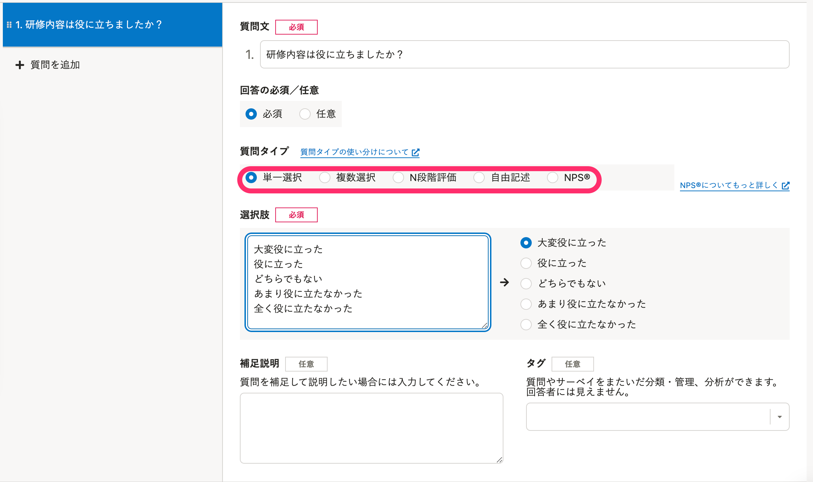

**回答画面**

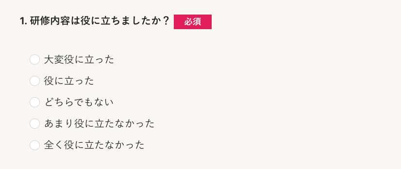

# 複数選択タイプ

複数の選択肢から、当てはまるものすべてを選択してもらう場合に使用します。

回答は複数選択できます。

選択肢は任意の数を追加できます。

**質問画面**

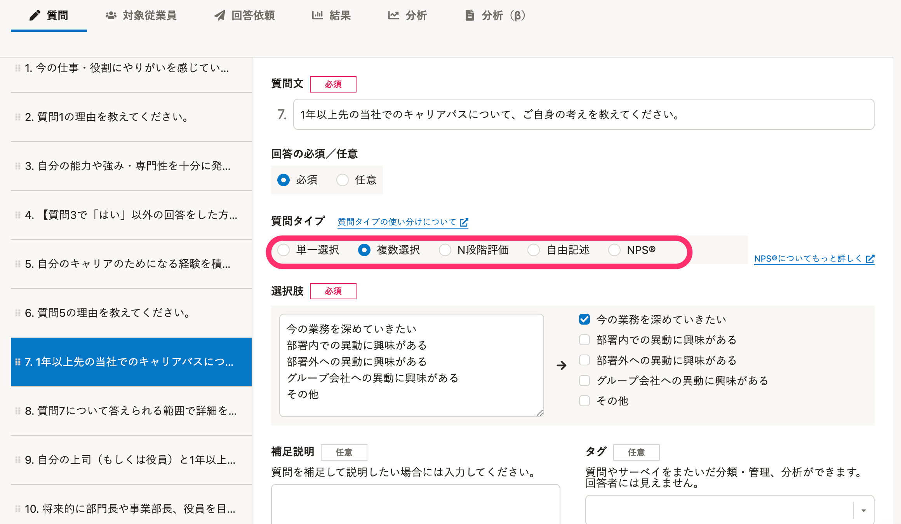

**回答画面**

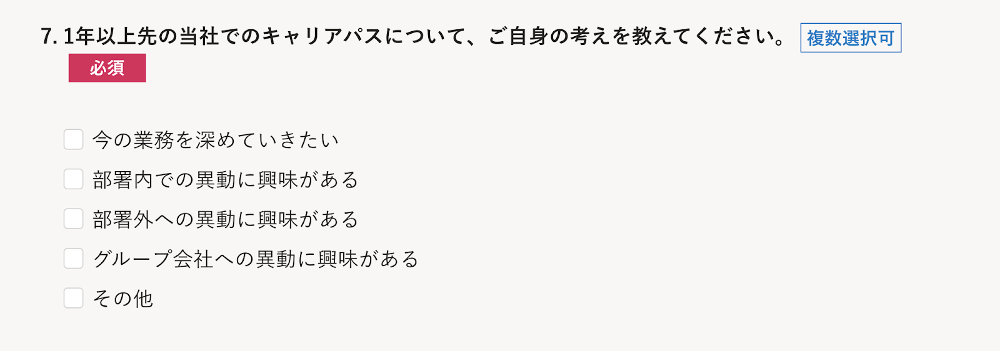

# N段階評価タイプ

「どのくらい満足しているか」「どのくらい好きか」などを段階で評価してもらい、尺度を計測して数値化したい場合に使用します。

回答は単一選択です。

2〜10段階の段階を設定でき、段階ごとにラベルを設定できます。

**質問画面**

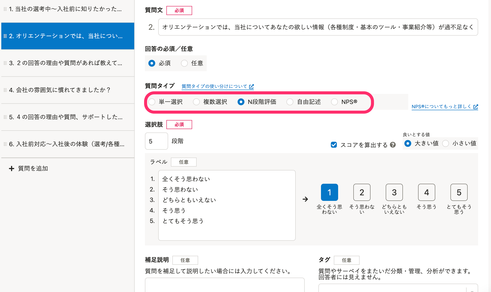

**回答画面**

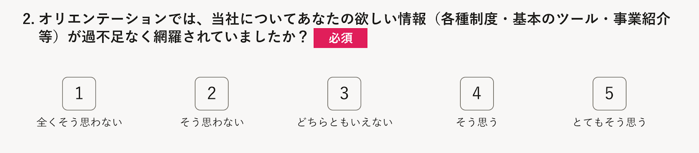

:::tips
### ［スコアを算出する］にチェックを入れた場合
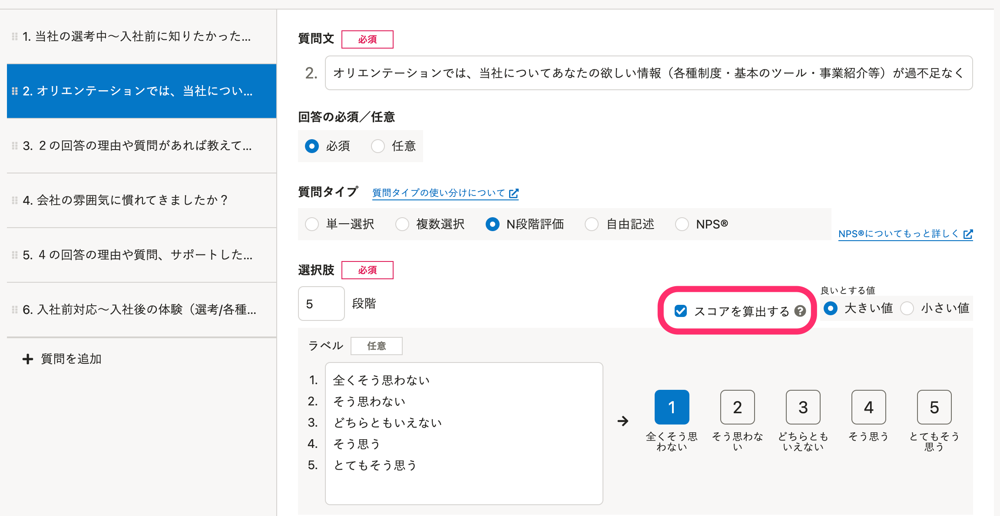
スコアとは、N段階評価の回答結果を10点満点で数値化したもので、これにより結果の善し悪しを簡単に判断できます。
 **［スコアを算出する］** にチェックを入れると、分析・レポート作成時にスコアに変換できます。
値の大きい選択肢を良いスコアとする場合は **［大きい値を良いスコアとする］** 、値の小さい選択肢を良いスコアとする場合は **［小さい値を良いスコアとする］** を選択します。例えば、5段階の選択肢で **［大きい値を良いスコアとする］** を選択した場合、10点満点は「5」の選択肢になります。
:::

# 自由記述タイプ

回答者からフリーテキストで回答を得る場合に使用します。

**質問画面**

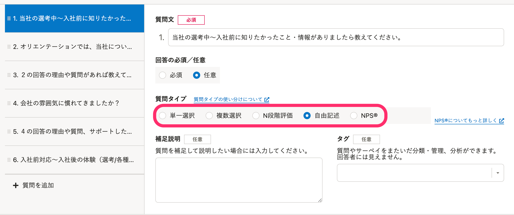

**回答画面**

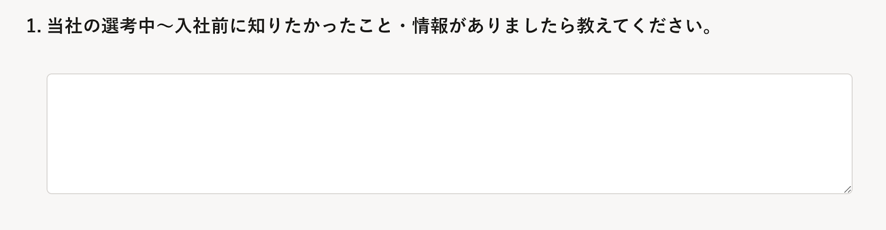

# NPS®

自社製品・サービスに関して「他人にすすめたいか」を数値化し、評価を知るための手法です。

0〜10の11段階で推奨度（全く思わない〜非常にそう思う）を計測して、NPSの計算方法に基づいて計算します。

**質問画面**

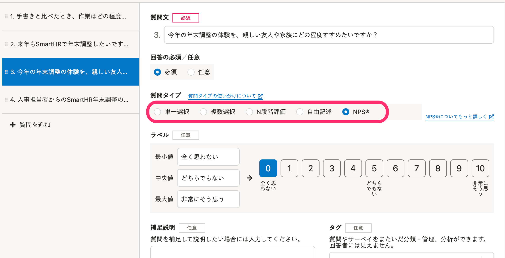

**回答画面**

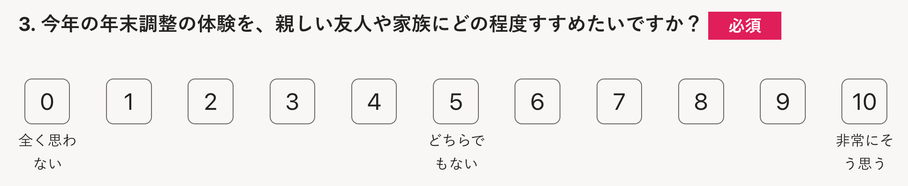

※ネット・プロモーター、ネット・プロモーター・システム、NPS、そして NPS 関連で使用されている顔文字は、ベイン・アンド・カンパニー、フレッド・ライクヘルド、サトメトリックス・システムズの登録商標又はサービスマークです。

:::related
[NPS® (ネット・プロモーター・スコア）とは？](https://knowledge.smarthr.jp/hc/ja/articles/360055579014)
:::
