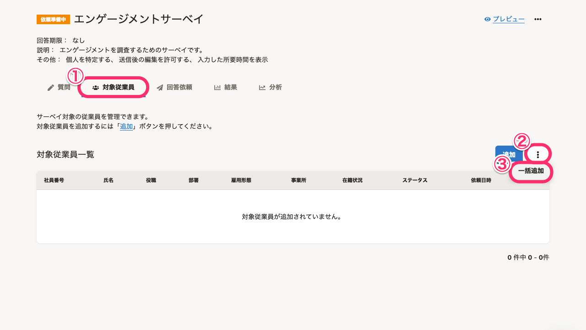
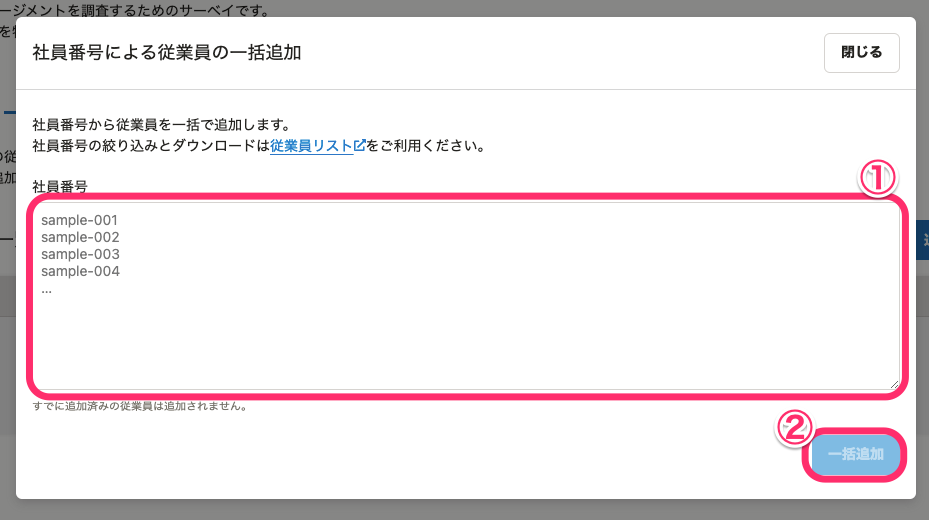
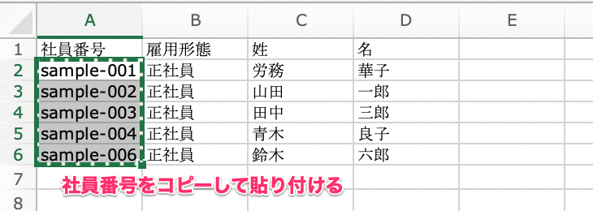
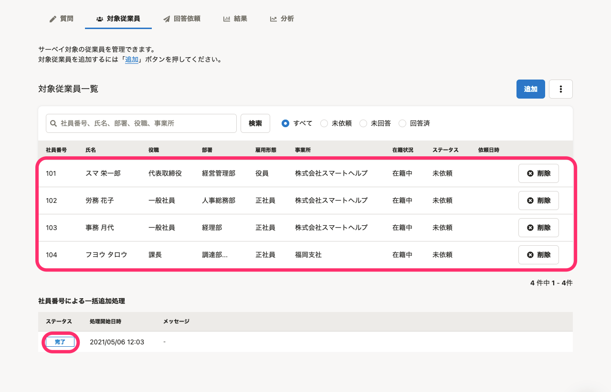
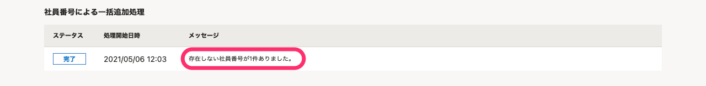

サーベイ対象の従業員を、社員番号を使って一括追加する方法を説明します。

SmartHR基本機能の「従業員リスト」からダウンロードしたファイルの社員番号をコピーアンドペーストすれば、複雑な条件で絞り込んだ従業員をサーベイ対象に一括追加できます。

# 1\. サーベイの［対象従業員］画面で［︙］>［一括追加］をクリック

対象従業員を追加したいサーベイの **［対象従業員］** 画面で、 **［︙］>［一括追加］** をクリックすると、 **［社員番号による従業員の一括追加］** ダイアログが表示されます。

# 2\. ［社員番号］を入力し、［一括追加］をクリック

 **［社員番号］** にサーベイ対象に追加したい従業員の社員番号を**1行に1つずつ**入力して、 **［一括追加］** をクリックします。

:::tips
社員番号は、SmartHR基本機能の「従業員リスト」のダウンロードファイルからコピーアンドペーストすると便利です。

 **［社員番号による従業員の一括追加］** ダイアログの **［従業員リスト］** リンクから、SmartHRの従業員リスト画面が表示できます。
従業員リストの操作とデータのダウンロードについては、下記のヘルプページをご覧ください。
- [フィルタ機能を使って、条件に合致する従業員リストを表示させる](https://knowledge.smarthr.jp/hc/ja/articles/360040965373)
- [従業員情報、家族情報の登録データをダウンロードする](https://knowledge.smarthr.jp/hc/ja/articles/360026106394)
:::

# 3\. ［社員番号による一括追加処理］のステータスが［完了］になったことを確認する

 **［一括追加］** をクリック後に、しばらく時間をおいて画面をリロードすると、一覧に従業員が追加され、画面の下部に **［社員番号による一括追加処理］** が表示されます。

処理が正常に完了すると、ステータスが **［完了］** になります。

:::tips
エラーなどで追加されなかった社員番号などがある場合は、 **［メッセージ］** にその旨が表示されます。
内容を確認して、必要に応じて操作をやり直してください。

:::
