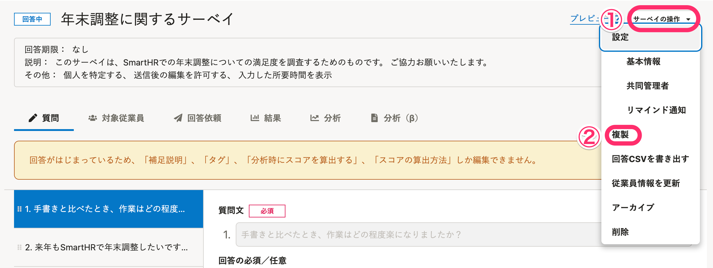

# 従業員サーベイにおける「サーベイ」とは

従業員サーベイでは、従業員に質問を送信することをサーベイ（調査）と呼びます。

それぞれのサーベイには、質問と対象従業員、実施時期がセットになって保存されます。

同じ内容のサーベイを実施する場合、回答時期が共通であれば、回答結果を従業員情報の項目別で集計できます。このため、事前に質問と従業員名簿を細かく分けて管理する必要はありません。

ここでは、サーベイの管理方法を紹介します。

# 回答者情報の取得範囲をコントロールする

サーベイの回答結果は、SmartHRに登録されている従業員項目と紐付けができます。サーベイの目的・特性によっては回答者の心理的負荷に配慮する必要が生じるケースもあるため、サーベイごとに情報の扱いを管理できるよう、権限や設定を設けています。

## 匿名でサーベイを実施する

回答と回答者の社員番号・氏名やメールアドレスなど、個人を特定する情報を取得することなく、サーベイを実施できます。この場合、回答結果には、部署と雇用形態のみを取得します。

回答を匿名で扱うための設定については、[回答の取り扱い方法（匿名かどうか）を設定する](https://knowledge.smarthr.jp/hc/ja/articles/6530342573081)を参照してください。

なお、回答者が3名以下の場合は個人を特定できる可能性があるため、回答結果を書き出しできません。

詳しい制限事項については、[Q. 「匿名で扱う」サーベイとは？](https://knowledge.smarthr.jp/hc/ja/articles/900005669166)を参照してください。

## SmartHR管理者とSmartHR管理者アカウントではないサーベイ管理者の違い

従業員サーベイにおける管理者権限である「サーベイ機能管理者」は、「サーベイ業務担当者」と比較して、サーベイに関する閲覧可能範囲に差はありません。

情報の取得可能な範囲の差は、SmartHRの管理者であるかどうかによります。

### 管理者が回答CSVの書き出し時に取得可能な従業員情報項目

| 書き出し可能な項目 | SmartHR管理者かつ サーベイ機能管理者、もしくはサーベイ業務担当者 | サーベイ機能管理者／サーベイ業務担当者 |
| --- | --- | --- |
| 部署 | ◯ | ◯ |
| 雇用形態 | ◯ | ◯ |
| 性別 | ◯ | ◯ |
| 生年月日 | ◯ | ー |
| 年齢 | ◯ | ー |
| 入社年月日 | ◯ | ◯ |
| 勤続年数 | ◯ | ◯ |
| 勤務月数 | ◯ | ◯ |
| 所属事業所 | ◯ | ◯ |
| 役職 | ◯ | ◯ |
| 業務内容 | ◯ | ◯ |
| 給与支払形態 | ◯ | ー |
| 住所 | ◯ | ー |
| 報酬月額 | ◯ | ー |
| 契約更新有無 | ◯ | ー |
| 雇用契約種別 | ◯ | ー |
| 契約開始日 | ◯ | ー |
| 契約終了日 | ◯ | ー |
| 配偶者有無 | ◯ | ー |
| カスタム項目 | ◯ | ー |

# 従業員情報を更新する

サーベイに紐づいた従業員情報を最新の状態に更新します。

情報を最新にしたいサーベイの詳細右上の **［サーベイの操作］** \> **［従業員情報を更新］** をクリックしてください。

結果画面の **［従業員情報を更新］** からも更新できます。

\>

:::tips
過去に実施したサーベイは従業員情報を最新にしなければ、サーベイ送信時の情報を保持しています。
過去に実施したサーベイの部署情報などを利用して、推移分析を作成したい場合などは、従業員情報を最新にしないことをおすすめします。
:::

# 質問の組み合わせを複製する

定期的に同じ内容のサーベイを実施する場合、質問をまるごと複製できます。

サーベイの詳細右上の **［サーベイの操作］>［複製］** をクリックしてください。

なお、対象従業員や回答依頼文は複製されません。

# サーベイをアーカイブする

サーベイの **［操作］** \>  **［アーカイブ］** をクリックすると、 **［アーカイブしたサーベイ］** に移動します。

アーカイブすると、対象従業員の追加や回答の依頼ができなくなります。

アーカイブを解除するには、アーカイブしたサーベイ一覧の  **［操作］** \> **［アーカイブを解除］** をクリックしてください。

# サーベイを削除する

サーベイの **［操作］** \> **［削除］** をクリックすると、サーベイを削除できます。

一覧から非表示にしたい場合は **［アーカイブ］** をクリックしてください。

