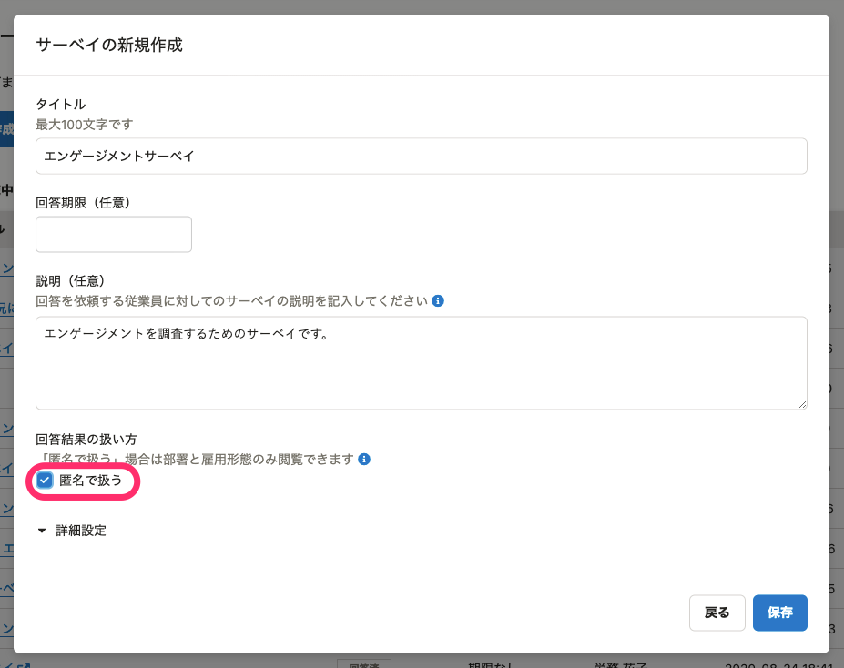
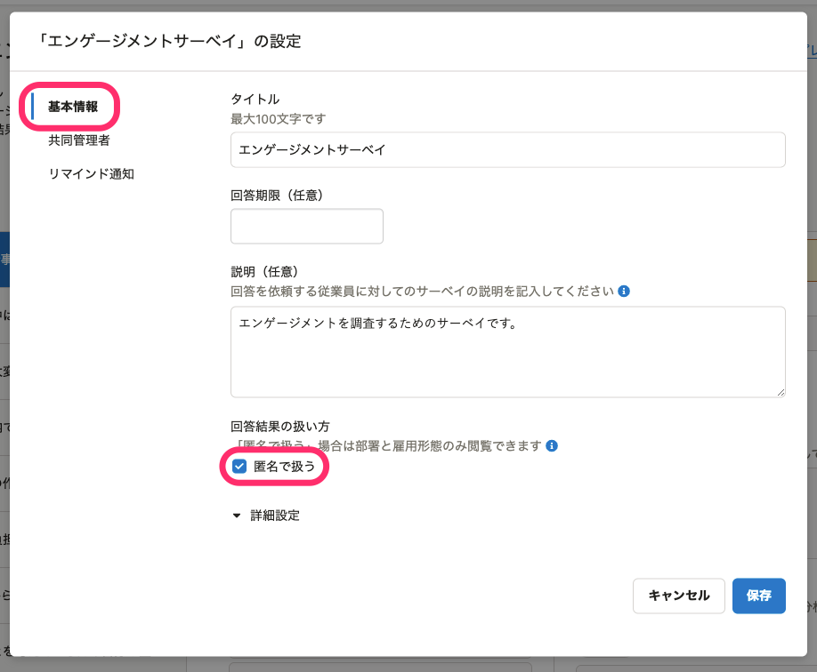
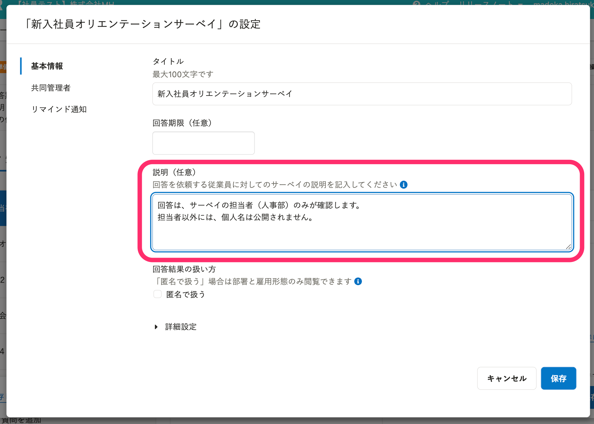
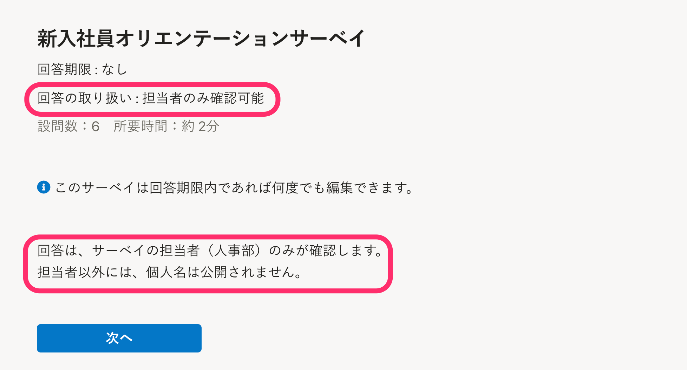
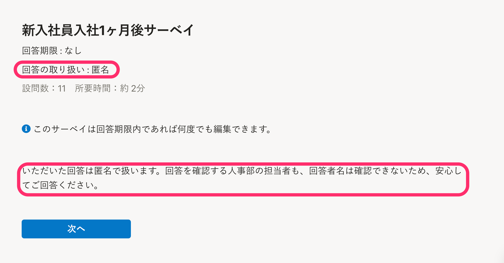

サーベイを実施する際、回答者を特定する情報を取得するか、回答を匿名で扱うか、いずれかを選択できます。

回答の取り扱い方法ごとの違いは、[Q. 「匿名で扱う」サーベイとは？](https://knowledge.smarthr.jp/hc/ja/articles/900005669166)を参照してください。

また、従業員が安心して回答できるように、回答の取り扱いについて、サーベイの説明欄で補足することをおすすめします。

# 設定方法

サーベイの作成時に設定する方法と、作成後に設定する方法があります。

従業員に回答依頼を送信したあとは、設定を変更できません。

## サーベイの作成時に設定する

匿名で扱う場合は、 **［回答の扱い方］>「匿名で扱う」** にチェックを入れます。

## サーベイ作成後に設定する

匿名で扱う場合は、サーベイの **［設定］>［基本情報］>［回答結果の扱い方］** で、 **「匿名で扱う」** にチェックを入れます。

# 従業員に安心して回答してもらうために

従業員が回答の公開範囲を理解し、安心して回答できるように、説明文を記載することをおすすめします。

## 匿名で扱わない場合

### 従業員からの見え方

「回答の取り扱い：担当者のみ確認可能」と表示されます。

### 説明文の例

- 回答は、サーベイの担当者（人事部）のみが確認します。担当者以外には、個人名は公開されません。
- 回答はサーベイ担当者が確認し、社内で結果を共有する際は、個人を特定されないよう加工して扱います。

:::tips
回答結果を従業員に公開する場合は、「個人を特定しない形で結果を公開する場合があります」などと補足しましょう。
また、サーベイの担当者名や担当部署は、できるだけ具体的に記載することをおすすめします。
例：人事部のXX（名前）、マネージャー以上の社員のみ など
:::

## 匿名の場合

### 従業員からの見え方

「回答の取り扱い：匿名」と表示されます。

### 説明文の例

- いただいた回答は匿名で扱います。回答を確認する人事部の担当者も、回答者名は確認できないため、安心してご回答ください。

