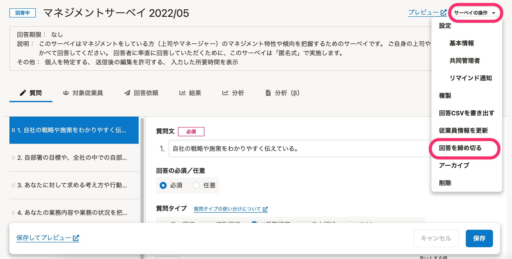

サーベイには任意の回答期限を設定できます。

回答期限はいつでも変更できます。期限が過ぎたあとで延長することもできます。

また、任意のタイミングで回答の受け付けを終了できます。

# 回答期限を設定・変更する

サーベイの開始前および回答受け付け中に、回答期限を設定・変更できます。

なお、回答期限を過ぎたあとで、期限を当日以降の日付に変更すると、回答の受け付けを再開できます。

## 1\. サーベイ編集画面の **［サーベイの操作］> ［基本情報］** をクリック

## 2\. 回答期限の日時を選択し、 **［保存］** をクリック

# 回答をただちに締め切る

サーベイの回答期限を現在日時に変更して、回答をただちに締め切れます。

## 1\. サーベイ編集画面の **［サーベイの操作］> ［回答を締め切る］** をクリック

## 2\.  **［回答の締め切り］** 画面で **［締め切る］** ボタンをクリック

:::tips
サーベイ一覧画面でも、サーベイの右側の **［操作］> ［回答を締め切る］** から締め切れます。

:::

# 回答期限を過ぎた場合

回答期限を過ぎると、従業員が回答画面にアクセスしても回答できません。

従業員から「回答したい」と問い合わせがあった場合は、必要に応じて期限を延長してください。
