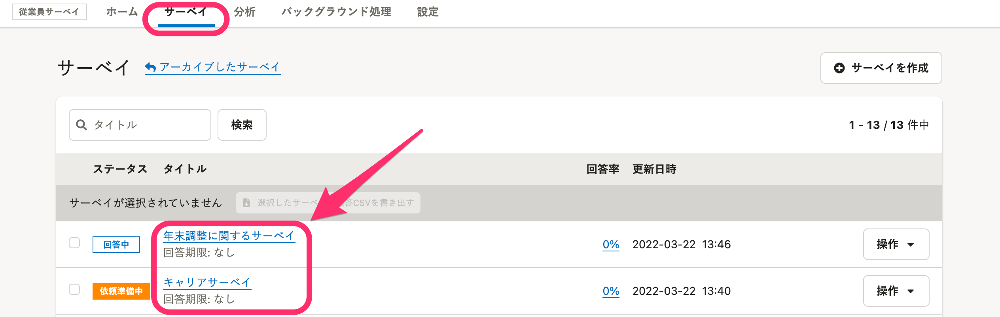
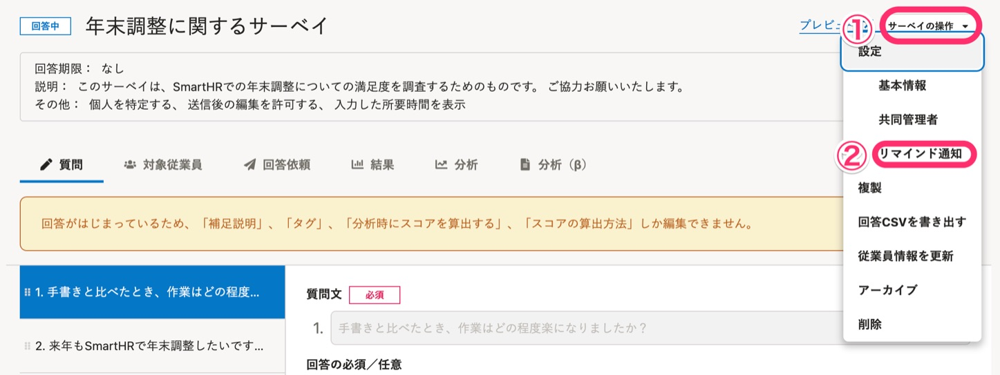
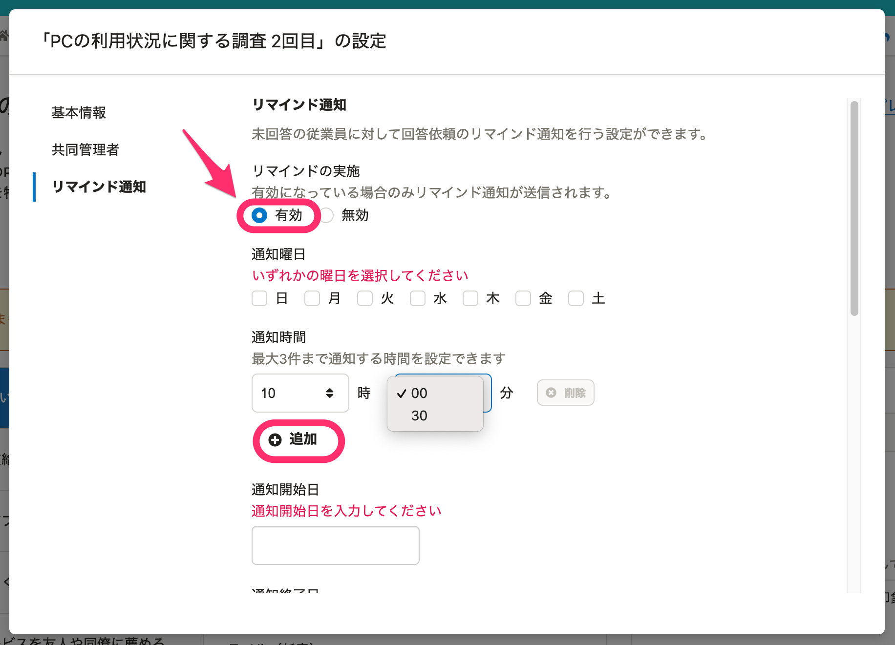
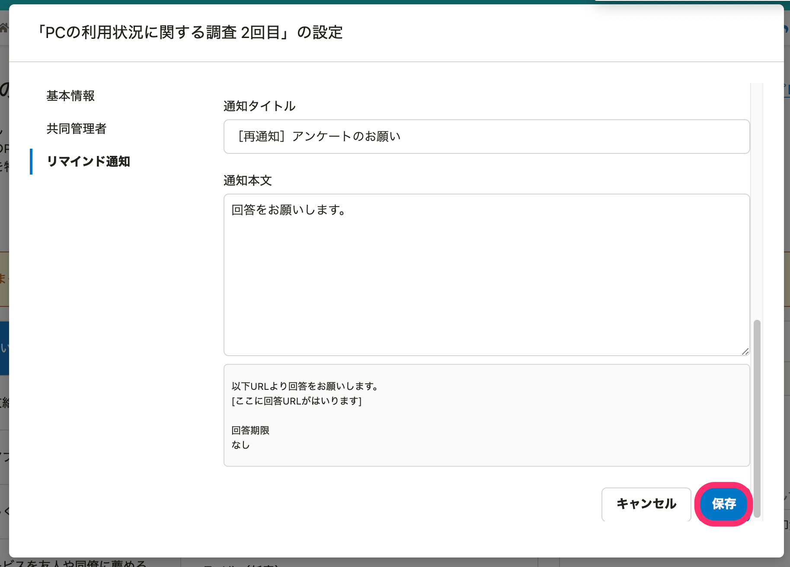
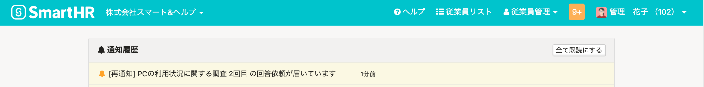
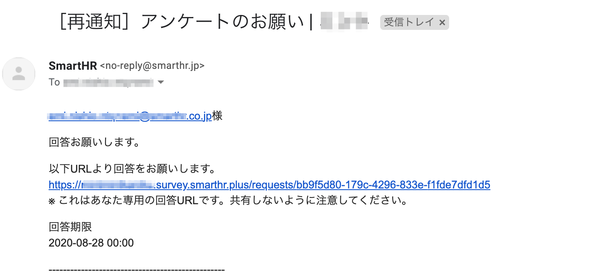

サーベイにまだ回答が済んでいない従業員に対して、リマインドメールとSmartHRへの通知を送れます。すでに回答済みの従業員に対しては送られません。

サーベイごとに設定しておくと、決まったタイミングで自動的に繰り返しリマインドを送ります。

# サーベイの \[リマインド通知設定\] の使い方

## 1\. ヘッダーメニューの \[サーベイ\] をクリック

ヘッダーメニューの **\[サーベイ\]** をクリックし、サーベイ一覧画面を表示します。

リマインドを設定したいサーベイのタイトルをクリックし、サーベイの詳細画面を表示します。

サーベイの詳細右上の **\[サーベイの操作\] > \[リマインド通知\]** をクリックし、リマインド通知設定画面を表示します。

## 2\. \[リマインドの実施\] を \[有効\] にし、タイミングを設定

**\[通知時間\]** は、30分刻みで設定できます。

**\[+追加\]** ボタンから最大3件まで追加できます。

**\[通知タイトル\]** と **\[通知本文\]** の内容は、従業員宛のリマインドメールに使用されます。

各項目を入力し、 **\[保存\]** をクリックすれば、設定が完了です。

:::tips
### サーベイの回答期限を過ぎた場合
回答期限を過ぎると、従業員はサーベイに回答できなくなり、リマインドメールも届きません。
期限超過後に回答を依頼するには、まず回答期限を延長してください。
サーベイの詳細右上の **\[サーベイの操作\] > \[基本情報\]** から回答期限を延長できます。
:::

# 従業員が受け取るリマインド画面

従業員に届く、通知欄ならびにメールには、サーベイのリンクが設置されています。

受けとった従業員は、通知からサーベイにアクセスして、そのまま回答できます。

### SmartHR通知画面

### メール画面

