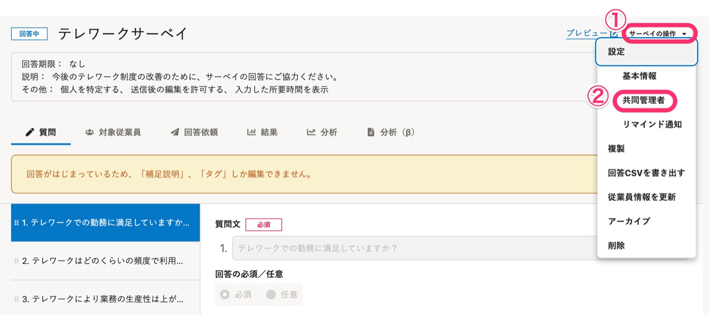
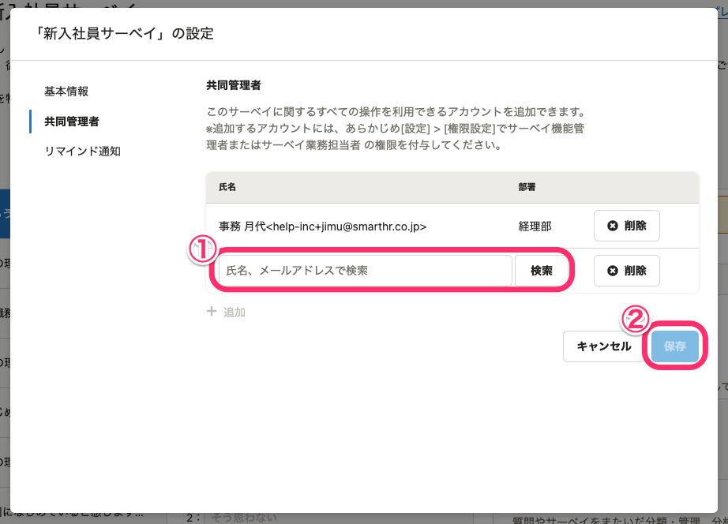
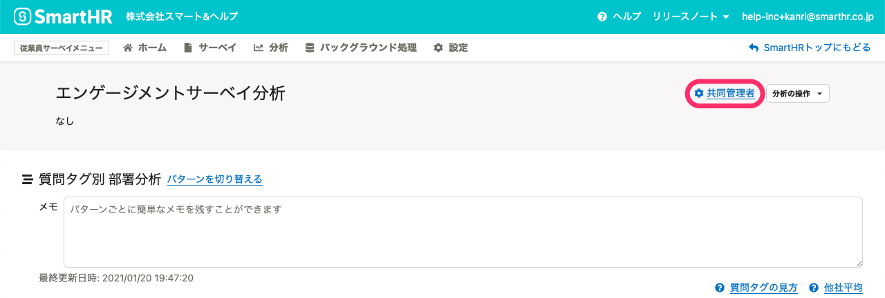

自分が作成したサーベイや分析を他のアカウントで閲覧・編集できるようにするには、サーベイや分析を共有したいアカウントを **「共同管理者」** に設定します。

共同管理者の設定は、サーベイ／分析ごとに行ないます。

:::alert
共同管理者に追加できるのは従業員サーベイの権限を付与されたアカウントのみです。
共同管理者に追加する前に、あらかじめ従業員サーベイの権限を付与してください。
[従業員サーベイの権限を管理する](https://knowledge.smarthr.jp/hc/ja/articles/360049602014)
:::

# サーベイを共有する

他のアカウントを「共同管理者」に追加して、サーベイを共有する方法を説明します。

サーベイの共同管理者に追加されたアカウントは、サーベイおよびレポートに関するすべての操作を行なえるようになります。

## 1\. サーベイの編集画面で［サーベイの操作］>［共同管理者］をクリック

共有したいサーベイの編集画面の右上にある **［サーベイの操作］>［共同管理者］** をクリックすると、設定ダイアログが表示されます。

## 2\. ［+ 追加］をクリックし、サーベイを共有するアカウントを選択して、［保存］をクリック

設定ダイアログの **［共同管理者］** で **［+ 追加］** をクリックすると、アカウントを検索するフォームが表示されます。

サーベイを共有するアカウントを検索し、 **［保存］** をクリックします。

共同管理者に追加されたアカウントは、サーベイ作成者と同等の操作が可能になります。

# 分析を共有する

他のアカウントを「共同管理者」に追加して、分析を共有する方法を説明します。

分析の共同管理者に追加されたアカウントは、**分析に関わる操作のみ** を行なえるようになります。

:::tips
部門長やマネージャーなどに分析結果を共有する場合は、サーベイではなく分析を共有してください。
詳しくは、下記のヘルプページもご覧ください。
[部門ごとに分析を作成する](https://knowledge.smarthr.jp/hc/ja/articles/900007406443)
:::

## 1\. 個別の分析の編集画面で［共同管理者］をクリック

共有したい分析の編集画面の右上の **［共同管理者］** をクリックすると、設定ダイアログが表示されます。

## 2\. ［+ 追加］をクリックし、分析を共有するアカウントを選択して、［保存］をクリック

設定ダイアログの **［共同管理者］** で **［+ 追加］** をクリックすると、アカウントを検索するフォームが表示されます。

分析を共有するアカウントを検索し、 **［保存］** をクリックします。

