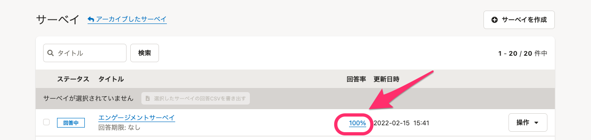
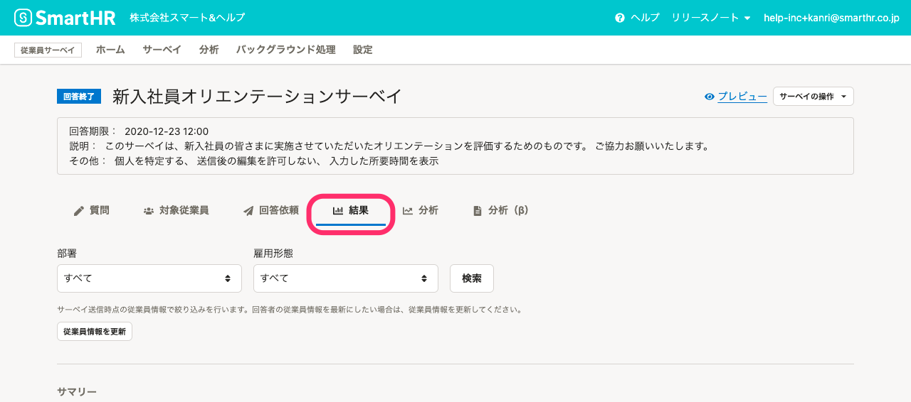
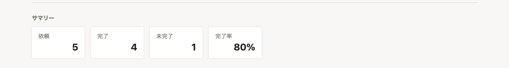
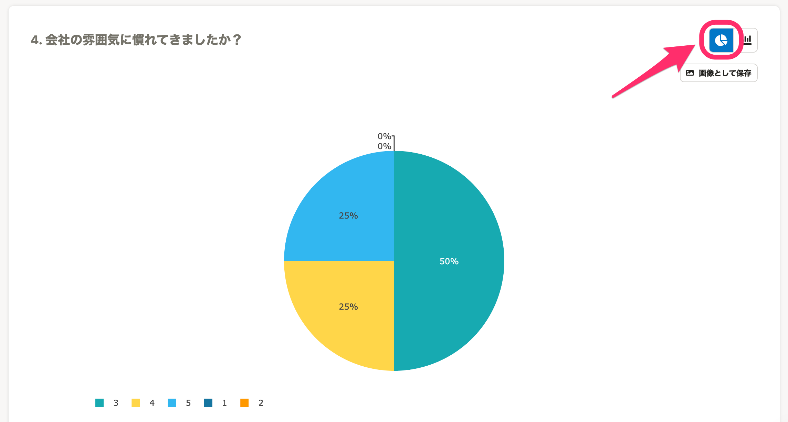
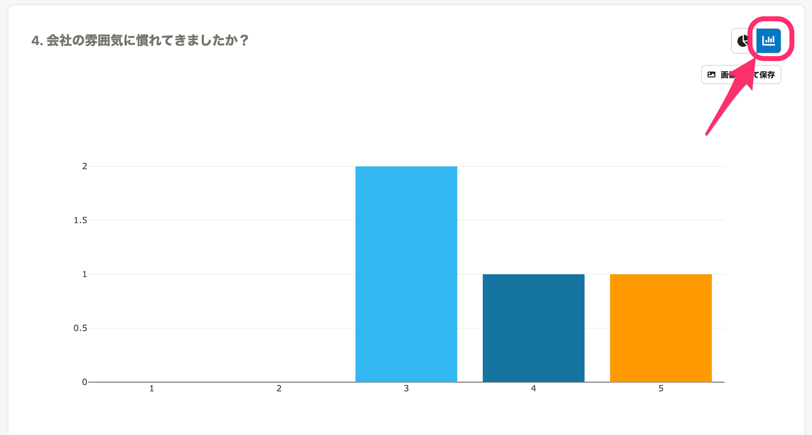
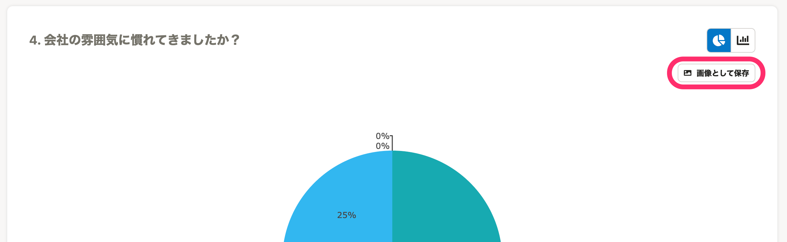
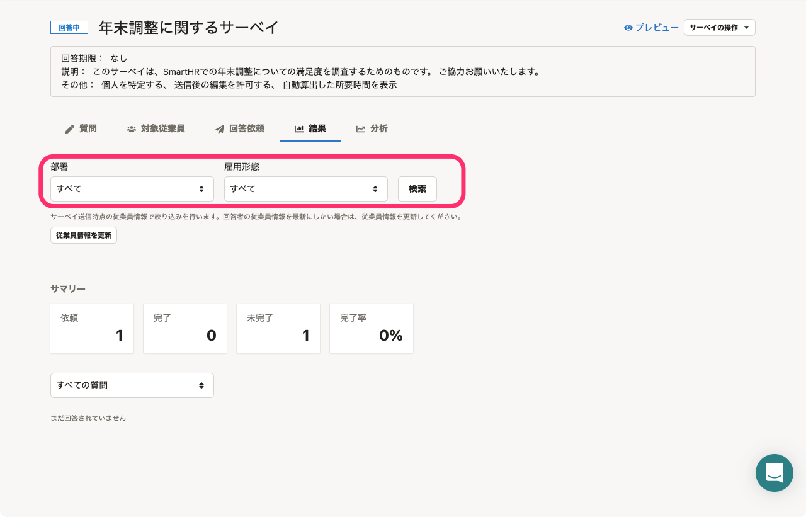

# 結果画面を確認する

回答がはじまると、随時集計が行われます。

サーベイの結果は、サーベイ一覧画面で回答率をクリックするか、またはサーベイ詳細画面の **［結果］** タブで確認できます。

# 自動集計された回答を閲覧する

結果画面には、その時点での回答結果が表示されます。

## サマリー

サマリーでは、回答内容依頼数、完了数、未完了数、完了率が数字で表示されます。

## 円グラフと棒グラフを切り替える

グラフは右上のアイコンをクリックすると、円グラフと棒グラフを切り替えられます。

チェックボックス形式の質問は、棒グラフのみ表示できます。

:::tips
グラフの画像ファイルはダウンロードもできます。
右上の **［画像として保存］** をクリックしてください。

:::

# 従業員情報を使って絞り込んだ集計結果を閲覧する

## 部署、雇用形態をプルダウンで選択し、［検索］をクリック

集計結果を部署や雇用形態で抽出して集計した結果が閲覧できます。

サーベイ送信時点の従業員情報で絞り込みを行ないます。回答者の従業員情報を最新にしたい場合は、絞り込みの下にある **［従業員情報を更新］** をクリックしてください。

:::tips
過去に実施したサーベイは従業員情報を最新にしなければ、サーベイ送信時の情報を保持しています。
過去に実施したサーベイの部署情報などを利用して、推移分析を作成したい場合などは、従業員情報を最新にしないことをおすすめします。
:::

# サーベイ回答結果の書き出し

サーベイの回答結果はCSV形式のファイルとして書き出せます。

CSVには、SmartHRに登録されている従業員項目の情報を含めることが可能です。

サーベイ回答結果を書き出す手順は、[サーベイの回答をCSVに書き出す](https://knowledge.smarthr.jp/hc/ja/articles/1500000846242)をご覧ください。
