サーベイの回答結果はCSV形式のファイルとして書き出せます。

CSVファイルには、SmartHRに登録されている従業員項目の情報を含めることが可能です。

# 1\. 書き出したいサーベイの［操作］>［回答CSVを書き出す］をクリック

サーベイ一覧画面で **［操作］** ボタンをクリックし、プルダウンから **［回答CSVを書き出す］** をクリックします。

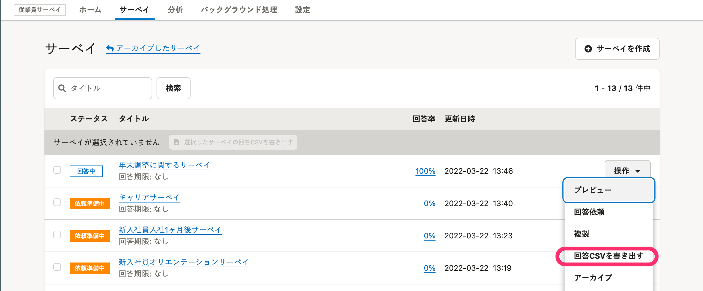

:::tips
複数のサーベイを1つのファイルとして書き出す場合は、書き出したいサーベイの左側にあるチェックボックスにチェックを入れ、 **［選択したサーベイの回答CSVを書き出す］**  をクリックします。
:::

# 2\. 書き出し対象にしたい質問を選択

初期設定では、すべての質問が選択されています。

 **［すべて解除する］** をクリックすると、すべての選択を解除できます。

選択後、 **［次へ］** をクリックします。

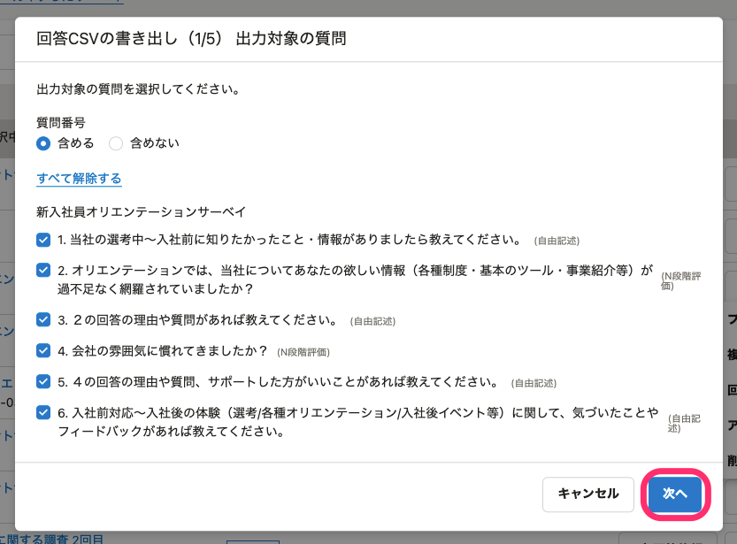

# 3\. 書き出し対象にしたい従業員の部署と雇用形態を選択

-  **［部署の絞り込みを］** および **［雇用形態の絞り込みを］** の項目で **［する］** を選択すると、特定の部署や雇用形態の従業員のみの結果を出力できます。
- 回答者全員を書き出し対象とする場合には、いずれも **［しない］** を選択してください。

選択後、 **［次へ］** をクリックします。

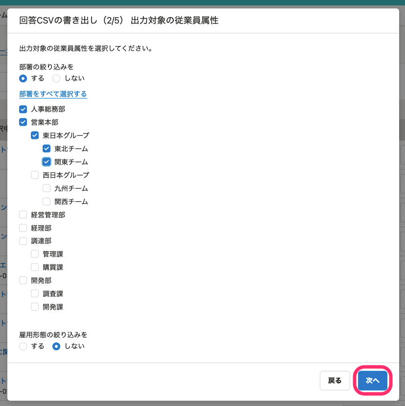

# 4\. 回答と合わせて取得したい回答者属性を選択

回答と紐付けて書き出す従業員項目を選択します。

選択後、 **［次へ］** をクリックします。

:::tips
 **［書き出し対象の従業員項目］** は、システム標準項目とカスタム項目から選択します。
カスタム項目の追加方法は、以下のページをご覧ください。
[カスタム従業員項目を追加する](https://knowledge.smarthr.jp/hc/ja/articles/360026265513)
:::

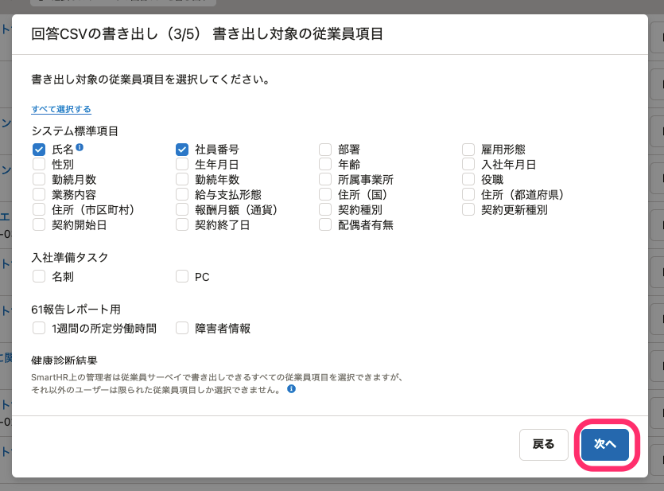

SmartHR上の管理者は従業員サーベイで出力可能なすべての従業員情報を選択できますが、それ以外の権限のアカウントは選択できる項目が限られます。

管理者以外のアカウントが選択できる従業員項目は、部署、雇用形態、性別、入社年月日、勤続月数、所属事業所、役職、業務内容です。

:::related
[管理者が回答書き出し時に取得可能な従業員情報項目｜サーベイを管理する](https://knowledge.smarthr.jp/hc/ja/articles/360050478353#toc--5)
:::

# 5\. 出力形式を選択

選択した内容が **［出力例］** に反映されます。 **［出力例］** を参考に、目的にあった形式を選択してください。

- **\[質問への回答ごとに行を書き出す\]** : 複数の質問項目がある場合、従業員1名に対して、質問項目の数だけ縦に行が増えます。
- **\[回答者ごとに行を書き出す\]** : 複数の質問項目がある場合、質問項目の数だけ横に列が増えます。

複数のサーベイを1ファイルとして書き出す場合は、 **［質問への回答ごとに行を書き出す］** のみ選択できます。

選択後、 **［次へ］** をクリックします。

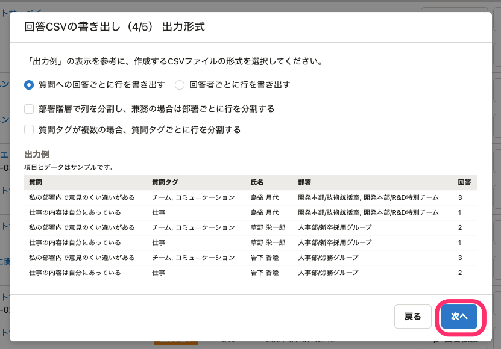

:::tips
### 回答CSVファイルの部署名の列を、階層ごとに分けるには?
 **［部署階層で列を分割し、兼務の場合は部署ごとに行を分割する］** にチェックを入れると、部署の階層ごとに列が分かれて出力されます
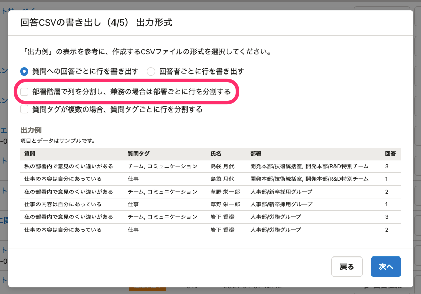
- 分割あり
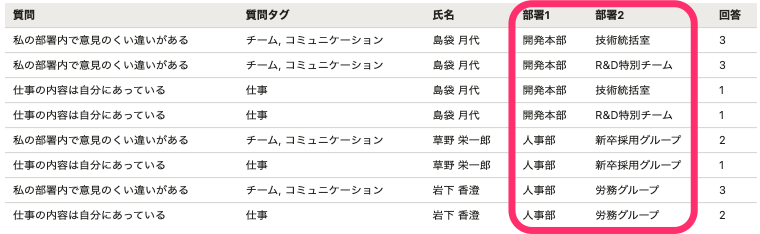
- 分割なし
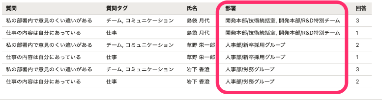
:::

# 6\. クロス集計する際の集計単位を設定し、［書き出す］をクリック

 **［回答CSVの書き出し（3/5）］** ダイアログで選択した一部の属性項目は、クロス集計する際にいくつかの単位をまとめた集計単位として表示できます。

数値項目を選択していない場合は、 **［変換可能な属性はありません］** と表示されます。

変換の数値を設定したら **［書き出す］** をクリックすると、バックグラウンドで書き出しの処理が開始されます。

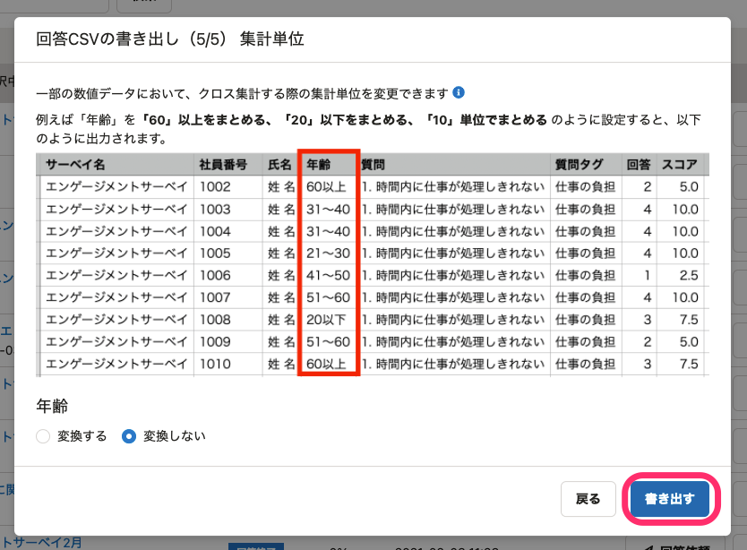

# 7\. ［バックグラウンド処理］をクリックし、該当の処理名の［ダウンロード］をクリック

処理が完了すると、CSVファイルがダウンロード可能になります。（バックグラウンド処理には時間がかかる場合があります。）

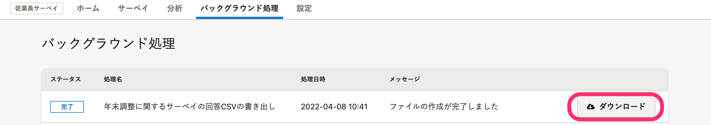

:::tips
出力対象を部署や雇用形態で絞り込んでいる場合、条件に該当する回答者が3名以下のときは、個人の特定を防ぐため、回答データは書き出し対象から除外されます。
除外された条件を確認するには、 **［除外された条件の確認］** をクリックします。
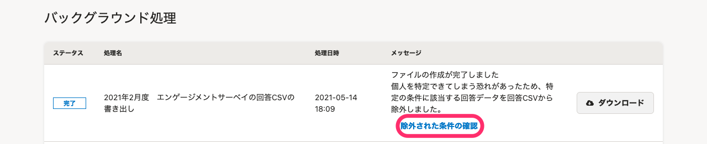
:::
