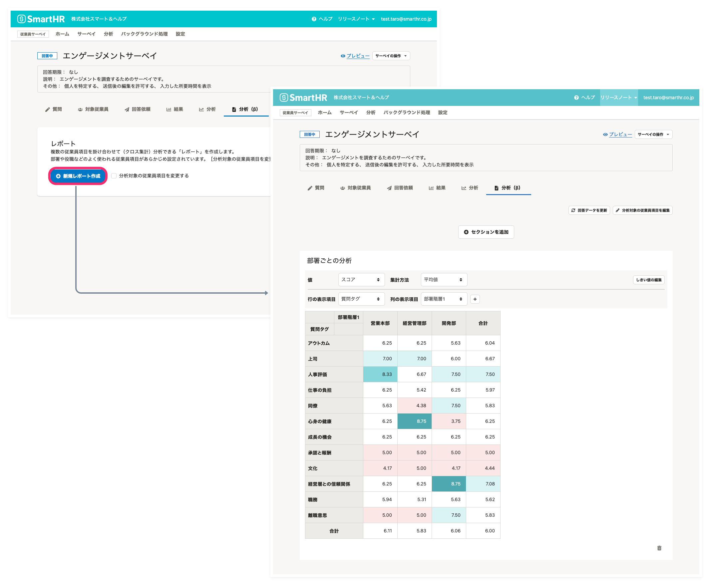
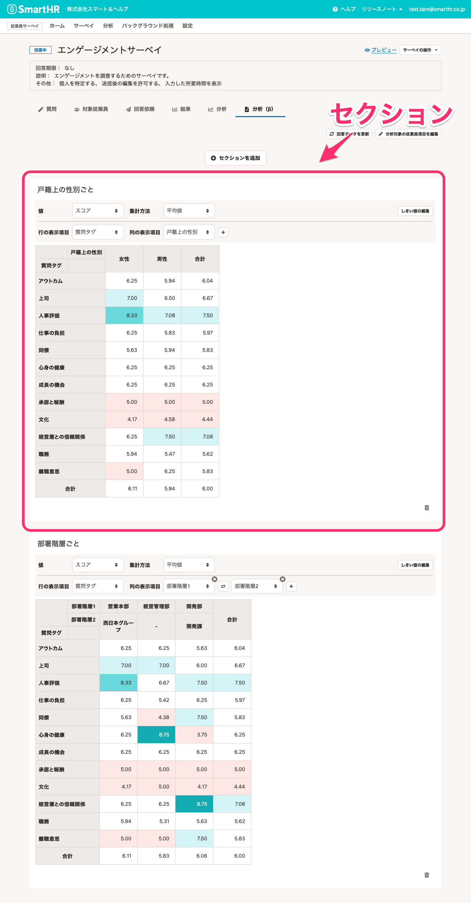

# レポート機能について

従業員サーベイの「レポート」機能は、 複数の従業員項目を掛け合わせて（クロス集計）分析できる機能です。

細かな設定が必要な「分析」機能とは異なり、部署や役職などの、分析によく使われる分析軸があらかじめ設定されているため、ボタン1つでサーベイ結果からクロス集計を作成できます。

:::related
[サーベイのレポートを作成する](https://knowledge.smarthr.jp/hc/ja/articles/4406865687065)
[サーベイのレポートを編集する](https://knowledge.smarthr.jp/hc/ja/articles/4406865715993)
:::

# レポート機能でできること

## 複雑な設定なしに分析できる

部署や役職などの、分析によく使われる分析軸があらかじめ設定されているため、細かな設定をしなくても結果を分析できます。

分析軸は変更することもできます。

## 複数のクロス集計分析（セクション）を同時に表示できる

レポートの中には、複数のセクションを追加でき、クロス集計を同時に確認できます。

例えば、戸籍上の性別ごと、部署ごとのセクションを作成して、傾向を並べて見ることができます。

## レポート作成後に、分析する項目を変更できる

レポートの作成後に分析対象の従業員項目や数値項目の集計単位を変更できるため、クロス集計を確認しながら表示を調整できます。

分析機能で分析対象の従業員項目を追加するには、一度分析を作り直す必要がありましたが、レポートではその必要がありません。

# 今後の開発予定

より便利にレポート機能をお使いいただけるように、下記の機能を開発予定です（2021年11月現在）。

※ 状況によっては開発が中止となる場合もあります。

- レポートを画像で出力する機能
- レポートに表示する項目のフィルター機能
- 行や列の表示のカイゼン
- セクションの並べ替え機能
- 推移を分析できる「推移レポート」機能
