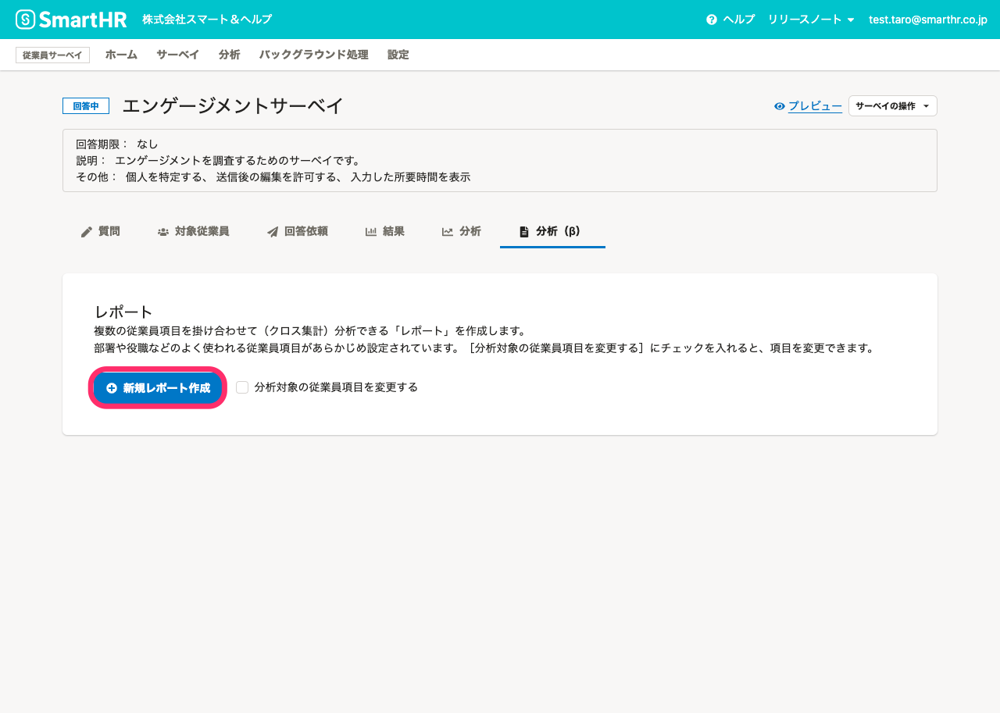
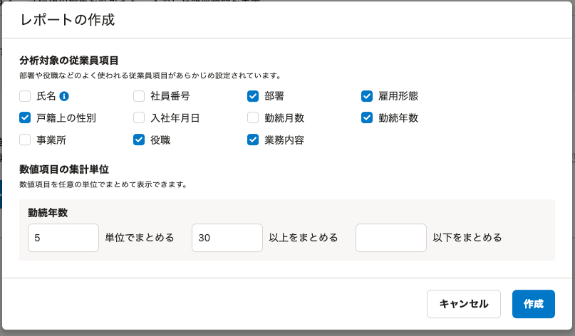

回答データからレポートを作成する方法を説明します。

# 事前準備

レポートを作成するには、下記の条件を満たす必要があります。

- 「サーベイ機能管理者」または「サーベイ業務担当者」の権限が付与されている
- レポートを作成するサーベイの「共同管理者」に設定されている
- 匿名で実施するサーベイの場合、回答が4件以上集まっている

詳しくは、下記のヘルプページをご覧ください。

- [従業員サーベイの権限を管理する](https://knowledge.smarthr.jp/hc/ja/articles/360049602014)
- [作成したサーベイや分析を他のアカウントに共有する（共同管理者の設定）](https://knowledge.smarthr.jp/hc/ja/articles/4402361764633)

# 1\. レポートを作成するサーベイの［分析（β）］タブをクリック

レポートを作成するサーベイを表示し、 **［分析（β）］** タブをクリックします。

# 2\. 必要に応じて、分析対象の従業員項目を設定し、［＋新規レポート作成］をクリック

 **［＋新規レポート作成］** をクリックします。

項目を変更する場合は、 **［分析対象の従業員項目を変更する］** にチェックを入れてから、 **［＋新規レポート作成］** をクリックします。

分析対象の従業員項目はレポートの作成後も変更できます。

数秒後に画面をリロードすると、レポートが表示されます。

レポートの操作方法については、[サーベイのレポートを編集する](https://knowledge.smarthr.jp/hc/ja/articles/4406865715993)を参照してください。

:::tips
レポートでは、自由記述形式の質問は表示されません。
自由記述形式の質問の回答は、結果画面で確認してください。
:::

## 分析対象の従業員項目を設定する

 **［分析対象の従業員項目を変更する］** にチェックを入れて **［＋新規レポート作成］** をクリックすると、 **［レポートの作成］** ダイアログが表示されます。

分析によく使われる下記の項目従業員項目があらかじめ選択されていますが、自由に変更できます。

- 部署
- 雇用形態
- 戸籍上の性別
- 勤続年数
- 役職
- 業務内容

また、数値項目の集計単位を変更できます。[Q. 年齢などの数値項目を10単位で集計するには？](https://knowledge.smarthr.jp/hc/ja/articles/360061809773)を参照してください。

:::tips
「匿名で扱う」サーベイの場合は、 **［部署］［雇用形態］** のみ選択できます。
[Q. 「匿名で扱う」サーベイとは？](https://knowledge.smarthr.jp/hc/ja/articles/900005669166)
:::
