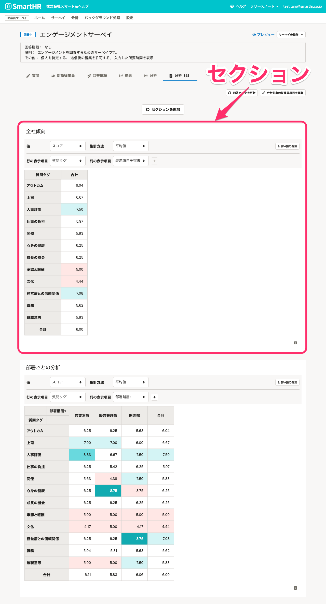
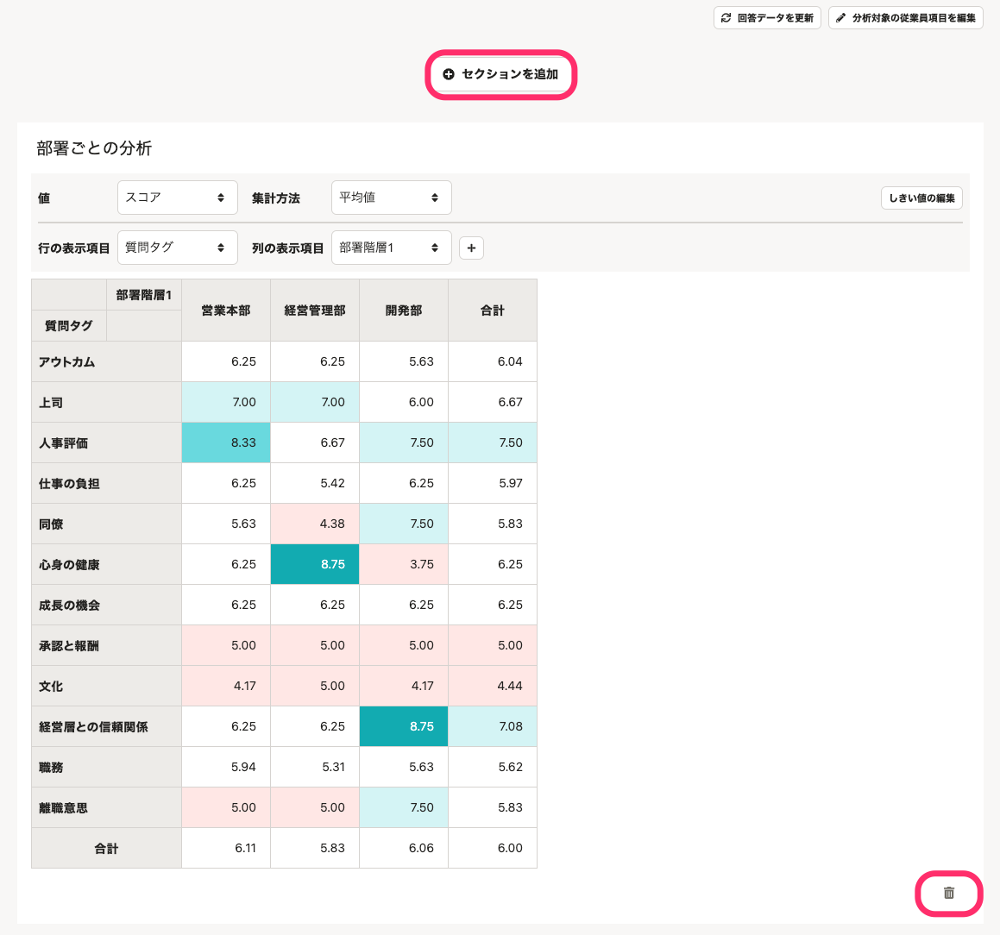
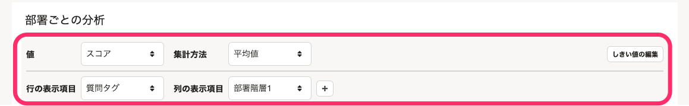
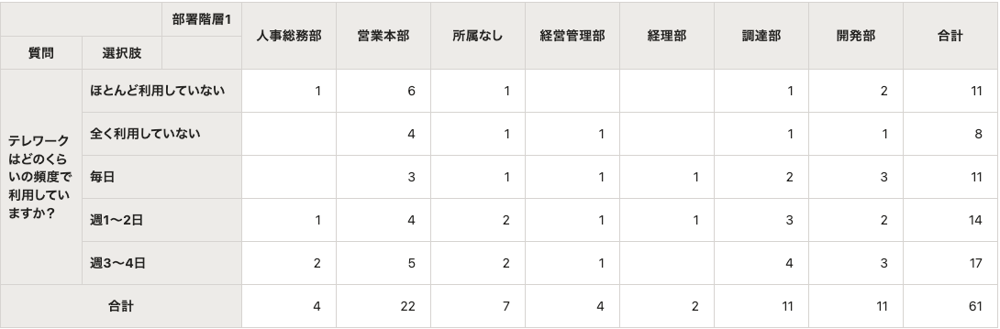
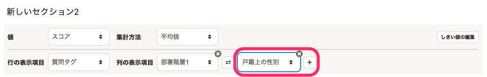
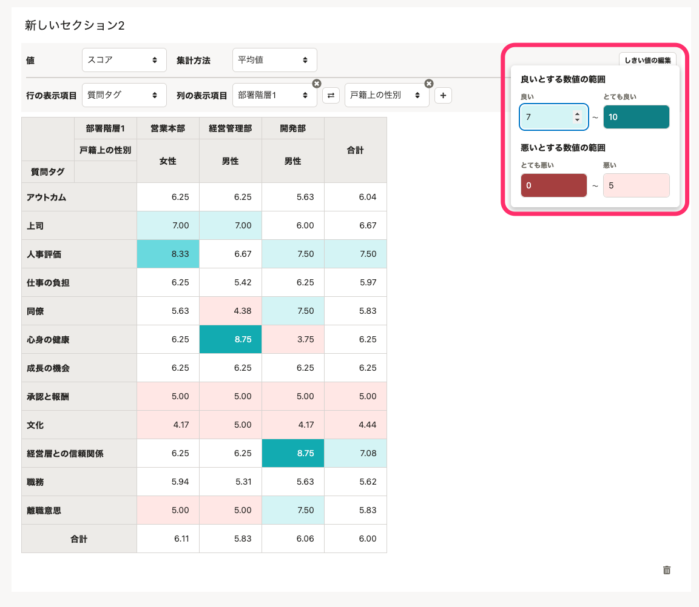
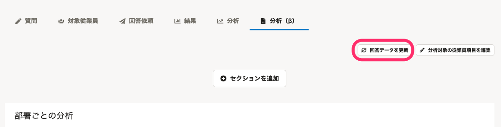
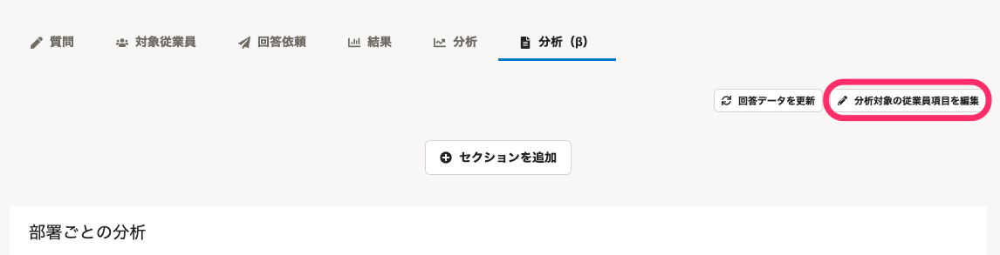
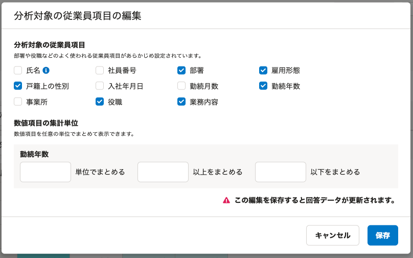

作成したレポートを編集する方法を説明します。

レポートの作成方法については、[サーベイのレポートを作成する](https://knowledge.smarthr.jp/hc/ja/articles/4406865687065)を参照してください。

# レポート画面の見かた

レポートは複数の「セクション」からできています。

セクションごとに行と列の表示項目を設定したり、集計する値や集計方法を変更したりできます。

レポートを作成した直後は、セクションが1つ自動で作成されています。

:::tips
レポートでは、自由記述形式の質問は表示されません。
自由記述形式の質問の回答は、結果画面で確認してください。
:::

# セクションの操作

## セクションを追加／削除する

 **［＋セクションを追加］** をクリックすると、レポートの一番上に新しいセクションが追加されます。

セクション右下のゴミ箱アイコンをクリックすると、セクションを削除できます。

## 集計方法や行・列の表示項目を編集する

セクションの上部で、セクションに表示するクロス集計の集計方法や表示項目などを編集します。

編集内容は自動的に保存されます。

#### 

### セクション名

自由にセクション名を変更できます。

### 値

下記の2つから集計する値を選択します。

- スコア：N段階評価の回答結果を10点満点に換算して表示します。
- 回答：回答件数を表示します。

### 集計方法

下記の5つの集計方法から選択します。

-  **［回答数］** ：質問の回答数を算出します。
-  **［平均値］** ：回答またはスコアの平均値を算出します。
-  **［全体総数の割合］** ：回答の合計件数を全体総数の割合に変換して算出します。
-  **［行の総数の割合］** ：回答の合計件数を行の全体総数の割合に変換して算出します。
-  **［列の総数の割合］** ：回答の合計件数を列の全体総数の割合に変換して算出します。

### 行の表示項目

行に表示する項目を下記の4つから選択します。

-  **［質問］** 
-  **［質問タグ］** 
-  **［質問タグと質問］：** 質問タグごとに質問がまとめて表示されます。
-  **［質問と選択肢］：** 回答の選択肢が質問ごとにまとめて表示されます。

**\[質問と選択肢\]** を選択したときの表示

### 列の表示項目

列に表示する項目を最大3つまで選択します。 **［＋］** で追加、 **［×］** で削除できます。

分析対象の従業員項目に設定した項目が選択肢として表示されます。

:::tips
分析対象の従業員項目変更するには、 **［分析対象の従業員項目を編集** ］をクリックします。
詳しくはこのページの「分析対象の従業員項目を変更する」をご覧ください。
:::

### しきい値を編集する

しきい値とは、回答の良し悪しを判断する境目となる、条件値のことです。

 **［しきい値の編集］** をクリックすると、 **［良いとする数値の範囲］［悪いとする数値の範囲］** が設定でき、該当するセルにはそれぞれ色がつきます。

# 最新の回答を反映する

レポートは、レポート作成時点の回答データを元に作成されます。

レポートの作成後に新しい回答があった場合は、 **［回答データを更新］** をクリックすると、レポートが最新の状態に更新されます。

# 分析対象の従業員項目を変更する

セクションの **［列の表示項目］** に表示する従業員項目の種類を増やしたい場合や、数値項目の集計単位を変更したい場合は、 **［分析対象の従業員項目を編集］** をクリックします。

 **［保存］** をクリックすると、レポートが再作成されます。

:::alert
保存すると、回答データが更新され、最新の回答が各セクションに反映されます。
:::
